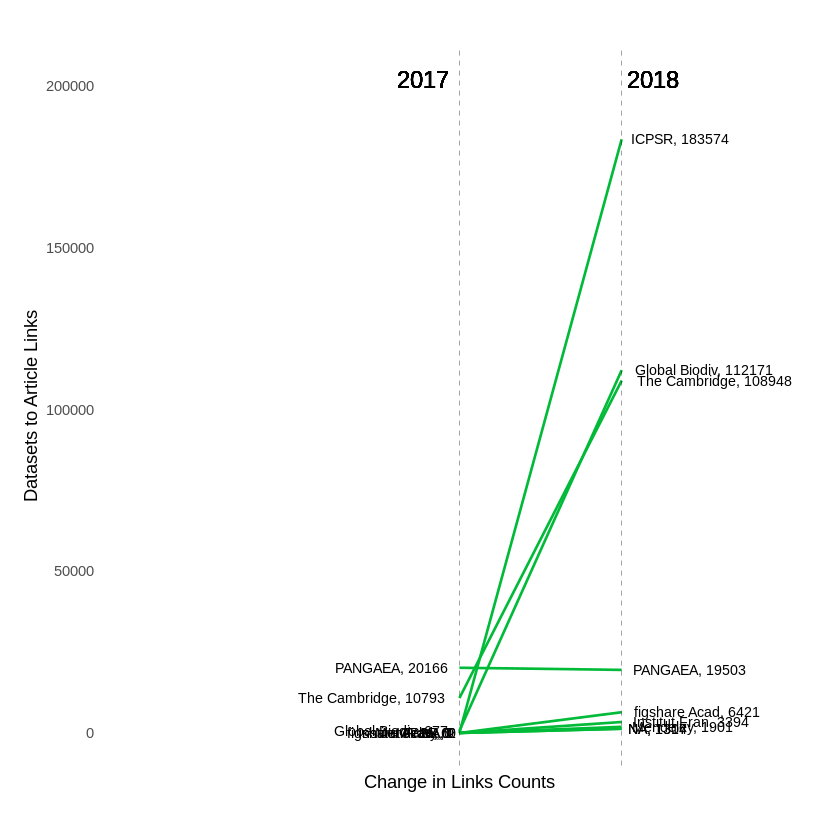
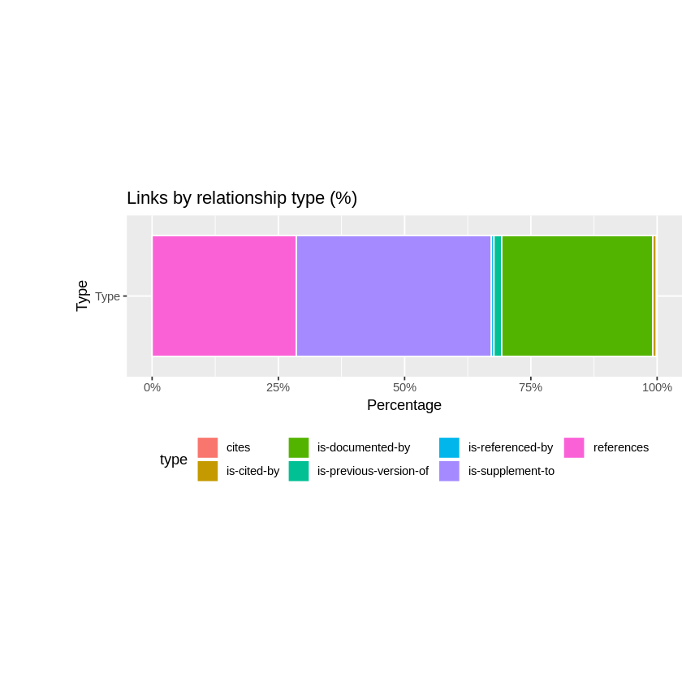
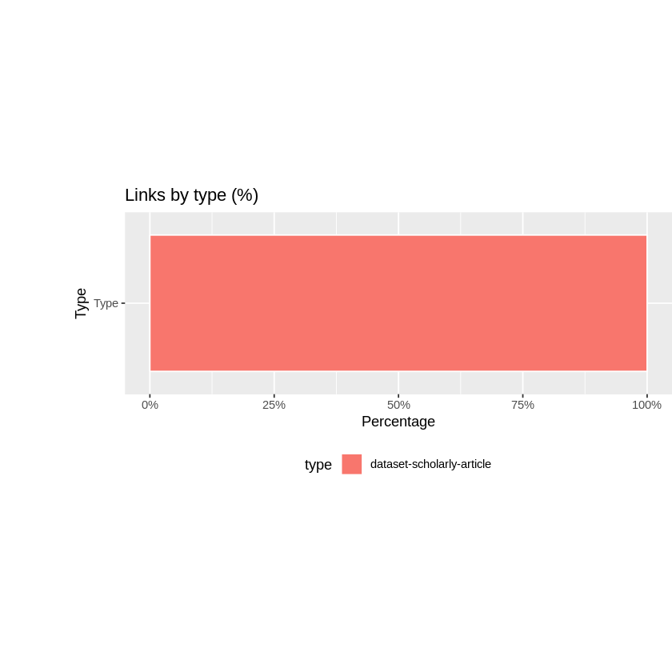
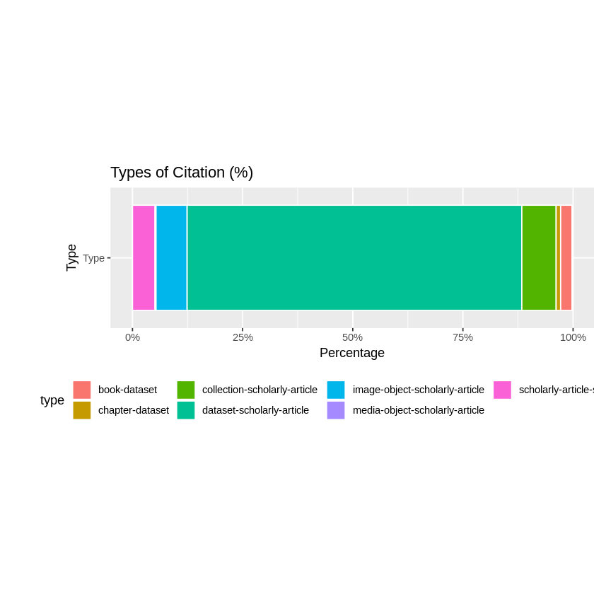
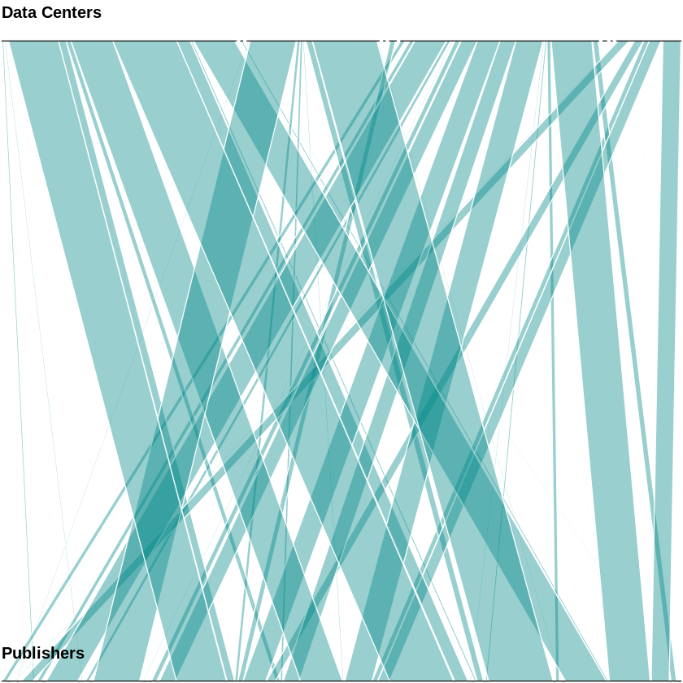
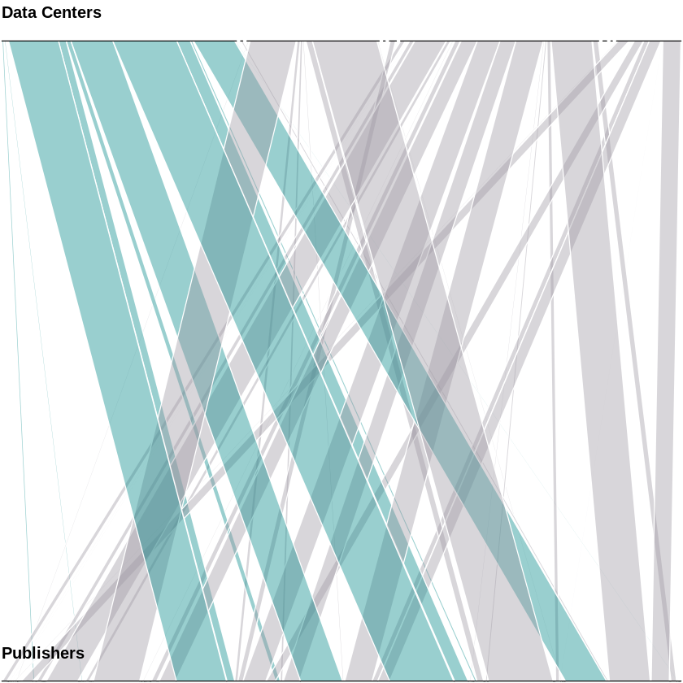
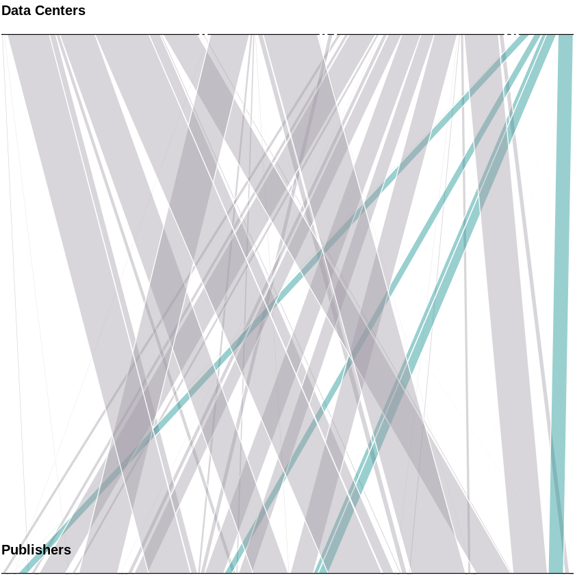
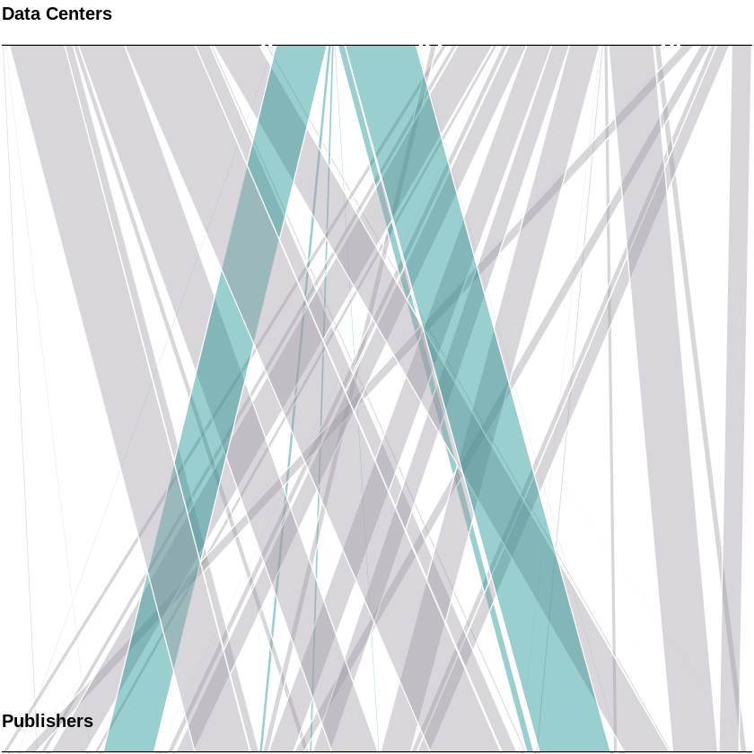
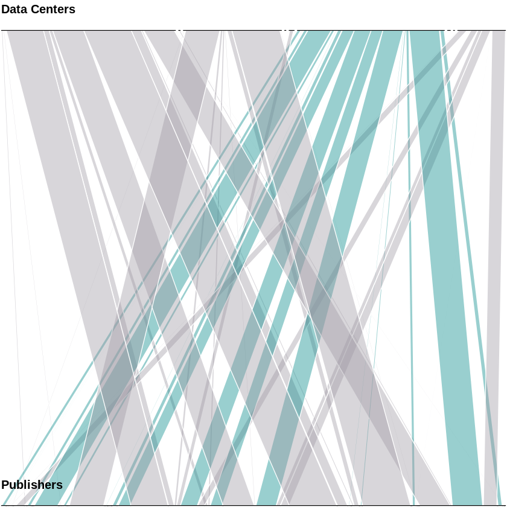
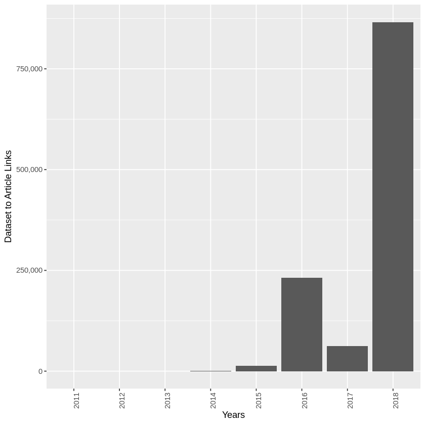

# Exploratory Analysis Data Center Angle
> by Kristian Garza


In this exploration the first question we asked was how big is our dataset? We are looking at events that represents links between journal article and scholarly resources. Therefore our dataset looks like this: there are around 50K links from journal articles to scholarly resources and around 900K links from scholarly resources to journal articles.


```R
library(ggplot2)
library(jsonlite)
library(plyr)
library(scales)
library(dplyr)
library(stringr)
library(RColorBrewer)
library(httr)
library(tidyr)
library(psych)
source("../functions/graph_functions.r")

```

subject,year,count,percentage,sum
copper,2006,32,79,5255
silver,2006,4176,79,5255


```R
# load("../data/2018-10-03_source_datacite-crossref_meta.Rda",verbose=TRUE)
load("../data/2018-10-28_source_datacite-crossref_meta.Rda",verbose=TRUE)
print((meta$registrants$years[1]))

registrants <- meta$registrants
citation_types <- meta$`citation-types`
relation_types <- meta$`relation-types`
pairings <- meta$pairings


```

    Loading objects:
      meta
    [[1]]
        id title    sum
    1 2016  2016  95308
    2 2017  2017  10793
    3 2018  2018 108948
    


```R
flat_year<-function(years){
    x <- filter(years[[1]], title == "2017")
    return(x$sum)
}
flat_year_8<-function(years){
    x <- filter(years[[1]], title == "2018")
    return(x$sum)
}

# registrants %>%  mutate(`2017` = "",`2018` = "" ) 

for (row in 1:nrow(registrants)) {
    first <- flat_year(registrants$years[row])
    second <- flat_year_8(registrants$years[row])
    if(length(first) == 0){
        first<-0
    }
    if(length(second) == 0){
        second<-0
    }        
        
    registrants$`2017`[row] <- first
    registrants$`2018`[row] <- second
}

registrants<-registrants %>% 
    mutate(m=((`2018`-`2017`)/(10000)), 
           client=title,
           `2018`=`2018`,
           `2017`=`2017`,
           `2018-p`=100*(`2018`/count),
           `2017-p`=100*(`2017`/count)      
          
          ) %>% 
    filter(startsWith(title, "datacite"))
# head(registrants,5)

```

# How Data citation has changed in the last 24 months?

FIG Slopegraph comparing data citations changes over time for a list of Publishers. In this graph we filtered to the top 8 contributors of data citations. The dataset corresponds to data citations collected as of September 2018.


```R
load("../data/2018-10-11_datacite_registrants.Rda",verbose=TRUE)
registrants <- registrants %>% rowwise() %>% left_join(datacite_reg)


```

    Loading objects:
      datacite_reg


    Joining, by = "id"


```R

plot_slopegraph(y_label="Datasets to Article Links", slope_df=head(registrants,15))
```

       vars n mean      sd median trimmed  mad min   max range skew kurtosis
    X1    1 9 3516 7179.44      2    3516 2.97   0 20166 20166 1.42     0.37
            se
    X1 2393.15
       vars n     mean      sd median  trimmed     mad  min    max  range skew
    X1    1 9 48725.89 68212.6   6421 48725.89 7582.02 1307 183574 182267 0.85
       kurtosis       se
    X1    -1.03 22737.53





```R
types <- relation_types %>%   
        mutate(total = sum(count), percentage = (count/total)*100, type=title, column="Type") %>%
        arrange(desc(total))


hundred_plot(head(types,7),"Links by relationship type (%)",TRUE)

```

       vars n     mean       sd median  trimmed      mad min    max  range skew
    X1    1 7 89185.14 107557.8   9682 89185.14 13734.81 418 241222 240804 0.31
       kurtosis       se
    X1    -2.04 40653.04





```R
citation <- citation_types %>%   
        mutate(total = sum(count), percentage = (count/total)*100, type=title, column="Type") %>%
        arrange(desc(total))


hundred_plot(head(citation,7),"Links by type (%)",TRUE)


```

       vars n   mean sd median trimmed mad    min    max range skew kurtosis se
    X1    1 1 624723 NA 624723  624723   0 624723 624723     0   NA       NA NA





# Links from Scholarly Resources to Article Publications 


FIG This is a distribution of links Scholarly Resources to Article Publications by type of citations. Links from dataset resources to schorlaly articles make the biggest contribution to this dataset.


```R
load("../data/2018-10-28_source_datacite_all_citations_types_meta.Rda",verbose=TRUE)
citation_types <- meta$`citation-types`

types <- citation_types %>%   
        mutate(total = sum(count), percentage = (count/total)*100, type=title, column="Type") %>%
        arrange(desc(percentage))
hundred_plot(head(types,7),"Types of Citation (%)",TRUE)


```

    Loading objects:
      meta
       vars n     mean       sd median  trimmed      mad  min    max  range skew
    X1    1 7 117212.6 225054.3  42153 117212.6 32589.03 1771 624723 622952 1.58
       kurtosis       se
    X1     0.72 85062.53





```R
pairings<-pairings %>% unnest(registrants)

```


```R
pairings<-pairings %>% filter(startsWith(title, "datacite")) %>% mutate(datacenter=as.factor(title),publisher=as.factor(id1))  %>%   
arrange(desc(sum))
head(pairings,10)
summary(pairings$count)
```


<table>
<thead><tr><th scope=col>id</th><th scope=col>title</th><th scope=col>count</th><th scope=col>id1</th><th scope=col>title1</th><th scope=col>sum</th><th scope=col>datacenter</th><th scope=col>publisher</th></tr></thead>
<tbody>
	<tr><td>datacite.dk.gbif    </td><td>datacite.dk.gbif    </td><td>121258              </td><td>crossref.4913       </td><td>crossref.4913       </td><td>58866               </td><td>datacite.dk.gbif    </td><td>crossref.4913       </td></tr>
	<tr><td>datacite.bl.ccdc    </td><td>datacite.bl.ccdc    </td><td>215049              </td><td>crossref.316        </td><td>crossref.316        </td><td>58463               </td><td>datacite.bl.ccdc    </td><td>crossref.316        </td></tr>
	<tr><td>datacite.bl.ccdc    </td><td>datacite.bl.ccdc    </td><td>215049              </td><td>crossref.292        </td><td>crossref.292        </td><td>45719               </td><td>datacite.bl.ccdc    </td><td>crossref.292        </td></tr>
	<tr><td>datacite.dk.gbif    </td><td>datacite.dk.gbif    </td><td>121258              </td><td>crossref.2258       </td><td>crossref.2258       </td><td>42066               </td><td>datacite.dk.gbif    </td><td>crossref.2258       </td></tr>
	<tr><td>datacite.bl.ccdc    </td><td>datacite.bl.ccdc    </td><td>215049              </td><td>crossref.311        </td><td>crossref.311        </td><td>38299               </td><td>datacite.bl.ccdc    </td><td>crossref.311        </td></tr>
	<tr><td>datacite.bl.ccdc    </td><td>datacite.bl.ccdc    </td><td>215049              </td><td>crossref.78         </td><td>crossref.78         </td><td>37508               </td><td>datacite.bl.ccdc    </td><td>crossref.78         </td></tr>
	<tr><td>datacite.gesis.icpsr</td><td>datacite.gesis.icpsr</td><td>183574              </td><td>crossref.78         </td><td>crossref.78         </td><td>37264               </td><td>datacite.gesis.icpsr</td><td>crossref.78         </td></tr>
	<tr><td>datacite.gesis.icpsr</td><td>datacite.gesis.icpsr</td><td>183574              </td><td>crossref.179        </td><td>crossref.179        </td><td>28642               </td><td>datacite.gesis.icpsr</td><td>crossref.179        </td></tr>
	<tr><td>datacite.gesis.icpsr</td><td>datacite.gesis.icpsr</td><td>183574              </td><td>crossref.311        </td><td>crossref.311        </td><td>24913               </td><td>datacite.gesis.icpsr</td><td>crossref.311        </td></tr>
	<tr><td>datacite.gesis.icpsr</td><td>datacite.gesis.icpsr</td><td>183574              </td><td>crossref.297        </td><td>crossref.297        </td><td>20670               </td><td>datacite.gesis.icpsr</td><td>crossref.297        </td></tr>
</tbody>
</table>


       Min. 1st Qu.  Median    Mean 3rd Qu.    Max. 
       1330    1901   59178   81446  183574  215049 


# Relationships between Data Centers and Publishers

Another interesting thing we can look is relationships of citations between Publishers and Datacenters.

FIG Parallel set graph for data citations between particular Publishers and a particular Data Center. Publishers as the top category and Data Centers as the bottom category. The width of the bar denotes the absolute number of citations for that Publisher-Data center match. The dataset corresponds to links collected as of September 2018.


```R
with(pairings, parallelset(datacenter, publisher,  freq=sum, col="#008888", alpha=0.4)) 
```





## Highlighting examples of Relationship between Datacenters and repositories

We highlight four examples:

- The Cambridge Crystallographic Data Centre 
- PANGAEA
- Global Biodiversity Information Facility
- Inter-university Consortium for Political and Social Research


```R
pairings_h <- pairings %>%
    mutate(highlighted = ifelse(datacenter=="datacite.bl.ccdc","Yes","No")) 
    

myt <- within(pairings_h, {
  highlighted <- factor(highlighted, levels=c("Yes","No"))
  color <- ifelse(highlighted=="Yes","#008888","#9e99a3")
})
with(myt, parallelset(datacenter, publisher,  freq=sum, col=color, alpha=0.4)) 
```





```R
pairings_h <- pairings %>%
    mutate(highlighted = ifelse(datacenter=="datacite.tib.pangaea","Yes","No")) 
    

myt <- within(pairings_h, {
  highlighted <- factor(highlighted, levels=c("Yes","No"))
  color <- ifelse(highlighted=="Yes","#008888","#9e99a3")
})
with(myt, parallelset(datacenter, publisher,  freq=sum, col=color, alpha=0.4)) 
```





```R
pairings_h <- pairings %>%
    mutate(highlighted = ifelse(datacenter=="datacite.dk.gbif","Yes","No")) 
    

myt <- within(pairings_h, {
  highlighted <- factor(highlighted, levels=c("Yes","No"))
  color <- ifelse(highlighted=="Yes","#008888","#9e99a3")
})
with(myt, parallelset(datacenter, publisher,  freq=sum, col=color, alpha=0.4)) 
```





```R
pairings_h <- pairings %>%
    mutate(highlighted = ifelse(datacenter=="datacite.gesis.icpsr","Yes","No")) 
    

myt <- within(pairings_h, {
  highlighted <- factor(highlighted, levels=c("Yes","No"))
  color <- ifelse(highlighted=="Yes","#008888","#9e99a3")
})
with(myt, parallelset(datacenter, publisher,  freq=sum, col=color, alpha=0.4)) 
```





# Links growth over the years

This is a distribution of between schilarly resources and article publications over the time. 


```R
load("../data/2018-10-28_source_datacite-crossref_meta.Rda",verbose=TRUE)
print((meta$registrants$years[1]))

registrants <- meta$registrants
citation_types <- meta$`citation-types`
relation_types <- meta$`relation-types`
pairings <- meta$pairings

```

    Loading objects:
      meta
    [[1]]
        id title    sum
    1 2016  2016  95308
    2 2017  2017  10793
    3 2018  2018 108948
    


```R
registrants<-registrants %>% unnest(`years`) %>% filter(id1>"2008") %>% mutate(year=as.factor(id1),sum=as.integer(sum))

x<-group_by(registrants, year) %>% summarise(total = sum(sum))
```


```R
p<-ggplot(x, aes(x=year,y=total)) + geom_bar(stat="identity") + scale_y_continuous(label=comma) +
                      labs(x="Years", y="Dataset to Article Links")  # Axis labels


p + theme( 
              axis.text.x = element_text(angle = 90, hjust = 1)) 

```




