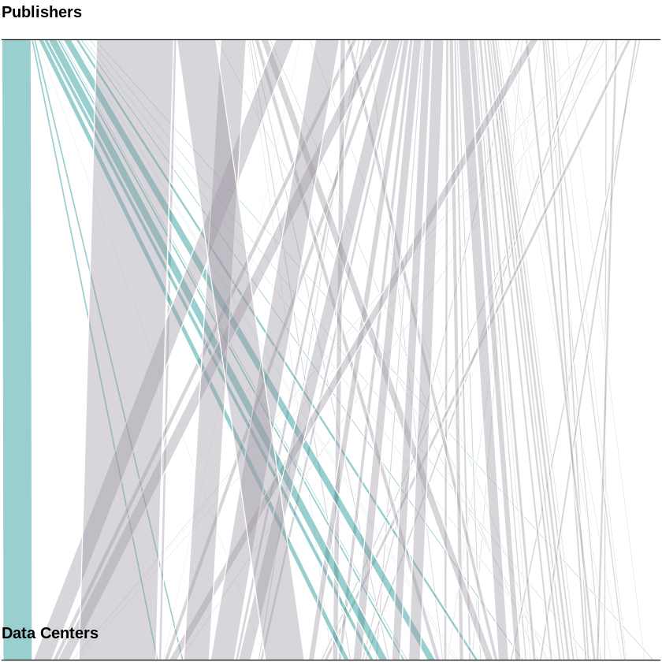

## Citations_Analysis_publishers_angle


```R
library(ggplot2)
library(plyr)
library(scales)
library(dplyr)
library(stringr)
library(RColorBrewer)
library(rdatacite)
library(jsonlite)

```

    
    Attaching package: ‘dplyr’
    
    The following objects are masked from ‘package:plyr’:
    
        arrange, count, desc, failwith, id, mutate, rename, summarise,
        summarize
    
    The following objects are masked from ‘package:stats’:
    
        filter, lag
    
    The following objects are masked from ‘package:base’:
    
        intersect, setdiff, setequal, union
    


subject,year,count,percentage,sum
copper,2006,32,79,5255
silver,2006,4176,79,5255


```R
# load("../data/links_with_xref_data_2.Rda",verbose=TRUE)
load("../data/2018-03-16_citation_link_with_DCandXR_metadata.Rda",verbose=TRUE)

# xref_data <- xref_data %>% 
#     mutate(publisher=substr(publisher, 1, 10),
#           dc_dc=substr(dc_dc, 1, 10),
#             ) 


        

get_summ_by_type<-function(data){
    data_type <- data %>% 
        group_by(subject) %>%  
            summarise(total = n())  %>%
        arrange(desc(total)) 
    return(data_type)
}
summ_data<-get_summ_by_type(xref_data)
head(xref_data)
nrow(xref_data)


```

    Loading objects:
      xref_data


<table>
<thead><tr><th scope=col>xref_doi</th><th scope=col>publisher</th><th scope=col>type</th><th scope=col>subject</th><th scope=col>dc_doi</th><th scope=col>occurred_at</th><th scope=col>dc_dc</th><th scope=col>published</th><th scope=col>dc_member</th></tr></thead>
<tbody>
	<tr><td>10.1111/pala.12283                                 </td><td>Wiley-Blackwell                                    </td><td>journal-article                                    </td><td>Palaeontology                                      </td><td>https://doi.org/10.5061/dryad.dk385                </td><td>2017-02-13                                         </td><td>cdl.dryad                                          </td><td>cdl                                                </td><td>2017                                               </td></tr>
	<tr><td>10.12688/f1000research.10763.1                     </td><td>F1000 Research, Ltd.                               </td><td>journal-article                                    </td><td>                                                   </td><td>https://doi.org/10.5256/f1000research.10763.d151064</td><td>2017-02-10                                         </td><td>bl.f1000r                                          </td><td>bl                                                 </td><td>2017                                               </td></tr>
	<tr><td>10.12688/f1000research.10426.1                     </td><td>F1000 Research, Ltd.                               </td><td>journal-article                                    </td><td>                                                   </td><td>https://doi.org/10.5281/zenodo.193080              </td><td>2016-12-20                                         </td><td>cern.zenodo                                        </td><td>cern                                               </td><td>2016                                               </td></tr>
	<tr><td>10.1080/15504263.2016.1277816                      </td><td>Informa UK Limited                                 </td><td>journal-article                                    </td><td>Psychiatry and Mental health                       </td><td>https://doi.org/10.3886/ICPSR24461.v4              </td><td>2017-01-03                                         </td><td>gesis.icpsr                                        </td><td>gesis                                              </td><td>2009                                               </td></tr>
	<tr><td>10.1080/13803395.2015.1125453                      </td><td>Informa UK Limited                                 </td><td>journal-article                                    </td><td>Clinical Psychology                                </td><td>https://doi.org/10.3886/ICPSR04248.v3              </td><td>2016-01-18                                         </td><td>gesis.icpsr                                        </td><td>gesis                                              </td><td>2005                                               </td></tr>
	<tr><td>10.12688/f1000research.10632.1                     </td><td>F1000 Research, Ltd.                               </td><td>journal-article                                    </td><td>                                                   </td><td>https://doi.org/10.5256/f1000research.10632.d150960</td><td>2017-02-08                                         </td><td>bl.f1000r                                          </td><td>bl                                                 </td><td>2017                                               </td></tr>
</tbody>
</table>


3657


```R
summ_data$column<-"Subject"
summ_data$sum<-sum(summ_data$total)
summ_data <- summ_data  %>% filter(subject !="")
summ_data$sum<-sum(summ_data$total)
summ_data <- summ_data %>% mutate(percentage = (total/sum)*100) %>%
        filter(percentage >= 1.80334) %>%
        arrange(desc(total)) 
# head(summ_data,15)
summ_data
```


<table>
<thead><tr><th scope=col>subject</th><th scope=col>total</th><th scope=col>column</th><th scope=col>sum</th><th scope=col>percentage</th></tr></thead>
<tbody>
	<tr><td>General Biochemistry, Genetics and Molecular Biology</td><td>187                                                 </td><td>Subject                                             </td><td>2401                                                </td><td>7.788421                                            </td></tr>
	<tr><td>Atmospheric Science                                 </td><td>150                                                 </td><td>Subject                                             </td><td>2401                                                </td><td>6.247397                                            </td></tr>
	<tr><td>General Earth and Planetary Sciences                </td><td>134                                                 </td><td>Subject                                             </td><td>2401                                                </td><td>5.581008                                            </td></tr>
	<tr><td>Ecology                                             </td><td>128                                                 </td><td>Subject                                             </td><td>2401                                                </td><td>5.331112                                            </td></tr>
	<tr><td>Physical and Theoretical Chemistry                  </td><td> 98                                                 </td><td>Subject                                             </td><td>2401                                                </td><td>4.081633                                            </td></tr>
	<tr><td>Ecology, Evolution, Behavior and Systematics        </td><td> 87                                                 </td><td>Subject                                             </td><td>2401                                                </td><td>3.623490                                            </td></tr>
	<tr><td>Sociology and Political Science                     </td><td> 79                                                 </td><td>Subject                                             </td><td>2401                                                </td><td>3.290296                                            </td></tr>
	<tr><td>Geotechnical Engineering and Engineering Geology    </td><td> 75                                                 </td><td>Subject                                             </td><td>2401                                                </td><td>3.123698                                            </td></tr>
	<tr><td>Plant Science                                       </td><td> 71                                                 </td><td>Subject                                             </td><td>2401                                                </td><td>2.957101                                            </td></tr>
	<tr><td>Applied Psychology                                  </td><td> 62                                                 </td><td>Subject                                             </td><td>2401                                                </td><td>2.582257                                            </td></tr>
	<tr><td>Geochemistry and Petrology                          </td><td> 59                                                 </td><td>Subject                                             </td><td>2401                                                </td><td>2.457309                                            </td></tr>
	<tr><td>Public Health, Environmental and Occupational Health</td><td> 55                                                 </td><td>Subject                                             </td><td>2401                                                </td><td>2.290712                                            </td></tr>
	<tr><td>Political Science and International Relations       </td><td> 51                                                 </td><td>Subject                                             </td><td>2401                                                </td><td>2.124115                                            </td></tr>
	<tr><td>Multidisciplinary                                   </td><td> 49                                                 </td><td>Subject                                             </td><td>2401                                                </td><td>2.040816                                            </td></tr>
	<tr><td>Palaeontology                                       </td><td> 44                                                 </td><td>Subject                                             </td><td>2401                                                </td><td>1.832570                                            </td></tr>
</tbody>
</table>


```R

p4 <- ggplot() + geom_bar(aes(y = percentage, x = column, fill = subject), data = head(summ_data,12),
                           stat="identity", colour="white")   + labs(x="Subject", y="Percentage") +
  scale_y_continuous(labels = dollar_format(suffix = "%", prefix = "")) + 
  ggtitle("Data citation by Subject of Science (%) [Showing most prominent Subjects]") 
p4
```


```R
get_summ_by_type(data_links)
```


    Error in eval(expr, envir, enclos): object 'data_links' not found
    Traceback:


    1. get_summ_by_type(data_links)

    2. data %>% group_by(subject) %>% summarise(total = n()) %>% arrange(desc(total))   # at line 13-16 of file <text>

    3. eval(lhs, parent, parent)

    4. eval(expr, envir, enclos)


```R
xref_data
```


<table>
<thead><tr><th scope=col>xref_doi</th><th scope=col>publisher</th><th scope=col>type</th><th scope=col>subject</th><th scope=col>dc_doi</th><th scope=col>occurred_at</th><th scope=col>dc_dc</th><th scope=col>published</th><th scope=col>dc_member</th></tr></thead>
<tbody>
	<tr><td>10.1111/pala.12283                                  </td><td>Wiley-Blackwell                                     </td><td>journal-article                                     </td><td>Palaeontology                                       </td><td>https://doi.org/10.5061/dryad.dk385                 </td><td>2017-02-13                                          </td><td>cdl.dryad                                           </td><td>cdl                                                 </td><td>2017                                                </td></tr>
	<tr><td>10.12688/f1000research.10763.1                      </td><td>F1000 Research, Ltd.                                </td><td>journal-article                                     </td><td>                                                    </td><td>https://doi.org/10.5256/f1000research.10763.d151064 </td><td>2017-02-10                                          </td><td>bl.f1000r                                           </td><td>bl                                                  </td><td>2017                                                </td></tr>
	<tr><td>10.12688/f1000research.10426.1                      </td><td>F1000 Research, Ltd.                                </td><td>journal-article                                     </td><td>                                                    </td><td>https://doi.org/10.5281/zenodo.193080               </td><td>2016-12-20                                          </td><td>cern.zenodo                                         </td><td>cern                                                </td><td>2016                                                </td></tr>
	<tr><td>10.1080/15504263.2016.1277816                       </td><td>Informa UK Limited                                  </td><td>journal-article                                     </td><td>Psychiatry and Mental health                        </td><td>https://doi.org/10.3886/ICPSR24461.v4               </td><td>2017-01-03                                          </td><td>gesis.icpsr                                         </td><td>gesis                                               </td><td>2009                                                </td></tr>
	<tr><td>10.1080/13803395.2015.1125453                       </td><td>Informa UK Limited                                  </td><td>journal-article                                     </td><td>Clinical Psychology                                 </td><td>https://doi.org/10.3886/ICPSR04248.v3               </td><td>2016-01-18                                          </td><td>gesis.icpsr                                         </td><td>gesis                                               </td><td>2005                                                </td></tr>
	<tr><td>10.12688/f1000research.10632.1                      </td><td>F1000 Research, Ltd.                                </td><td>journal-article                                     </td><td>                                                    </td><td>https://doi.org/10.5256/f1000research.10632.d150960 </td><td>2017-02-08                                          </td><td>bl.f1000r                                           </td><td>bl                                                  </td><td>2017                                                </td></tr>
	<tr><td>10.1080/15504263.2016.1277816                       </td><td>Informa UK Limited                                  </td><td>journal-article                                     </td><td>Psychiatry and Mental health                        </td><td>https://doi.org/10.3886/ICPSR30122.v5               </td><td>2017-01-03                                          </td><td>gesis.icpsr                                         </td><td>gesis                                               </td><td>2011                                                </td></tr>
	<tr><td>10.7554/eLife.20975                                 </td><td>eLife Sciences Organisation, Ltd.                   </td><td>journal-article                                     </td><td>General Biochemistry, Genetics and Molecular Biology</td><td>https://doi.org/10.5061/dryad.bn1gf                 </td><td>2017-02-14                                          </td><td>cdl.dryad                                           </td><td>cdl                                                 </td><td>2017                                                </td></tr>
	<tr><td>10.1111/pala.12281                                  </td><td>Wiley-Blackwell                                     </td><td>journal-article                                     </td><td>Palaeontology                                       </td><td>https://doi.org/10.5061/dryad.320h5                 </td><td>2017-02-13                                          </td><td>cdl.dryad                                           </td><td>cdl                                                 </td><td>2017                                                </td></tr>
	<tr><td>10.12688/f1000research.9434.1                       </td><td>F1000 Research, Ltd.                                </td><td>journal-article                                     </td><td>                                                    </td><td>https://doi.org/10.5281/zenodo.167143               </td><td>2016-12-01                                          </td><td>cern.zenodo                                         </td><td>cern                                                </td><td>2016                                                </td></tr>
	<tr><td>10.12688/f1000research.9667.2                       </td><td>F1000 Research, Ltd.                                </td><td>journal-article                                     </td><td>                                                    </td><td>https://doi.org/10.5256/f1000research.9667.d136816  </td><td>2016-12-06                                          </td><td>bl.f1000r                                           </td><td>bl                                                  </td><td>2016                                                </td></tr>
	<tr><td>10.1111/jeb.13002                                   </td><td>Wiley-Blackwell                                     </td><td>journal-article                                     </td><td>Ecology, Evolution, Behavior and Systematics        </td><td>https://doi.org/10.5281/zenodo.54705                </td><td>2016-11-23                                          </td><td>cern.zenodo                                         </td><td>cern                                                </td><td>2016                                                </td></tr>
	<tr><td>10.12688/f1000research.9740.1                       </td><td>F1000 Research, Ltd.                                </td><td>journal-article                                     </td><td>                                                    </td><td>https://doi.org/10.5256/f1000research.9740.d139661  </td><td>2016-10-21                                          </td><td>bl.f1000r                                           </td><td>bl                                                  </td><td>2016                                                </td></tr>
	<tr><td>10.12688/f1000research.9740.1                       </td><td>F1000 Research, Ltd.                                </td><td>journal-article                                     </td><td>                                                    </td><td>https://doi.org/10.5256/f1000research.9740.d139660  </td><td>2016-10-21                                          </td><td>bl.f1000r                                           </td><td>bl                                                  </td><td>2016                                                </td></tr>
	<tr><td>10.12688/f1000research.9667.2                       </td><td>F1000 Research, Ltd.                                </td><td>journal-article                                     </td><td>                                                    </td><td>https://doi.org/10.5524/100076                      </td><td>2016-12-06                                          </td><td>bl.bgi                                              </td><td>bl                                                  </td><td>2014                                                </td></tr>
	<tr><td>10.12688/f1000research.10335.1                      </td><td>F1000 Research, Ltd.                                </td><td>journal-article                                     </td><td>                                                    </td><td>https://doi.org/10.6084/m9.figshare.1254958         </td><td>2016-12-06                                          </td><td>figshare.ars                                        </td><td>figshare                                            </td><td>2014                                                </td></tr>
	<tr><td>10.12688/f1000research.10559.1                      </td><td>F1000 Research, Ltd.                                </td><td>journal-article                                     </td><td>                                                    </td><td>https://doi.org/10.5256/f1000research.10559.d148698 </td><td>2017-01-09                                          </td><td>bl.f1000r                                           </td><td>bl                                                  </td><td>2017                                                </td></tr>
	<tr><td>10.1002/hbm.23471                                   </td><td>Wiley-Blackwell                                     </td><td>journal-article                                     </td><td>Anatomy                                             </td><td>https://doi.org/10.5061/dryad.8m2g3                 </td><td>2016-11-17                                          </td><td>cdl.dryad                                           </td><td>cdl                                                 </td><td>2015                                                </td></tr>
	<tr><td>10.1002/dys.1496                                    </td><td>Wiley-Blackwell                                     </td><td>journal-article                                     </td><td>Experimental and Cognitive Psychology               </td><td>https://doi.org/10.5255/UKDA-SN-6411-3              </td><td>2015-02-18                                          </td><td>bl.ukda                                             </td><td>bl                                                  </td><td>2012                                                </td></tr>
	<tr><td>10.1108/S0277-283320160000029026                    </td><td>Emerald Group Publishing Limited                    </td><td>book-chapter                                        </td><td>                                                    </td><td>https://doi.org/10.3886/ICPSR04652.v6               </td><td>2016-08-19                                          </td><td>gesis.icpsr                                         </td><td>gesis                                               </td><td>2007                                                </td></tr>
	<tr><td>10.1007/978-3-319-43633-3_20                        </td><td>Springer International Publishing                   </td><td>book-chapter                                        </td><td>                                                    </td><td>https://doi.org/10.1594/PANGAEA.821916              </td><td>2016-01-01                                          </td><td>tib.pangaea                                         </td><td>tib                                                 </td><td>2013                                                </td></tr>
	<tr><td>10.1002/hyp.10989                                   </td><td>Wiley-Blackwell                                     </td><td>journal-article                                     </td><td>Water Science and Technology                        </td><td>https://doi.org/10.7289/V5PN93JP                    </td><td>2016-10-10                                          </td><td>cdl.noaa                                            </td><td>cdl                                                 </td><td>2010                                                </td></tr>
	<tr><td>10.1002/hyp.10883                                   </td><td>Wiley-Blackwell                                     </td><td>journal-article                                     </td><td>Water Science and Technology                        </td><td>https://doi.org/10.5440/1164892                     </td><td>2016-08-26                                          </td><td>osti.ornlngee                                       </td><td>osti                                                </td><td>2012                                                </td></tr>
	<tr><td>10.1002/esp.3898                                    </td><td>Wiley-Blackwell                                     </td><td>journal-article                                     </td><td>Earth-Surface Processes                             </td><td>https://doi.org/10.6092/INGV.IT-CPTI11              </td><td>2016-01-21                                          </td><td>crui.ingv                                           </td><td>crui                                                </td><td>2011                                                </td></tr>
	<tr><td>10.1002/eqe.2704                                    </td><td>Wiley-Blackwell                                     </td><td>journal-article                                     </td><td>Geotechnical Engineering and Engineering Geology    </td><td>https://doi.org/10.4231/D3F76678B                   </td><td>2016-02-26                                          </td><td>cdl.tacc                                            </td><td>cdl                                                 </td><td>2014                                                </td></tr>
	<tr><td>10.1002/eqe.2781                                    </td><td>Wiley-Blackwell                                     </td><td>journal-article                                     </td><td>Geotechnical Engineering and Engineering Geology    </td><td>https://doi.org/10.4231/D35T3G04T                   </td><td>2016-07-13                                          </td><td>cdl.tacc                                            </td><td>cdl                                                 </td><td>2013                                                </td></tr>
	<tr><td>10.1002/hbm.23471                                   </td><td>Wiley-Blackwell                                     </td><td>journal-article                                     </td><td>Anatomy                                             </td><td>https://doi.org/10.5061/dryad.8b146                 </td><td>2016-11-17                                          </td><td>cdl.dryad                                           </td><td>cdl                                                 </td><td>2016                                                </td></tr>
	<tr><td>10.2204/iodp.proc.336.107.2012                      </td><td>Integrated Ocean Drilling Program                   </td><td>book-chapter                                        </td><td>                                                    </td><td>https://doi.org/10.1594/PANGAEA.778514              </td><td>2012-11-16                                          </td><td>tib.pangaea                                         </td><td>tib                                                 </td><td>2009                                                </td></tr>
	<tr><td>10.1007/978-3-662-49902-3_5                         </td><td>Springer Berlin Heidelberg                          </td><td>book-chapter                                        </td><td>                                                    </td><td>https://doi.org/10.3334/CDIAC/00001_V2010           </td><td>2016-01-01                                          </td><td>osti.essdive                                        </td><td>osti                                                </td><td>2010                                                </td></tr>
	<tr><td>10.1007/978-3-662-49902-3_5                         </td><td>Springer Berlin Heidelberg                          </td><td>book-chapter                                        </td><td>                                                    </td><td>https://doi.org/10.3334/CDIAC/00001_V2010           </td><td>2016-01-01                                          </td><td>osti.essdive                                        </td><td>osti                                                </td><td>2010                                                </td></tr>
	<tr><td>⋮</td><td>⋮</td><td>⋮</td><td>⋮</td><td>⋮</td><td>⋮</td><td>⋮</td><td>⋮</td><td>⋮</td></tr>
	<tr><td>10.1177/0011128715615883                                  </td><td>SAGE Publications                                         </td><td>journal-article                                           </td><td>Pathology and Forensic Medicine                           </td><td>https://doi.org/10.3886/ICPSR20080.v1                     </td><td>2015-11-18                                                </td><td>gesis.icpsr                                               </td><td>gesis                                                     </td><td>2009                                                      </td></tr>
	<tr><td>10.1162/003355301753265552                                </td><td>Oxford University Press (OUP)                             </td><td>journal-article                                           </td><td>Economics and Econometrics                                </td><td>https://doi.org/10.3886/ICPSR02147.v1                     </td><td>2001-11-01                                                </td><td>gesis.icpsr                                               </td><td>gesis                                                     </td><td>1999                                                      </td></tr>
	<tr><td>10.5194/essd-9-977-2017                                   </td><td>Copernicus GmbH                                           </td><td>journal-article                                           </td><td>General Earth and Planetary Sciences                      </td><td>https://doi.org/10.14291/tccon.ggg2014.lauder02.R0/1149298</td><td>2017-12-07                                                </td><td>cdl.caltech                                               </td><td>cdl                                                       </td><td>2017                                                      </td></tr>
	<tr><td>10.12688/f1000research.12994.2                            </td><td>F1000 Research, Ltd.                                      </td><td>journal-article                                           </td><td>                                                          </td><td>https://doi.org/10.5256/f1000research.12994.d182846       </td><td>2017-12-13                                                </td><td>bl.f1000r                                                 </td><td>bl                                                        </td><td>2017                                                      </td></tr>
	<tr><td>10.1007/s10910-017-0848-3                                 </td><td>Springer Nature                                           </td><td>journal-article                                           </td><td>Applied Mathematics                                       </td><td>https://doi.org/10.13140/RG.2.2.33473.86886               </td><td>2017-12-11                                                </td><td>rg.rg                                                     </td><td>rg                                                        </td><td>2017                                                      </td></tr>
	<tr><td>10.12688/f1000research.12337.4                            </td><td>F1000 Research, Ltd.                                      </td><td>journal-article                                           </td><td>                                                          </td><td>https://doi.org/10.5256/f1000research.12337.d173160       </td><td>2017-12-08                                                </td><td>bl.f1000r                                                 </td><td>bl                                                        </td><td>2017                                                      </td></tr>
	<tr><td>10.12688/f1000research.13058.2                            </td><td>F1000 Research, Ltd.                                      </td><td>journal-article                                           </td><td>                                                          </td><td>https://doi.org/10.5256/f1000research.13058.d183533       </td><td>2017-12-11                                                </td><td>bl.f1000r                                                 </td><td>bl                                                        </td><td>2017                                                      </td></tr>
	<tr><td>10.1177/1088767913483130                                  </td><td>SAGE Publications                                         </td><td>journal-article                                           </td><td>Psychology (miscellaneous)                                </td><td>https://doi.org/10.3886/ICPSR08676                        </td><td>2013-03-25                                                </td><td>gesis.icpsr                                               </td><td>gesis                                                     </td><td>1987                                                      </td></tr>
	<tr><td>10.1177/1043986214536659                                  </td><td>SAGE Publications                                         </td><td>journal-article                                           </td><td>Law                                                       </td><td>https://doi.org/10.3886/ICPSR03451.v4                     </td><td>2014-06-11                                                </td><td>gesis.icpsr                                               </td><td>gesis                                                     </td><td>2002                                                      </td></tr>
	<tr><td>10.1177/1043986214536659                                  </td><td>SAGE Publications                                         </td><td>journal-article                                           </td><td>Law                                                       </td><td>https://doi.org/10.3886/ICPSR09785.v1                     </td><td>2014-06-11                                                </td><td>gesis.icpsr                                               </td><td>gesis                                                     </td><td>1993                                                      </td></tr>
	<tr><td>10.1177/1088767912442501                                  </td><td>SAGE Publications                                         </td><td>journal-article                                           </td><td>Psychology (miscellaneous)                                </td><td>https://doi.org/10.3886/ICPSR08451                        </td><td>2012-04-10                                                </td><td>gesis.icpsr                                               </td><td>gesis                                                     </td><td>1988                                                      </td></tr>
	<tr><td>10.1002/2016PA003077                                      </td><td>Wiley-Blackwell                                           </td><td>journal-article                                           </td><td>Palaeontology                                             </td><td>https://doi.org/10.7289/V5J1012Q                          </td><td>2017-11-01                                                </td><td>cdl.noaa                                                  </td><td>cdl                                                       </td><td>2006                                                      </td></tr>
	<tr><td>10.1007/s10508-017-1134-y                                 </td><td>Springer Nature                                           </td><td>journal-article                                           </td><td>Arts and Humanities (miscellaneous)                       </td><td>https://doi.org/10.3886/icpsr27021.v9                     </td><td>2017-12-18                                                </td><td>gesis.icpsr                                               </td><td>gesis                                                     </td><td>2010                                                      </td></tr>
	<tr><td>10.1007/s10508-017-1134-y                                 </td><td>Springer Nature                                           </td><td>journal-article                                           </td><td>Arts and Humanities (miscellaneous)                       </td><td>https://doi.org/10.3886/icpsr27021.v9                     </td><td>2017-12-18                                                </td><td>gesis.icpsr                                               </td><td>gesis                                                     </td><td>2010                                                      </td></tr>
	<tr><td>10.1002/2017JD027656                                      </td><td>Wiley-Blackwell                                           </td><td>journal-article                                           </td><td>                                                          </td><td>https://doi.org/10.5067/Q9QMY5PBNV1T                      </td><td>2017-12-18                                                </td><td>cdl.nasagsfc                                              </td><td>cdl                                                       </td><td>2015                                                      </td></tr>
	<tr><td>10.1080/01431161.2017.1410296                             </td><td>Informa UK Limited                                        </td><td>journal-article                                           </td><td>General Earth and Planetary Sciences                      </td><td>https://doi.org/10.7927/H4639MPP                          </td><td>2017-12-18                                                </td><td>cdl.ciesin                                                </td><td>cdl                                                       </td><td>2005                                                      </td></tr>
	<tr><td>10.5194/acp-17-14955-2017                                 </td><td>Copernicus GmbH                                           </td><td>journal-article                                           </td><td>Atmospheric Science                                       </td><td>https://doi.org/10.5067/WWQSXQ8IVFW8                      </td><td>2017-12-19                                                </td><td>cdl.nasagsfc                                              </td><td>cdl                                                       </td><td>2015                                                      </td></tr>
	<tr><td>10.1007/s00024-017-1759-8                                 </td><td>Springer Nature                                           </td><td>journal-article                                           </td><td>Geochemistry and Petrology                                </td><td>https://doi.org/10.6092/INGV.IT-CPTI15                    </td><td>2017-12-18                                                </td><td>crui.ingv                                                 </td><td>crui                                                      </td><td>2016                                                      </td></tr>
	<tr><td>10.1177/0011128711420111                                  </td><td>SAGE Publications                                         </td><td>journal-article                                           </td><td>Pathology and Forensic Medicine                           </td><td>https://doi.org/10.3886/ICPSR02766                        </td><td>2011-11-08                                                </td><td>gesis.icpsr                                               </td><td>gesis                                                     </td><td>1999                                                      </td></tr>
	<tr><td>10.1007/s00531-017-1577-3                                 </td><td>Springer Nature                                           </td><td>journal-article                                           </td><td>General Earth and Planetary Sciences                      </td><td>https://doi.org/10.7289/V5C8276M                          </td><td>2017-12-22                                                </td><td>cdl.noaa                                                  </td><td>cdl                                                       </td><td>2009                                                      </td></tr>
	<tr><td>10.1007/s11113-017-9454-0                                 </td><td>Springer Nature                                           </td><td>journal-article                                           </td><td>Management, Monitoring, Policy and Law                    </td><td>https://doi.org/10.18128/D030.V5.0                        </td><td>2017-12-23                                                </td><td>purdue.ipums                                              </td><td>purdue                                                    </td><td>2017                                                      </td></tr>
	<tr><td>10.1016/S0360-1315(02)00073-8                             </td><td>Elsevier BV                                               </td><td>journal-article                                           </td><td>General Computer Science                                  </td><td>https://doi.org/10.3886/ICPSR02667.v2                     </td><td>2002-11-01                                                </td><td>gesis.icpsr                                               </td><td>gesis                                                     </td><td>1999                                                      </td></tr>
	<tr><td>10.1248/yakushi.121.679                                   </td><td>Pharmaceutical Society of Japan                           </td><td>journal-article                                           </td><td>Pharmacology                                              </td><td>https://doi.org/10.3886/ICPSR03274.v3                     </td><td>2001-01-01                                                </td><td>gesis.icpsr                                               </td><td>gesis                                                     </td><td>2001                                                      </td></tr>
	<tr><td>10.1007/s00024-017-1765-x                                 </td><td>Springer Nature                                           </td><td>journal-article                                           </td><td>Geochemistry and Petrology                                </td><td>https://doi.org/10.7289/V5PN93H7                          </td><td>2017-12-30                                                </td><td>cdl.noaa                                                  </td><td>cdl                                                       </td><td>0000                                                      </td></tr>
	<tr><td>10.1007/s00382-017-4053-7                                 </td><td>Springer Nature                                           </td><td>journal-article                                           </td><td>Atmospheric Science                                       </td><td>https://doi.org/10.25423/MEDSEA_REANALYSIS_PHY_006_009    </td><td>2018-01-10                                                </td><td>cmcc.opa                                                  </td><td>cmcc                                                      </td><td>2014                                                      </td></tr>
	<tr><td>10.1007/s00024-017-1653-4                                 </td><td>Springer Nature                                           </td><td>journal-article                                           </td><td>Geochemistry and Petrology                                </td><td>https://doi.org/10.13127/ITACA/2.1                        </td><td>2017-08-30                                                </td><td>crui.ingv                                                 </td><td>crui                                                      </td><td>2016                                                      </td></tr>
	<tr><td>10.1177/0011392117749685                                  </td><td>SAGE Publications                                         </td><td>journal-article                                           </td><td>Sociology and Political Science                           </td><td>https://doi.org/10.4232/1.12777                           </td><td>2018-01-10                                                </td><td>gesis.gesis                                               </td><td>gesis                                                     </td><td>2017                                                      </td></tr>
	<tr><td>10.1002/soej.12242                                        </td><td>Wiley-Blackwell                                           </td><td>journal-article                                           </td><td>Economics and Econometrics                                </td><td>https://doi.org/10.3886/ICPSR00013.v2                     </td><td>2017-11-02                                                </td><td>gesis.icpsr                                               </td><td>gesis                                                     </td><td>1984                                                      </td></tr>
	<tr><td>10.1108/00251740110399521                                 </td><td>Emerald                                                   </td><td>journal-article                                           </td><td>Management Science and Operations Research                </td><td>https://doi.org/10.3886/ICPSR03274.v3                     </td><td>2001-10-01                                                </td><td>gesis.icpsr                                               </td><td>gesis                                                     </td><td>2001                                                      </td></tr>
	<tr><td>10.1007/s41060-017-0094-6                                 </td><td>Springer Nature                                           </td><td>journal-article                                           </td><td>                                                          </td><td>https://doi.org/10.3886/ICPSR36053.v1                     </td><td>2018-01-19                                                </td><td>gesis.icpsr                                               </td><td>gesis                                                     </td><td>2015                                                      </td></tr>
</tbody>
</table>


## Publisher citing over time


```R
get_summ_by_publisher_before<-function(data){
    data_type <- data %>%
        filter(occurred_at <= as.Date("2017-03-01")) %>%
        group_by(publisher) %>%  
            summarise(total = n())  %>%
        arrange(desc(total))
    return(data_type)
}


create_slope_data<-function(data){

    previous<-get_summ_by_publisher_before(data)
    colnames(previous)[2] <- "2017"
    
    last<-get_summ_by_publisher(data)
    colnames(last)[2] <- "2018"

    r <- previous %>% 
        rowwise() %>% 
        full_join(last)
    print(nrow(r))
    r[is.na(r)] <- 0
#     r<-normalise_data(head(r,20))
#     return(r) 
    return(head(r,8)) 
}


normalise_data<-function(data){

    colnames(data)[2] <- "x"
    colnames(data)[3] <- "y"

    dat2 <- data %>% mutate_each_(funs(scale(., scale=FALSE) %>% as.vector), 
                                 vars=c("x","y"))
    
    colnames(dat2)[2] <- "2017"
    colnames(dat2)[3] <- "2018"

    return(dat2)
}

```


```R
get_summ_by_publisher<-function(data){
    data_type <- data %>% 
        group_by(publisher) %>%  
            summarise(total = n())  %>%
        arrange(desc(total))
    return(data_type)
}

head(get_summ_by_publisher(xref_data),9)
```


<table>
<thead><tr><th scope=col>publisher</th><th scope=col>total</th></tr></thead>
<tbody>
	<tr><td>Springer Nature                  </td><td>831                              </td></tr>
	<tr><td>F1000 Research, Ltd.             </td><td>717                              </td></tr>
	<tr><td>Wiley-Blackwell                  </td><td>551                              </td></tr>
	<tr><td>Informa UK Limited               </td><td>326                              </td></tr>
	<tr><td>SAGE Publications                </td><td>213                              </td></tr>
	<tr><td>eLife Sciences Organisation, Ltd.</td><td>127                              </td></tr>
	<tr><td>American Chemical Society (ACS)  </td><td>115                              </td></tr>
	<tr><td>MDPI AG                          </td><td> 85                              </td></tr>
	<tr><td>Springer International Publishing</td><td> 71                              </td></tr>
</tbody>
</table>


```R
create_slope_data(xref_data)
```

    Joining, by = "publisher"


    [1] 82


<table>
<thead><tr><th scope=col>publisher</th><th scope=col>2017</th><th scope=col>2018</th></tr></thead>
<tbody>
	<tr><td>Springer Nature                  </td><td>502                              </td><td>831                              </td></tr>
	<tr><td>Wiley-Blackwell                  </td><td>479                              </td><td>551                              </td></tr>
	<tr><td>F1000 Research, Ltd.             </td><td>367                              </td><td>717                              </td></tr>
	<tr><td>Informa UK Limited               </td><td>266                              </td><td>326                              </td></tr>
	<tr><td>SAGE Publications                </td><td>188                              </td><td>213                              </td></tr>
	<tr><td>eLife Sciences Organisation, Ltd.</td><td>105                              </td><td>127                              </td></tr>
	<tr><td>American Chemical Society (ACS)  </td><td> 85                              </td><td>115                              </td></tr>
	<tr><td>Springer International Publishing</td><td> 63                              </td><td> 71                              </td></tr>
</tbody>
</table>


```R
plot_slopegraph<-function(slope_df){
    # Plot
    left_label <- paste(slope_df$publisher, round(slope_df$`2017`, digits = 2),sep=", ")
    right_label <- paste(slope_df$publisher, round(slope_df$`2018`, digits = 2),sep=", ")
    slope_df$class <- ifelse((slope_df$`2018` - slope_df$`2017`) > 1000, "red", "green")

    p <- ggplot(slope_df) + geom_segment(aes(x=1.5, xend=2, y=`2017`, yend=`2018`, col=class), size=.75, show.legend=F) + 
                      geom_vline(xintercept=1.5, linetype="dashed", size=.1) + 
                      geom_vline(xintercept=2, linetype="dashed", size=.1) +
                      scale_color_manual(labels = c("Up", "Down"), 
                                         values = c("green"="#00ba38", "red"="#f8766d")) +  # color of lines
                      labs(x="Change in Dataset Citations Counts", y="Dataset Citations in Metadata") +  # Axis labels
                      xlim(.5, 2.5) + ylim(0,(1.1*(max(slope_df$`2017`, slope_df$`2018`))))  # X and Y axis limits

    # Add texts
    p <- p + geom_text(label=left_label, y=slope_df$`2017`, x=rep(1.5, NROW(slope_df)), hjust=1.1, size=3)
    p <- p + geom_text(label=right_label, y=slope_df$`2018`, x=rep(2, NROW(slope_df)), hjust=-0.1, size=3)
    p <- p + geom_text(label="2017", x=1.5, y=1.1*(max(slope_df$`2017`, slope_df$`2018`)), hjust=1.2, size=5)  # title
    p <- p + geom_text(label="2018", x=2, y=1.1*(max(slope_df$`2017`, slope_df$`2018`)), hjust=-0.1, size=5)  # title

    # Minify theme
    p + theme(panel.background = element_blank(), 
               panel.grid = element_blank(),
               axis.ticks = element_blank(),
               axis.text.x = element_blank(),
               panel.border = element_blank(),
               plot.margin = unit(c(1,0.5,1,0.5), "cm"))
}


plot_slopegraph(create_slope_data(xref_data))


```

    Joining, by = "publisher"


    [1] 82


```R
get_summ_by_datacentre<-function(data){
    data_type <- data %>% 
#             filter(occurred_at <= as.Date("2017-03-01")) %>%
        group_by(dc_dc) %>%  
            summarise(total = n())  %>%
        arrange(desc(total))
    return(data_type)
}
head(get_summ_by_datacentre(xref_data),8)


```


<table>
<thead><tr><th scope=col>dc_dc</th><th scope=col>total</th></tr></thead>
<tbody>
	<tr><td>bl.f1000r   </td><td>450         </td></tr>
	<tr><td>cdl.dryad   </td><td>440         </td></tr>
	<tr><td>gesis.icpsr </td><td>437         </td></tr>
	<tr><td>figshare.ars</td><td>377         </td></tr>
	<tr><td>gesis.gesis </td><td>158         </td></tr>
	<tr><td>tib.pangaea </td><td>148         </td></tr>
	<tr><td>cern.zenodo </td><td>146         </td></tr>
	<tr><td>osti.essdive</td><td>144         </td></tr>
</tbody>
</table>


```R
get_summ_by_dc_dc_before<-function(data){
    data_type <- data %>%
        filter(occurred_at <= as.Date("2017-03-01")) %>%
        group_by(dc_name) %>%  
            summarise(total = n())  %>%
        arrange(desc(total))
    return(data_type)
}


create_slope_data<-function(data){

    previous<-get_summ_by_dc_dc_before(data)
    colnames(previous)[2] <- "2017"
    
    last<-get_summ_by_dc_dc(data)
    colnames(last)[2] <- "2018"

    r <- previous %>% 
        rowwise() %>% 
        full_join(last)
    print(nrow(r))
    r[is.na(r)] <- 0
    r<-normalise_data(head(r,20))
    return(r) 
}

normalise_data<-function(data){
        print(data)

    colnames(data)[2] <- "x"
    colnames(data)[3] <- "y"

    dat2 <- data %>% mutate_each_(funs(scale(.) %>% as.vector), 
                                 vars=c("x","y"))
    
    colnames(dat2)[2] <- "2017"
    colnames(dat2)[3] <- "2018"
    print(dat2)
    return(dat2)
}


get_summ_by_dc_dc<-function(data){
    data_type <- data %>% 
        group_by(dc_name) %>%  
            summarise(total = n())  %>%

        arrange(desc(total))
    return(data_type)
}

plot_slopegraph<-function(slope_df){
    # Plot
    left_label <- paste(slope_df$dc_name, round(slope_df$`2017`),sep=", ")
    right_label <- paste(slope_df$dc_name, round(slope_df$`2018`),sep=", ")
    slope_df$class <- ifelse((slope_df$`2018` - slope_df$`2017`) > 1000, "red", "green")

    p <- ggplot(slope_df) + geom_segment(aes(x=1.5, xend=2, y=`2017`, yend=`2018`, col=class), size=.75, show.legend=F) + 
                      geom_vline(xintercept=1.5, linetype="dashed", size=.1) + 
                      geom_vline(xintercept=2, linetype="dashed", size=.1) +
                      scale_color_manual(labels = c("Up", "Down"), 
                                         values = c("green"="#00ba38", "red"="#f8766d")) +  # color of lines
                      labs(x="Change in Dataset Citations Counts", y="Dataset Citations in Metadata") +  # Axis labels
                      xlim(.5, 2.5) + ylim(0,(1.1*(max(slope_df$`2017`, slope_df$`2018`))))  # X and Y axis limits

    # Add texts
    p <- p + geom_text(label=left_label, y=slope_df$`2017`, x=rep(1.5, NROW(slope_df)), hjust=1.1, size=3)
    p <- p + geom_text(label=right_label, y=slope_df$`2018`, x=rep(2, NROW(slope_df)), hjust=-0.1, size=3)
    p <- p + geom_text(label="2017", x=1.5, y=1.1*(max(slope_df$`2017`, slope_df$`2018`)), hjust=1.2, size=5)  # title
    p <- p + geom_text(label="2018", x=2, y=1.1*(max(slope_df$`2017`, slope_df$`2018`)), hjust=-0.1, size=5)  # title

    # Minify theme
    p + theme(panel.background = element_blank(), 
               panel.grid = element_blank(),
               axis.ticks = element_blank(),
               axis.text.x = element_blank(),
               panel.border = element_blank(),
               plot.margin = unit(c(1,0.5,1,0.5), "cm"))
}

plot_slopegraph(create_slope_data(xref_data_name))


```

    Warning message:
    “Grouping rowwise data frame strips rowwise nature”Warning message:
    “Grouping rowwise data frame strips rowwise nature”Joining, by = "dc_name"


    [1] 122
    # A tibble: 20 x 3
       dc_name                                                        `2017` `2018`
       <chr>                                                           <dbl>  <int>
     1 ICPSR                                                           374      437
     2 Dryad                                                           363      440
     3 figshare Academic Research System                               326      377
     4 Faculty of 1000 Research Ltd                                    144      450
     5 PANGAEA                                                         123      148
     6 GESIS Leibniz Institute for the Social Sciences                 121      158
     7 ESS-DIVE project                                                120      144
     8 ZENODO - Research. Shared.                                      100      146
     9 US National Oceanic and Atmospheric Administration (NOAA)        95.0    131
    10 Istituto Nazionale di Geofisica e Vulcanologia                   57.0     86
    11 UK Data Archive                                                  53.0     76
    12 California Institute of Technology (Caltech)                     43.0     51
    13 Beijing Genomics Institute                                       37.0     44
    14 NASA Goddard Space Flight Center (GSFC)                          35.0     55
    15 Natural Environment Research Council                             34.0     44
    16 Deutscher Wetterdienst - Klimaüberwachung                        33.0     44
    17 Oak Ridge National Laboratory Distributed Active Archive Cent…   33.0     51
    18 Archaeology Data Service                                         29.0     30
    19 Geoforschungszentrum Potsdam                                     28.0     51
    20 National Center for Atmospheric Research (NCAR)                  28.0     37


    `mutate_each()` is deprecated.
    Use `mutate_all()`, `mutate_at()` or `mutate_if()` instead.
    To map `funs` over a selection of variables, use `mutate_at()`


    # A tibble: 20 x 3
       dc_name                                                       `2017`  `2018`
       <chr>                                                          <dbl>   <dbl>
     1 ICPSR                                                         2.35    1.94  
     2 Dryad                                                         2.26    1.96  
     3 figshare Academic Research System                             1.93    1.53  
     4 Faculty of 1000 Research Ltd                                  0.312   2.02  
     5 PANGAEA                                                       0.126  -0.0135
     6 GESIS Leibniz Institute for the Social Sciences               0.108   0.0540
     7 ESS-DIVE project                                              0.0994 -0.0405
     8 ZENODO - Research. Shared.                                   -0.0781 -0.0270
     9 US National Oceanic and Atmospheric Administration (NOAA)    -0.122  -0.128 
    10 Istituto Nazionale di Geofisica e Vulcanologia               -0.460  -0.432 
    11 UK Data Archive                                              -0.495  -0.499 
    12 California Institute of Technology (Caltech)                 -0.584  -0.668 
    13 Beijing Genomics Institute                                   -0.637  -0.715 
    14 NASA Goddard Space Flight Center (GSFC)                      -0.655  -0.641 
    15 Natural Environment Research Council                         -0.664  -0.715 
    16 Deutscher Wetterdienst - Klimaüberwachung                    -0.673  -0.715 
    17 Oak Ridge National Laboratory Distributed Active Archive Ce… -0.673  -0.668 
    18 Archaeology Data Service                                     -0.708  -0.810 
    19 Geoforschungszentrum Potsdam                                 -0.717  -0.668 
    20 National Center for Atmospheric Research (NCAR)              -0.717  -0.762 


    Warning message:
    “Removed 15 rows containing missing values (geom_segment).”


```R
create_slope_data(xref_data_name)
```

    Warning message:
    “Grouping rowwise data frame strips rowwise nature”Warning message:
    “Grouping rowwise data frame strips rowwise nature”Joining, by = "dc_name"


    [1] 122


<table>
<thead><tr><th scope=col>dc_name</th><th scope=col>2017</th><th scope=col>2018</th></tr></thead>
<tbody>
	<tr><td>ICPSR                                          </td><td>374                                            </td><td>437                                            </td></tr>
	<tr><td>Dryad                                          </td><td>363                                            </td><td>440                                            </td></tr>
	<tr><td>figshare Academic Research System              </td><td>326                                            </td><td>377                                            </td></tr>
	<tr><td>Faculty of 1000 Research Ltd                   </td><td>144                                            </td><td>450                                            </td></tr>
	<tr><td>PANGAEA                                        </td><td>123                                            </td><td>148                                            </td></tr>
	<tr><td>GESIS Leibniz Institute for the Social Sciences</td><td>121                                            </td><td>158                                            </td></tr>
	<tr><td>ESS-DIVE project                               </td><td>120                                            </td><td>144                                            </td></tr>
	<tr><td>ZENODO - Research. Shared.                     </td><td>100                                            </td><td>146                                            </td></tr>
</tbody>
</table>


```R
dat<-create_slope_data(xref_data_name)
colnames(dat)[2] <- "x"
colnames(dat)[3] <- "y"

dat2 <- dat %>% mutate_each_(funs(scale(.) %>% as.vector), 
                             vars=c("x","y"))
dat2
```

    Warning message:
    “Grouping rowwise data frame strips rowwise nature”Warning message:
    “Grouping rowwise data frame strips rowwise nature”Joining, by = "dc_name"


    [1] 122


    `mutate_each()` is deprecated.
    Use `mutate_all()`, `mutate_at()` or `mutate_if()` instead.
    To map `funs` over a selection of variables, use `mutate_at()`


<table>
<thead><tr><th scope=col>dc_name</th><th scope=col>x</th><th scope=col>y</th></tr></thead>
<tbody>
	<tr><td>ICPSR                                          </td><td> 1.3560313                                     </td><td> 0.9986724                                     </td></tr>
	<tr><td>Dryad                                          </td><td> 1.2656976                                     </td><td> 1.0187126                                     </td></tr>
	<tr><td>figshare Academic Research System              </td><td> 0.9618481                                     </td><td> 0.5978674                                     </td></tr>
	<tr><td>Faculty of 1000 Research Ltd                   </td><td>-0.5327632                                     </td><td> 1.0855134                                     </td></tr>
	<tr><td>PANGAEA                                        </td><td>-0.7052184                                     </td><td>-0.9318715                                     </td></tr>
	<tr><td>GESIS Leibniz Institute for the Social Sciences</td><td>-0.7216427                                     </td><td>-0.8650707                                     </td></tr>
	<tr><td>ESS-DIVE project                               </td><td>-0.7298548                                     </td><td>-0.9585919                                     </td></tr>
	<tr><td>ZENODO - Research. Shared.                     </td><td>-0.8940978                                     </td><td>-0.9452317                                     </td></tr>
</tbody>
</table>


```R
get_by_type<-function(data){
    data_type <- data %>% 
        group_by(type) %>%  
            summarise(total = n())  %>%
        arrange(desc(total)) 
    return(data_type)
}
type_data<-get_by_type(xref_data)
head(type_data)
    
    
    
```


<table>
<thead><tr><th scope=col>type</th><th scope=col>total</th></tr></thead>
<tbody>
	<tr><td>journal-article    </td><td>3549               </td></tr>
	<tr><td>book-chapter       </td><td> 102               </td></tr>
	<tr><td>monograph          </td><td>   3               </td></tr>
	<tr><td>proceedings-article</td><td>   2               </td></tr>
	<tr><td>reference-entry    </td><td>   1               </td></tr>
</tbody>
</table>


```R
get_distribution_relationships<-function(data){
    data <- data %>% 
    mutate(publisher= as.factor(publisher),
            dc_dc = as.factor(dc_dc)) %>%  
    group_by(publisher, dc_dc) %>%  
        summarise(total = n())  %>%
        arrange(desc(total))
    return(data)
}


relationships<-get_distribution_relationships(xref_data)
```


```R

relationships_name <- relationships %>% 
        rowwise()%>% 
        mutate(dc_name = (fromJSON(paste0("https://api.datacite.org/clients/",dc_dc)))$data$attributes$name)  


```


```R
xref_data_name <- xref_data %>%
    rowwise() %>% 
    left_join(relationships_name)
```


```R
head(xref_data_name,20)
```


```R
# https://stats.stackexchange.com/questions/12029/is-it-possible-to-create-parallel-sets-plot-using-r

parallelset <- function(..., freq, col="gray", border=0, layer, 
                             alpha=0.5, gap.width=0.05) {
  p <- data.frame(..., freq, col, border, alpha, stringsAsFactors=FALSE)
  n <- nrow(p)
  if(missing(layer)) { layer <- 1:n }
  p$layer <- layer
  np <- ncol(p) - 5
  d <- p[ , 1:np, drop=FALSE]
  p <- p[ , -c(1:np), drop=FALSE]
  p$freq <- with(p, freq/sum(freq))
  col <- col2rgb(p$col, alpha=TRUE)
  if(!identical(alpha, FALSE)) { col["alpha", ] <- p$alpha*256 }
  p$col <- apply(col, 2, function(x) do.call(rgb, c(as.list(x), maxColorValue = 256)))
  getp <- function(i, d, f, w=gap.width) {
    a <- c(i, (1:ncol(d))[-i])
    o <- do.call(order, d[a])
    x <- c(0, cumsum(f[o])) * (1-w)
    x <- cbind(x[-length(x)], x[-1])
    gap <- cumsum( c(0L, diff(as.numeric(d[o,i])) != 0) )
    gap <- gap / max(gap) * w
    (x + gap)[order(o),]
  }
  dd <- lapply(seq_along(d), getp, d=d, f=p$freq)
  par(mar = c(0, 0, 2, 0) + 0.1, xpd=TRUE )
  plot(NULL, type="n",xlim=c(0, 1), ylim=c(np, 1),
       xaxt="n", yaxt="n", xaxs="i", yaxs="i", xlab='', ylab='', frame=FALSE)
  for(i in rev(order(p$layer)) ) {
     for(j in 1:(np-1) )
     polygon(c(dd[[j]][i,], rev(dd[[j+1]][i,])), c(j, j, j+1, j+1),
             col=p$col[i], border=p$border[i])
   }
   text(0, seq_along(dd), labels=c("Publishers","Data Centers"), adj=c(0,-2), font=2)
   for(j in seq_along(dd)) {
     ax <- lapply(split(dd[[j]], d[,j]), range)
     for(k in seq_along(ax)) {
       lines(ax[[k]], c(j, j))
#          text(ax[[k]][1], j, labels=names(ax)[k], adj=c(0, -0.25))
     }
   }           
}
darkcols <- brewer.pal(8, "Spectral")
pal <-colorRampPalette(brewer.pal(8, "Paired"))
pal
```


```R
with(relationships, parallelset(publisher, dc_dc,  freq=total)) 
```

### LEts highligh the 3 largers links contributors

- Springer
- F1000
- whiley- blackwell


```R
relationships <- relationships %>%
    mutate(highlighted = ifelse(publisher=="F1000 Research, Ltd.","Yes","No")) 
    

myt <- within(relationships, {
  highlighted <- factor(highlighted, levels=c("Yes","No"))
  color <- ifelse(highlighted=="Yes","#008888","#9e99a3")
})
with(myt, parallelset(publisher, dc_dc,  freq=total, col=color, alpha=0.4)) 
```

    Warning message in min(x):
    “no non-missing arguments to min; returning Inf”Warning message in max(x):
    “no non-missing arguments to max; returning -Inf”Warning message in min(x):
    “no non-missing arguments to min; returning Inf”Warning message in max(x):
    “no non-missing arguments to max; returning -Inf”Warning message in min(x):
    “no non-missing arguments to min; returning Inf”Warning message in max(x):
    “no non-missing arguments to max; returning -Inf”Warning message in min(x):
    “no non-missing arguments to min; returning Inf”Warning message in max(x):
    “no non-missing arguments to max; returning -Inf”Warning message in min(x):
    “no non-missing arguments to min; returning Inf”Warning message in max(x):
    “no non-missing arguments to max; returning -Inf”Warning message in min(x):
    “no non-missing arguments to min; returning Inf”Warning message in max(x):
    “no non-missing arguments to max; returning -Inf”Warning message in min(x):
    “no non-missing arguments to min; returning Inf”Warning message in max(x):
    “no non-missing arguments to max; returning -Inf”Warning message in min(x):
    “no non-missing arguments to min; returning Inf”Warning message in max(x):
    “no non-missing arguments to max; returning -Inf”Warning message in min(x):
    “no non-missing arguments to min; returning Inf”Warning message in max(x):
    “no non-missing arguments to max; returning -Inf”Warning message in min(x):
    “no non-missing arguments to min; returning Inf”Warning message in max(x):
    “no non-missing arguments to max; returning -Inf”Warning message in min(x):
    “no non-missing arguments to min; returning Inf”Warning message in max(x):
    “no non-missing arguments to max; returning -Inf”Warning message in min(x):
    “no non-missing arguments to min; returning Inf”Warning message in max(x):
    “no non-missing arguments to max; returning -Inf”Warning message in min(x):
    “no non-missing arguments to min; returning Inf”Warning message in max(x):
    “no non-missing arguments to max; returning -Inf”Warning message in min(x):
    “no non-missing arguments to min; returning Inf”Warning message in max(x):
    “no non-missing arguments to max; returning -Inf”Warning message in min(x):
    “no non-missing arguments to min; returning Inf”Warning message in max(x):
    “no non-missing arguments to max; returning -Inf”Warning message in min(x):
    “no non-missing arguments to min; returning Inf”Warning message in max(x):
    “no non-missing arguments to max; returning -Inf”Warning message in min(x):
    “no non-missing arguments to min; returning Inf”Warning message in max(x):
    “no non-missing arguments to max; returning -Inf”Warning message in min(x):
    “no non-missing arguments to min; returning Inf”Warning message in max(x):
    “no non-missing arguments to max; returning -Inf”Warning message in min(x):
    “no non-missing arguments to min; returning Inf”Warning message in max(x):
    “no non-missing arguments to max; returning -Inf”Warning message in min(x):
    “no non-missing arguments to min; returning Inf”Warning message in max(x):
    “no non-missing arguments to max; returning -Inf”Warning message in min(x):
    “no non-missing arguments to min; returning Inf”Warning message in max(x):
    “no non-missing arguments to max; returning -Inf”Warning message in min(x):
    “no non-missing arguments to min; returning Inf”Warning message in max(x):
    “no non-missing arguments to max; returning -Inf”Warning message in min(x):
    “no non-missing arguments to min; returning Inf”Warning message in max(x):
    “no non-missing arguments to max; returning -Inf”Warning message in min(x):
    “no non-missing arguments to min; returning Inf”Warning message in max(x):
    “no non-missing arguments to max; returning -Inf”Warning message in min(x):
    “no non-missing arguments to min; returning Inf”Warning message in max(x):
    “no non-missing arguments to max; returning -Inf”Warning message in min(x):
    “no non-missing arguments to min; returning Inf”Warning message in max(x):
    “no non-missing arguments to max; returning -Inf”Warning message in min(x):
    “no non-missing arguments to min; returning Inf”Warning message in max(x):
    “no non-missing arguments to max; returning -Inf”Warning message in min(x):
    “no non-missing arguments to min; returning Inf”Warning message in max(x):
    “no non-missing arguments to max; returning -Inf”Warning message in min(x):
    “no non-missing arguments to min; returning Inf”Warning message in max(x):
    “no non-missing arguments to max; returning -Inf”Warning message in min(x):
    “no non-missing arguments to min; returning Inf”Warning message in max(x):
    “no non-missing arguments to max; returning -Inf”Warning message in min(x):
    “no non-missing arguments to min; returning Inf”Warning message in max(x):
    “no non-missing arguments to max; returning -Inf”Warning message in min(x):
    “no non-missing arguments to min; returning Inf”Warning message in max(x):
    “no non-missing arguments to max; returning -Inf”Warning message in min(x):
    “no non-missing arguments to min; returning Inf”Warning message in max(x):
    “no non-missing arguments to max; returning -Inf”Warning message in min(x):
    “no non-missing arguments to min; returning Inf”Warning message in max(x):
    “no non-missing arguments to max; returning -Inf”Warning message in min(x):
    “no non-missing arguments to min; returning Inf”Warning message in max(x):
    “no non-missing arguments to max; returning -Inf”Warning message in min(x):
    “no non-missing arguments to min; returning Inf”Warning message in max(x):
    “no non-missing arguments to max; returning -Inf”Warning message in min(x):
    “no non-missing arguments to min; returning Inf”Warning message in max(x):
    “no non-missing arguments to max; returning -Inf”Warning message in min(x):
    “no non-missing arguments to min; returning Inf”Warning message in max(x):
    “no non-missing arguments to max; returning -Inf”Warning message in min(x):
    “no non-missing arguments to min; returning Inf”Warning message in max(x):
    “no non-missing arguments to max; returning -Inf”Warning message in min(x):
    “no non-missing arguments to min; returning Inf”Warning message in max(x):
    “no non-missing arguments to max; returning -Inf”Warning message in min(x):
    “no non-missing arguments to min; returning Inf”Warning message in max(x):
    “no non-missing arguments to max; returning -Inf”Warning message in min(x):
    “no non-missing arguments to min; returning Inf”Warning message in max(x):
    “no non-missing arguments to max; returning -Inf”Warning message in min(x):
    “no non-missing arguments to min; returning Inf”Warning message in max(x):
    “no non-missing arguments to max; returning -Inf”Warning message in min(x):
    “no non-missing arguments to min; returning Inf”Warning message in max(x):
    “no non-missing arguments to max; returning -Inf”Warning message in min(x):
    “no non-missing arguments to min; returning Inf”Warning message in max(x):
    “no non-missing arguments to max; returning -Inf”Warning message in min(x):
    “no non-missing arguments to min; returning Inf”Warning message in max(x):
    “no non-missing arguments to max; returning -Inf”Warning message in min(x):
    “no non-missing arguments to min; returning Inf”Warning message in max(x):
    “no non-missing arguments to max; returning -Inf”Warning message in min(x):
    “no non-missing arguments to min; returning Inf”Warning message in max(x):
    “no non-missing arguments to max; returning -Inf”Warning message in min(x):
    “no non-missing arguments to min; returning Inf”Warning message in max(x):
    “no non-missing arguments to max; returning -Inf”Warning message in min(x):
    “no non-missing arguments to min; returning Inf”Warning message in max(x):
    “no non-missing arguments to max; returning -Inf”Warning message in min(x):
    “no non-missing arguments to min; returning Inf”Warning message in max(x):
    “no non-missing arguments to max; returning -Inf”Warning message in min(x):
    “no non-missing arguments to min; returning Inf”Warning message in max(x):
    “no non-missing arguments to max; returning -Inf”Warning message in min(x):
    “no non-missing arguments to min; returning Inf”Warning message in max(x):
    “no non-missing arguments to max; returning -Inf”Warning message in min(x):
    “no non-missing arguments to min; returning Inf”Warning message in max(x):
    “no non-missing arguments to max; returning -Inf”Warning message in min(x):
    “no non-missing arguments to min; returning Inf”Warning message in max(x):
    “no non-missing arguments to max; returning -Inf”Warning message in min(x):
    “no non-missing arguments to min; returning Inf”Warning message in max(x):
    “no non-missing arguments to max; returning -Inf”Warning message in min(x):
    “no non-missing arguments to min; returning Inf”Warning message in max(x):
    “no non-missing arguments to max; returning -Inf”Warning message in min(x):
    “no non-missing arguments to min; returning Inf”Warning message in max(x):
    “no non-missing arguments to max; returning -Inf”Warning message in min(x):
    “no non-missing arguments to min; returning Inf”Warning message in max(x):
    “no non-missing arguments to max; returning -Inf”Warning message in min(x):
    “no non-missing arguments to min; returning Inf”Warning message in max(x):
    “no non-missing arguments to max; returning -Inf”Warning message in min(x):
    “no non-missing arguments to min; returning Inf”Warning message in max(x):
    “no non-missing arguments to max; returning -Inf”Warning message in min(x):
    “no non-missing arguments to min; returning Inf”Warning message in max(x):
    “no non-missing arguments to max; returning -Inf”Warning message in min(x):
    “no non-missing arguments to min; returning Inf”Warning message in max(x):
    “no non-missing arguments to max; returning -Inf”Warning message in min(x):
    “no non-missing arguments to min; returning Inf”Warning message in max(x):
    “no non-missing arguments to max; returning -Inf”Warning message in min(x):
    “no non-missing arguments to min; returning Inf”Warning message in max(x):
    “no non-missing arguments to max; returning -Inf”Warning message in min(x):
    “no non-missing arguments to min; returning Inf”Warning message in max(x):
    “no non-missing arguments to max; returning -Inf”Warning message in min(x):
    “no non-missing arguments to min; returning Inf”Warning message in max(x):
    “no non-missing arguments to max; returning -Inf”Warning message in min(x):
    “no non-missing arguments to min; returning Inf”Warning message in max(x):
    “no non-missing arguments to max; returning -Inf”Warning message in min(x):
    “no non-missing arguments to min; returning Inf”Warning message in max(x):
    “no non-missing arguments to max; returning -Inf”Warning message in min(x):
    “no non-missing arguments to min; returning Inf”Warning message in max(x):
    “no non-missing arguments to max; returning -Inf”Warning message in min(x):
    “no non-missing arguments to min; returning Inf”Warning message in max(x):
    “no non-missing arguments to max; returning -Inf”Warning message in min(x):
    “no non-missing arguments to min; returning Inf”Warning message in max(x):
    “no non-missing arguments to max; returning -Inf”Warning message in min(x):
    “no non-missing arguments to min; returning Inf”Warning message in max(x):
    “no non-missing arguments to max; returning -Inf”Warning message in min(x):
    “no non-missing arguments to min; returning Inf”Warning message in max(x):
    “no non-missing arguments to max; returning -Inf”Warning message in min(x):
    “no non-missing arguments to min; returning Inf”Warning message in max(x):
    “no non-missing arguments to max; returning -Inf”Warning message in min(x):
    “no non-missing arguments to min; returning Inf”Warning message in max(x):
    “no non-missing arguments to max; returning -Inf”Warning message in min(x):
    “no non-missing arguments to min; returning Inf”Warning message in max(x):
    “no non-missing arguments to max; returning -Inf”Warning message in min(x):
    “no non-missing arguments to min; returning Inf”Warning message in max(x):
    “no non-missing arguments to max; returning -Inf”Warning message in min(x):
    “no non-missing arguments to min; returning Inf”Warning message in max(x):
    “no non-missing arguments to max; returning -Inf”Warning message in min(x):
    “no non-missing arguments to min; returning Inf”Warning message in max(x):
    “no non-missing arguments to max; returning -Inf”Warning message in min(x):
    “no non-missing arguments to min; returning Inf”Warning message in max(x):
    “no non-missing arguments to max; returning -Inf”Warning message in min(x):
    “no non-missing arguments to min; returning Inf”Warning message in max(x):
    “no non-missing arguments to max; returning -Inf”Warning message in min(x):
    “no non-missing arguments to min; returning Inf”Warning message in max(x):
    “no non-missing arguments to max; returning -Inf”Warning message in min(x):
    “no non-missing arguments to min; returning Inf”Warning message in max(x):
    “no non-missing arguments to max; returning -Inf”Warning message in min(x):
    “no non-missing arguments to min; returning Inf”Warning message in max(x):
    “no non-missing arguments to max; returning -Inf”Warning message in min(x):
    “no non-missing arguments to min; returning Inf”Warning message in max(x):
    “no non-missing arguments to max; returning -Inf”Warning message in min(x):
    “no non-missing arguments to min; returning Inf”Warning message in max(x):
    “no non-missing arguments to max; returning -Inf”Warning message in min(x):
    “no non-missing arguments to min; returning Inf”Warning message in max(x):
    “no non-missing arguments to max; returning -Inf”Warning message in min(x):
    “no non-missing arguments to min; returning Inf”Warning message in max(x):
    “no non-missing arguments to max; returning -Inf”Warning message in min(x):
    “no non-missing arguments to min; returning Inf”Warning message in max(x):
    “no non-missing arguments to max; returning -Inf”Warning message in min(x):
    “no non-missing arguments to min; returning Inf”Warning message in max(x):
    “no non-missing arguments to max; returning -Inf”Warning message in min(x):
    “no non-missing arguments to min; returning Inf”Warning message in max(x):
    “no non-missing arguments to max; returning -Inf”Warning message in min(x):
    “no non-missing arguments to min; returning Inf”Warning message in max(x):
    “no non-missing arguments to max; returning -Inf”Warning message in min(x):
    “no non-missing arguments to min; returning Inf”Warning message in max(x):
    “no non-missing arguments to max; returning -Inf”Warning message in min(x):
    “no non-missing arguments to min; returning Inf”Warning message in max(x):
    “no non-missing arguments to max; returning -Inf”Warning message in min(x):
    “no non-missing arguments to min; returning Inf”Warning message in max(x):
    “no non-missing arguments to max; returning -Inf”Warning message in min(x):
    “no non-missing arguments to min; returning Inf”Warning message in max(x):
    “no non-missing arguments to max; returning -Inf”Warning message in min(x):
    “no non-missing arguments to min; returning Inf”Warning message in max(x):
    “no non-missing arguments to max; returning -Inf”Warning message in min(x):
    “no non-missing arguments to min; returning Inf”Warning message in max(x):
    “no non-missing arguments to max; returning -Inf”Warning message in min(x):
    “no non-missing arguments to min; returning Inf”Warning message in max(x):
    “no non-missing arguments to max; returning -Inf”Warning message in min(x):
    “no non-missing arguments to min; returning Inf”Warning message in max(x):
    “no non-missing arguments to max; returning -Inf”Warning message in min(x):
    “no non-missing arguments to min; returning Inf”Warning message in max(x):
    “no non-missing arguments to max; returning -Inf”Warning message in min(x):
    “no non-missing arguments to min; returning Inf”Warning message in max(x):
    “no non-missing arguments to max; returning -Inf”Warning message in min(x):
    “no non-missing arguments to min; returning Inf”Warning message in max(x):
    “no non-missing arguments to max; returning -Inf”Warning message in min(x):
    “no non-missing arguments to min; returning Inf”Warning message in max(x):
    “no non-missing arguments to max; returning -Inf”Warning message in min(x):
    “no non-missing arguments to min; returning Inf”Warning message in max(x):
    “no non-missing arguments to max; returning -Inf”Warning message in min(x):
    “no non-missing arguments to min; returning Inf”Warning message in max(x):
    “no non-missing arguments to max; returning -Inf”Warning message in min(x):
    “no non-missing arguments to min; returning Inf”Warning message in max(x):
    “no non-missing arguments to max; returning -Inf”Warning message in min(x):
    “no non-missing arguments to min; returning Inf”Warning message in max(x):
    “no non-missing arguments to max; returning -Inf”Warning message in min(x):
    “no non-missing arguments to min; returning Inf”Warning message in max(x):
    “no non-missing arguments to max; returning -Inf”Warning message in min(x):
    “no non-missing arguments to min; returning Inf”Warning message in max(x):
    “no non-missing arguments to max; returning -Inf”Warning message in min(x):
    “no non-missing arguments to min; returning Inf”Warning message in max(x):
    “no non-missing arguments to max; returning -Inf”Warning message in min(x):
    “no non-missing arguments to min; returning Inf”Warning message in max(x):
    “no non-missing arguments to max; returning -Inf”Warning message in min(x):
    “no non-missing arguments to min; returning Inf”Warning message in max(x):
    “no non-missing arguments to max; returning -Inf”Warning message in min(x):
    “no non-missing arguments to min; returning Inf”Warning message in max(x):
    “no non-missing arguments to max; returning -Inf”Warning message in min(x):
    “no non-missing arguments to min; returning Inf”Warning message in max(x):
    “no non-missing arguments to max; returning -Inf”Warning message in min(x):
    “no non-missing arguments to min; returning Inf”Warning message in max(x):
    “no non-missing arguments to max; returning -Inf”Warning message in min(x):
    “no non-missing arguments to min; returning Inf”Warning message in max(x):
    “no non-missing arguments to max; returning -Inf”Warning message in min(x):
    “no non-missing arguments to min; returning Inf”Warning message in max(x):
    “no non-missing arguments to max; returning -Inf”Warning message in min(x):
    “no non-missing arguments to min; returning Inf”Warning message in max(x):
    “no non-missing arguments to max; returning -Inf”Warning message in min(x):
    “no non-missing arguments to min; returning Inf”Warning message in max(x):
    “no non-missing arguments to max; returning -Inf”Warning message in min(x):
    “no non-missing arguments to min; returning Inf”Warning message in max(x):
    “no non-missing arguments to max; returning -Inf”Warning message in min(x):
    “no non-missing arguments to min; returning Inf”Warning message in max(x):
    “no non-missing arguments to max; returning -Inf”Warning message in min(x):
    “no non-missing arguments to min; returning Inf”Warning message in max(x):
    “no non-missing arguments to max; returning -Inf”Warning message in min(x):
    “no non-missing arguments to min; returning Inf”Warning message in max(x):
    “no non-missing arguments to max; returning -Inf”Warning message in min(x):
    “no non-missing arguments to min; returning Inf”Warning message in max(x):
    “no non-missing arguments to max; returning -Inf”Warning message in min(x):
    “no non-missing arguments to min; returning Inf”Warning message in max(x):
    “no non-missing arguments to max; returning -Inf”Warning message in min(x):
    “no non-missing arguments to min; returning Inf”Warning message in max(x):
    “no non-missing arguments to max; returning -Inf”Warning message in min(x):
    “no non-missing arguments to min; returning Inf”Warning message in max(x):
    “no non-missing arguments to max; returning -Inf”Warning message in min(x):
    “no non-missing arguments to min; returning Inf”Warning message in max(x):
    “no non-missing arguments to max; returning -Inf”Warning message in min(x):
    “no non-missing arguments to min; returning Inf”Warning message in max(x):
    “no non-missing arguments to max; returning -Inf”Warning message in min(x):
    “no non-missing arguments to min; returning Inf”Warning message in max(x):
    “no non-missing arguments to max; returning -Inf”Warning message in min(x):
    “no non-missing arguments to min; returning Inf”Warning message in max(x):
    “no non-missing arguments to max; returning -Inf”Warning message in min(x):
    “no non-missing arguments to min; returning Inf”Warning message in max(x):
    “no non-missing arguments to max; returning -Inf”Warning message in min(x):
    “no non-missing arguments to min; returning Inf”Warning message in max(x):
    “no non-missing arguments to max; returning -Inf”Warning message in min(x):
    “no non-missing arguments to min; returning Inf”Warning message in max(x):
    “no non-missing arguments to max; returning -Inf”Warning message in min(x):
    “no non-missing arguments to min; returning Inf”Warning message in max(x):
    “no non-missing arguments to max; returning -Inf”Warning message in min(x):
    “no non-missing arguments to min; returning Inf”Warning message in max(x):
    “no non-missing arguments to max; returning -Inf”Warning message in min(x):
    “no non-missing arguments to min; returning Inf”Warning message in max(x):
    “no non-missing arguments to max; returning -Inf”Warning message in min(x):
    “no non-missing arguments to min; returning Inf”Warning message in max(x):
    “no non-missing arguments to max; returning -Inf”Warning message in min(x):
    “no non-missing arguments to min; returning Inf”Warning message in max(x):
    “no non-missing arguments to max; returning -Inf”Warning message in min(x):
    “no non-missing arguments to min; returning Inf”Warning message in max(x):
    “no non-missing arguments to max; returning -Inf”Warning message in min(x):
    “no non-missing arguments to min; returning Inf”Warning message in max(x):
    “no non-missing arguments to max; returning -Inf”Warning message in min(x):
    “no non-missing arguments to min; returning Inf”Warning message in max(x):
    “no non-missing arguments to max; returning -Inf”Warning message in min(x):
    “no non-missing arguments to min; returning Inf”Warning message in max(x):
    “no non-missing arguments to max; returning -Inf”Warning message in min(x):
    “no non-missing arguments to min; returning Inf”Warning message in max(x):
    “no non-missing arguments to max; returning -Inf”Warning message in min(x):
    “no non-missing arguments to min; returning Inf”Warning message in max(x):
    “no non-missing arguments to max; returning -Inf”Warning message in min(x):
    “no non-missing arguments to min; returning Inf”Warning message in max(x):
    “no non-missing arguments to max; returning -Inf”Warning message in min(x):
    “no non-missing arguments to min; returning Inf”Warning message in max(x):
    “no non-missing arguments to max; returning -Inf”Warning message in min(x):
    “no non-missing arguments to min; returning Inf”Warning message in max(x):
    “no non-missing arguments to max; returning -Inf”Warning message in min(x):
    “no non-missing arguments to min; returning Inf”Warning message in max(x):
    “no non-missing arguments to max; returning -Inf”Warning message in min(x):
    “no non-missing arguments to min; returning Inf”Warning message in max(x):
    “no non-missing arguments to max; returning -Inf”Warning message in min(x):
    “no non-missing arguments to min; returning Inf”Warning message in max(x):
    “no non-missing arguments to max; returning -Inf”Warning message in min(x):
    “no non-missing arguments to min; returning Inf”Warning message in max(x):
    “no non-missing arguments to max; returning -Inf”Warning message in min(x):
    “no non-missing arguments to min; returning Inf”Warning message in max(x):
    “no non-missing arguments to max; returning -Inf”Warning message in min(x):
    “no non-missing arguments to min; returning Inf”Warning message in max(x):
    “no non-missing arguments to max; returning -Inf”Warning message in min(x):
    “no non-missing arguments to min; returning Inf”Warning message in max(x):
    “no non-missing arguments to max; returning -Inf”Warning message in min(x):
    “no non-missing arguments to min; returning Inf”Warning message in max(x):
    “no non-missing arguments to max; returning -Inf”Warning message in min(x):
    “no non-missing arguments to min; returning Inf”Warning message in max(x):
    “no non-missing arguments to max; returning -Inf”Warning message in min(x):
    “no non-missing arguments to min; returning Inf”Warning message in max(x):
    “no non-missing arguments to max; returning -Inf”Warning message in min(x):
    “no non-missing arguments to min; returning Inf”Warning message in max(x):
    “no non-missing arguments to max; returning -Inf”Warning message in min(x):
    “no non-missing arguments to min; returning Inf”Warning message in max(x):
    “no non-missing arguments to max; returning -Inf”Warning message in min(x):
    “no non-missing arguments to min; returning Inf”Warning message in max(x):
    “no non-missing arguments to max; returning -Inf”Warning message in min(x):
    “no non-missing arguments to min; returning Inf”Warning message in max(x):
    “no non-missing arguments to max; returning -Inf”Warning message in min(x):
    “no non-missing arguments to min; returning Inf”Warning message in max(x):
    “no non-missing arguments to max; returning -Inf”Warning message in min(x):
    “no non-missing arguments to min; returning Inf”Warning message in max(x):
    “no non-missing arguments to max; returning -Inf”Warning message in min(x):
    “no non-missing arguments to min; returning Inf”Warning message in max(x):
    “no non-missing arguments to max; returning -Inf”Warning message in min(x):
    “no non-missing arguments to min; returning Inf”Warning message in max(x):
    “no non-missing arguments to max; returning -Inf”Warning message in min(x):
    “no non-missing arguments to min; returning Inf”Warning message in max(x):
    “no non-missing arguments to max; returning -Inf”Warning message in min(x):
    “no non-missing arguments to min; returning Inf”Warning message in max(x):
    “no non-missing arguments to max; returning -Inf”Warning message in min(x):
    “no non-missing arguments to min; returning Inf”Warning message in max(x):
    “no non-missing arguments to max; returning -Inf”Warning message in min(x):
    “no non-missing arguments to min; returning Inf”Warning message in max(x):
    “no non-missing arguments to max; returning -Inf”Warning message in min(x):
    “no non-missing arguments to min; returning Inf”Warning message in max(x):
    “no non-missing arguments to max; returning -Inf”Warning message in min(x):
    “no non-missing arguments to min; returning Inf”Warning message in max(x):
    “no non-missing arguments to max; returning -Inf”Warning message in min(x):
    “no non-missing arguments to min; returning Inf”Warning message in max(x):
    “no non-missing arguments to max; returning -Inf”Warning message in min(x):
    “no non-missing arguments to min; returning Inf”Warning message in max(x):
    “no non-missing arguments to max; returning -Inf”Warning message in min(x):
    “no non-missing arguments to min; returning Inf”Warning message in max(x):
    “no non-missing arguments to max; returning -Inf”Warning message in min(x):
    “no non-missing arguments to min; returning Inf”Warning message in max(x):
    “no non-missing arguments to max; returning -Inf”Warning message in min(x):
    “no non-missing arguments to min; returning Inf”Warning message in max(x):
    “no non-missing arguments to max; returning -Inf”Warning message in min(x):
    “no non-missing arguments to min; returning Inf”Warning message in max(x):
    “no non-missing arguments to max; returning -Inf”Warning message in min(x):
    “no non-missing arguments to min; returning Inf”Warning message in max(x):
    “no non-missing arguments to max; returning -Inf”Warning message in min(x):
    “no non-missing arguments to min; returning Inf”Warning message in max(x):
    “no non-missing arguments to max; returning -Inf”Warning message in min(x):
    “no non-missing arguments to min; returning Inf”Warning message in max(x):
    “no non-missing arguments to max; returning -Inf”Warning message in min(x):
    “no non-missing arguments to min; returning Inf”Warning message in max(x):
    “no non-missing arguments to max; returning -Inf”Warning message in min(x):
    “no non-missing arguments to min; returning Inf”Warning message in max(x):
    “no non-missing arguments to max; returning -Inf”Warning message in min(x):
    “no non-missing arguments to min; returning Inf”Warning message in max(x):
    “no non-missing arguments to max; returning -Inf”Warning message in min(x):
    “no non-missing arguments to min; returning Inf”Warning message in max(x):
    “no non-missing arguments to max; returning -Inf”Warning message in min(x):
    “no non-missing arguments to min; returning Inf”Warning message in max(x):
    “no non-missing arguments to max; returning -Inf”Warning message in min(x):
    “no non-missing arguments to min; returning Inf”Warning message in max(x):
    “no non-missing arguments to max; returning -Inf”Warning message in min(x):
    “no non-missing arguments to min; returning Inf”Warning message in max(x):
    “no non-missing arguments to max; returning -Inf”Warning message in min(x):
    “no non-missing arguments to min; returning Inf”Warning message in max(x):
    “no non-missing arguments to max; returning -Inf”Warning message in min(x):
    “no non-missing arguments to min; returning Inf”Warning message in max(x):
    “no non-missing arguments to max; returning -Inf”Warning message in min(x):
    “no non-missing arguments to min; returning Inf”Warning message in max(x):
    “no non-missing arguments to max; returning -Inf”Warning message in min(x):
    “no non-missing arguments to min; returning Inf”Warning message in max(x):
    “no non-missing arguments to max; returning -Inf”Warning message in min(x):
    “no non-missing arguments to min; returning Inf”Warning message in max(x):
    “no non-missing arguments to max; returning -Inf”Warning message in min(x):
    “no non-missing arguments to min; returning Inf”Warning message in max(x):
    “no non-missing arguments to max; returning -Inf”Warning message in min(x):
    “no non-missing arguments to min; returning Inf”Warning message in max(x):
    “no non-missing arguments to max; returning -Inf”Warning message in min(x):
    “no non-missing arguments to min; returning Inf”Warning message in max(x):
    “no non-missing arguments to max; returning -Inf”Warning message in min(x):
    “no non-missing arguments to min; returning Inf”Warning message in max(x):
    “no non-missing arguments to max; returning -Inf”Warning message in min(x):
    “no non-missing arguments to min; returning Inf”Warning message in max(x):
    “no non-missing arguments to max; returning -Inf”Warning message in min(x):
    “no non-missing arguments to min; returning Inf”Warning message in max(x):
    “no non-missing arguments to max; returning -Inf”Warning message in min(x):
    “no non-missing arguments to min; returning Inf”Warning message in max(x):
    “no non-missing arguments to max; returning -Inf”Warning message in min(x):
    “no non-missing arguments to min; returning Inf”Warning message in max(x):
    “no non-missing arguments to max; returning -Inf”Warning message in min(x):
    “no non-missing arguments to min; returning Inf”Warning message in max(x):
    “no non-missing arguments to max; returning -Inf”Warning message in min(x):
    “no non-missing arguments to min; returning Inf”Warning message in max(x):
    “no non-missing arguments to max; returning -Inf”Warning message in min(x):
    “no non-missing arguments to min; returning Inf”Warning message in max(x):
    “no non-missing arguments to max; returning -Inf”Warning message in min(x):
    “no non-missing arguments to min; returning Inf”Warning message in max(x):
    “no non-missing arguments to max; returning -Inf”Warning message in min(x):
    “no non-missing arguments to min; returning Inf”Warning message in max(x):
    “no non-missing arguments to max; returning -Inf”Warning message in min(x):
    “no non-missing arguments to min; returning Inf”Warning message in max(x):
    “no non-missing arguments to max; returning -Inf”Warning message in min(x):
    “no non-missing arguments to min; returning Inf”Warning message in max(x):
    “no non-missing arguments to max; returning -Inf”Warning message in min(x):
    “no non-missing arguments to min; returning Inf”Warning message in max(x):
    “no non-missing arguments to max; returning -Inf”Warning message in min(x):
    “no non-missing arguments to min; returning Inf”Warning message in max(x):
    “no non-missing arguments to max; returning -Inf”Warning message in min(x):
    “no non-missing arguments to min; returning Inf”Warning message in max(x):
    “no non-missing arguments to max; returning -Inf”Warning message in min(x):
    “no non-missing arguments to min; returning Inf”Warning message in max(x):
    “no non-missing arguments to max; returning -Inf”Warning message in min(x):
    “no non-missing arguments to min; returning Inf”Warning message in max(x):
    “no non-missing arguments to max; returning -Inf”Warning message in min(x):
    “no non-missing arguments to min; returning Inf”Warning message in max(x):
    “no non-missing arguments to max; returning -Inf”Warning message in min(x):
    “no non-missing arguments to min; returning Inf”Warning message in max(x):
    “no non-missing arguments to max; returning -Inf”Warning message in min(x):
    “no non-missing arguments to min; returning Inf”Warning message in max(x):
    “no non-missing arguments to max; returning -Inf”Warning message in min(x):
    “no non-missing arguments to min; returning Inf”Warning message in max(x):
    “no non-missing arguments to max; returning -Inf”Warning message in min(x):
    “no non-missing arguments to min; returning Inf”Warning message in max(x):
    “no non-missing arguments to max; returning -Inf”Warning message in min(x):
    “no non-missing arguments to min; returning Inf”Warning message in max(x):
    “no non-missing arguments to max; returning -Inf”Warning message in min(x):
    “no non-missing arguments to min; returning Inf”Warning message in max(x):
    “no non-missing arguments to max; returning -Inf”Warning message in min(x):
    “no non-missing arguments to min; returning Inf”Warning message in max(x):
    “no non-missing arguments to max; returning -Inf”


```R
relationships <- relationships %>%
    mutate(highlighted = ifelse(publisher=="Springer Nature","Yes","No"))

myt <- within(relationships, {
  highlighted <- factor(highlighted, levels=c("Yes","No"))
  color <- ifelse(highlighted=="Yes","#008888","#9e99a3")
})
with(myt, parallelset(publisher, dc_dc,  freq=total, col=color, alpha=0.4)) 
```

    Warning message in min(x):
    “no non-missing arguments to min; returning Inf”Warning message in max(x):
    “no non-missing arguments to max; returning -Inf”Warning message in min(x):
    “no non-missing arguments to min; returning Inf”Warning message in max(x):
    “no non-missing arguments to max; returning -Inf”Warning message in min(x):
    “no non-missing arguments to min; returning Inf”Warning message in max(x):
    “no non-missing arguments to max; returning -Inf”Warning message in min(x):
    “no non-missing arguments to min; returning Inf”Warning message in max(x):
    “no non-missing arguments to max; returning -Inf”Warning message in min(x):
    “no non-missing arguments to min; returning Inf”Warning message in max(x):
    “no non-missing arguments to max; returning -Inf”Warning message in min(x):
    “no non-missing arguments to min; returning Inf”Warning message in max(x):
    “no non-missing arguments to max; returning -Inf”Warning message in min(x):
    “no non-missing arguments to min; returning Inf”Warning message in max(x):
    “no non-missing arguments to max; returning -Inf”Warning message in min(x):
    “no non-missing arguments to min; returning Inf”Warning message in max(x):
    “no non-missing arguments to max; returning -Inf”Warning message in min(x):
    “no non-missing arguments to min; returning Inf”Warning message in max(x):
    “no non-missing arguments to max; returning -Inf”Warning message in min(x):
    “no non-missing arguments to min; returning Inf”Warning message in max(x):
    “no non-missing arguments to max; returning -Inf”Warning message in min(x):
    “no non-missing arguments to min; returning Inf”Warning message in max(x):
    “no non-missing arguments to max; returning -Inf”Warning message in min(x):
    “no non-missing arguments to min; returning Inf”Warning message in max(x):
    “no non-missing arguments to max; returning -Inf”Warning message in min(x):
    “no non-missing arguments to min; returning Inf”Warning message in max(x):
    “no non-missing arguments to max; returning -Inf”Warning message in min(x):
    “no non-missing arguments to min; returning Inf”Warning message in max(x):
    “no non-missing arguments to max; returning -Inf”Warning message in min(x):
    “no non-missing arguments to min; returning Inf”Warning message in max(x):
    “no non-missing arguments to max; returning -Inf”Warning message in min(x):
    “no non-missing arguments to min; returning Inf”Warning message in max(x):
    “no non-missing arguments to max; returning -Inf”Warning message in min(x):
    “no non-missing arguments to min; returning Inf”Warning message in max(x):
    “no non-missing arguments to max; returning -Inf”Warning message in min(x):
    “no non-missing arguments to min; returning Inf”Warning message in max(x):
    “no non-missing arguments to max; returning -Inf”Warning message in min(x):
    “no non-missing arguments to min; returning Inf”Warning message in max(x):
    “no non-missing arguments to max; returning -Inf”Warning message in min(x):
    “no non-missing arguments to min; returning Inf”Warning message in max(x):
    “no non-missing arguments to max; returning -Inf”Warning message in min(x):
    “no non-missing arguments to min; returning Inf”Warning message in max(x):
    “no non-missing arguments to max; returning -Inf”Warning message in min(x):
    “no non-missing arguments to min; returning Inf”Warning message in max(x):
    “no non-missing arguments to max; returning -Inf”Warning message in min(x):
    “no non-missing arguments to min; returning Inf”Warning message in max(x):
    “no non-missing arguments to max; returning -Inf”Warning message in min(x):
    “no non-missing arguments to min; returning Inf”Warning message in max(x):
    “no non-missing arguments to max; returning -Inf”Warning message in min(x):
    “no non-missing arguments to min; returning Inf”Warning message in max(x):
    “no non-missing arguments to max; returning -Inf”Warning message in min(x):
    “no non-missing arguments to min; returning Inf”Warning message in max(x):
    “no non-missing arguments to max; returning -Inf”Warning message in min(x):
    “no non-missing arguments to min; returning Inf”Warning message in max(x):
    “no non-missing arguments to max; returning -Inf”Warning message in min(x):
    “no non-missing arguments to min; returning Inf”Warning message in max(x):
    “no non-missing arguments to max; returning -Inf”Warning message in min(x):
    “no non-missing arguments to min; returning Inf”Warning message in max(x):
    “no non-missing arguments to max; returning -Inf”Warning message in min(x):
    “no non-missing arguments to min; returning Inf”Warning message in max(x):
    “no non-missing arguments to max; returning -Inf”Warning message in min(x):
    “no non-missing arguments to min; returning Inf”Warning message in max(x):
    “no non-missing arguments to max; returning -Inf”Warning message in min(x):
    “no non-missing arguments to min; returning Inf”Warning message in max(x):
    “no non-missing arguments to max; returning -Inf”Warning message in min(x):
    “no non-missing arguments to min; returning Inf”Warning message in max(x):
    “no non-missing arguments to max; returning -Inf”Warning message in min(x):
    “no non-missing arguments to min; returning Inf”Warning message in max(x):
    “no non-missing arguments to max; returning -Inf”Warning message in min(x):
    “no non-missing arguments to min; returning Inf”Warning message in max(x):
    “no non-missing arguments to max; returning -Inf”Warning message in min(x):
    “no non-missing arguments to min; returning Inf”Warning message in max(x):
    “no non-missing arguments to max; returning -Inf”Warning message in min(x):
    “no non-missing arguments to min; returning Inf”Warning message in max(x):
    “no non-missing arguments to max; returning -Inf”Warning message in min(x):
    “no non-missing arguments to min; returning Inf”Warning message in max(x):
    “no non-missing arguments to max; returning -Inf”Warning message in min(x):
    “no non-missing arguments to min; returning Inf”Warning message in max(x):
    “no non-missing arguments to max; returning -Inf”Warning message in min(x):
    “no non-missing arguments to min; returning Inf”Warning message in max(x):
    “no non-missing arguments to max; returning -Inf”Warning message in min(x):
    “no non-missing arguments to min; returning Inf”Warning message in max(x):
    “no non-missing arguments to max; returning -Inf”Warning message in min(x):
    “no non-missing arguments to min; returning Inf”Warning message in max(x):
    “no non-missing arguments to max; returning -Inf”Warning message in min(x):
    “no non-missing arguments to min; returning Inf”Warning message in max(x):
    “no non-missing arguments to max; returning -Inf”Warning message in min(x):
    “no non-missing arguments to min; returning Inf”Warning message in max(x):
    “no non-missing arguments to max; returning -Inf”Warning message in min(x):
    “no non-missing arguments to min; returning Inf”Warning message in max(x):
    “no non-missing arguments to max; returning -Inf”Warning message in min(x):
    “no non-missing arguments to min; returning Inf”Warning message in max(x):
    “no non-missing arguments to max; returning -Inf”Warning message in min(x):
    “no non-missing arguments to min; returning Inf”Warning message in max(x):
    “no non-missing arguments to max; returning -Inf”Warning message in min(x):
    “no non-missing arguments to min; returning Inf”Warning message in max(x):
    “no non-missing arguments to max; returning -Inf”Warning message in min(x):
    “no non-missing arguments to min; returning Inf”Warning message in max(x):
    “no non-missing arguments to max; returning -Inf”Warning message in min(x):
    “no non-missing arguments to min; returning Inf”Warning message in max(x):
    “no non-missing arguments to max; returning -Inf”Warning message in min(x):
    “no non-missing arguments to min; returning Inf”Warning message in max(x):
    “no non-missing arguments to max; returning -Inf”Warning message in min(x):
    “no non-missing arguments to min; returning Inf”Warning message in max(x):
    “no non-missing arguments to max; returning -Inf”Warning message in min(x):
    “no non-missing arguments to min; returning Inf”Warning message in max(x):
    “no non-missing arguments to max; returning -Inf”Warning message in min(x):
    “no non-missing arguments to min; returning Inf”Warning message in max(x):
    “no non-missing arguments to max; returning -Inf”Warning message in min(x):
    “no non-missing arguments to min; returning Inf”Warning message in max(x):
    “no non-missing arguments to max; returning -Inf”Warning message in min(x):
    “no non-missing arguments to min; returning Inf”Warning message in max(x):
    “no non-missing arguments to max; returning -Inf”Warning message in min(x):
    “no non-missing arguments to min; returning Inf”Warning message in max(x):
    “no non-missing arguments to max; returning -Inf”Warning message in min(x):
    “no non-missing arguments to min; returning Inf”Warning message in max(x):
    “no non-missing arguments to max; returning -Inf”Warning message in min(x):
    “no non-missing arguments to min; returning Inf”Warning message in max(x):
    “no non-missing arguments to max; returning -Inf”Warning message in min(x):
    “no non-missing arguments to min; returning Inf”Warning message in max(x):
    “no non-missing arguments to max; returning -Inf”Warning message in min(x):
    “no non-missing arguments to min; returning Inf”Warning message in max(x):
    “no non-missing arguments to max; returning -Inf”Warning message in min(x):
    “no non-missing arguments to min; returning Inf”Warning message in max(x):
    “no non-missing arguments to max; returning -Inf”Warning message in min(x):
    “no non-missing arguments to min; returning Inf”Warning message in max(x):
    “no non-missing arguments to max; returning -Inf”Warning message in min(x):
    “no non-missing arguments to min; returning Inf”Warning message in max(x):
    “no non-missing arguments to max; returning -Inf”Warning message in min(x):
    “no non-missing arguments to min; returning Inf”Warning message in max(x):
    “no non-missing arguments to max; returning -Inf”Warning message in min(x):
    “no non-missing arguments to min; returning Inf”Warning message in max(x):
    “no non-missing arguments to max; returning -Inf”Warning message in min(x):
    “no non-missing arguments to min; returning Inf”Warning message in max(x):
    “no non-missing arguments to max; returning -Inf”Warning message in min(x):
    “no non-missing arguments to min; returning Inf”Warning message in max(x):
    “no non-missing arguments to max; returning -Inf”Warning message in min(x):
    “no non-missing arguments to min; returning Inf”Warning message in max(x):
    “no non-missing arguments to max; returning -Inf”Warning message in min(x):
    “no non-missing arguments to min; returning Inf”Warning message in max(x):
    “no non-missing arguments to max; returning -Inf”Warning message in min(x):
    “no non-missing arguments to min; returning Inf”Warning message in max(x):
    “no non-missing arguments to max; returning -Inf”Warning message in min(x):
    “no non-missing arguments to min; returning Inf”Warning message in max(x):
    “no non-missing arguments to max; returning -Inf”Warning message in min(x):
    “no non-missing arguments to min; returning Inf”Warning message in max(x):
    “no non-missing arguments to max; returning -Inf”Warning message in min(x):
    “no non-missing arguments to min; returning Inf”Warning message in max(x):
    “no non-missing arguments to max; returning -Inf”Warning message in min(x):
    “no non-missing arguments to min; returning Inf”Warning message in max(x):
    “no non-missing arguments to max; returning -Inf”Warning message in min(x):
    “no non-missing arguments to min; returning Inf”Warning message in max(x):
    “no non-missing arguments to max; returning -Inf”Warning message in min(x):
    “no non-missing arguments to min; returning Inf”Warning message in max(x):
    “no non-missing arguments to max; returning -Inf”Warning message in min(x):
    “no non-missing arguments to min; returning Inf”Warning message in max(x):
    “no non-missing arguments to max; returning -Inf”Warning message in min(x):
    “no non-missing arguments to min; returning Inf”Warning message in max(x):
    “no non-missing arguments to max; returning -Inf”Warning message in min(x):
    “no non-missing arguments to min; returning Inf”Warning message in max(x):
    “no non-missing arguments to max; returning -Inf”Warning message in min(x):
    “no non-missing arguments to min; returning Inf”Warning message in max(x):
    “no non-missing arguments to max; returning -Inf”Warning message in min(x):
    “no non-missing arguments to min; returning Inf”Warning message in max(x):
    “no non-missing arguments to max; returning -Inf”Warning message in min(x):
    “no non-missing arguments to min; returning Inf”Warning message in max(x):
    “no non-missing arguments to max; returning -Inf”Warning message in min(x):
    “no non-missing arguments to min; returning Inf”Warning message in max(x):
    “no non-missing arguments to max; returning -Inf”Warning message in min(x):
    “no non-missing arguments to min; returning Inf”Warning message in max(x):
    “no non-missing arguments to max; returning -Inf”Warning message in min(x):
    “no non-missing arguments to min; returning Inf”Warning message in max(x):
    “no non-missing arguments to max; returning -Inf”Warning message in min(x):
    “no non-missing arguments to min; returning Inf”Warning message in max(x):
    “no non-missing arguments to max; returning -Inf”Warning message in min(x):
    “no non-missing arguments to min; returning Inf”Warning message in max(x):
    “no non-missing arguments to max; returning -Inf”Warning message in min(x):
    “no non-missing arguments to min; returning Inf”Warning message in max(x):
    “no non-missing arguments to max; returning -Inf”Warning message in min(x):
    “no non-missing arguments to min; returning Inf”Warning message in max(x):
    “no non-missing arguments to max; returning -Inf”Warning message in min(x):
    “no non-missing arguments to min; returning Inf”Warning message in max(x):
    “no non-missing arguments to max; returning -Inf”Warning message in min(x):
    “no non-missing arguments to min; returning Inf”Warning message in max(x):
    “no non-missing arguments to max; returning -Inf”Warning message in min(x):
    “no non-missing arguments to min; returning Inf”Warning message in max(x):
    “no non-missing arguments to max; returning -Inf”Warning message in min(x):
    “no non-missing arguments to min; returning Inf”Warning message in max(x):
    “no non-missing arguments to max; returning -Inf”Warning message in min(x):
    “no non-missing arguments to min; returning Inf”Warning message in max(x):
    “no non-missing arguments to max; returning -Inf”Warning message in min(x):
    “no non-missing arguments to min; returning Inf”Warning message in max(x):
    “no non-missing arguments to max; returning -Inf”Warning message in min(x):
    “no non-missing arguments to min; returning Inf”Warning message in max(x):
    “no non-missing arguments to max; returning -Inf”Warning message in min(x):
    “no non-missing arguments to min; returning Inf”Warning message in max(x):
    “no non-missing arguments to max; returning -Inf”Warning message in min(x):
    “no non-missing arguments to min; returning Inf”Warning message in max(x):
    “no non-missing arguments to max; returning -Inf”Warning message in min(x):
    “no non-missing arguments to min; returning Inf”Warning message in max(x):
    “no non-missing arguments to max; returning -Inf”Warning message in min(x):
    “no non-missing arguments to min; returning Inf”Warning message in max(x):
    “no non-missing arguments to max; returning -Inf”Warning message in min(x):
    “no non-missing arguments to min; returning Inf”Warning message in max(x):
    “no non-missing arguments to max; returning -Inf”Warning message in min(x):
    “no non-missing arguments to min; returning Inf”Warning message in max(x):
    “no non-missing arguments to max; returning -Inf”Warning message in min(x):
    “no non-missing arguments to min; returning Inf”Warning message in max(x):
    “no non-missing arguments to max; returning -Inf”Warning message in min(x):
    “no non-missing arguments to min; returning Inf”Warning message in max(x):
    “no non-missing arguments to max; returning -Inf”Warning message in min(x):
    “no non-missing arguments to min; returning Inf”Warning message in max(x):
    “no non-missing arguments to max; returning -Inf”Warning message in min(x):
    “no non-missing arguments to min; returning Inf”Warning message in max(x):
    “no non-missing arguments to max; returning -Inf”Warning message in min(x):
    “no non-missing arguments to min; returning Inf”Warning message in max(x):
    “no non-missing arguments to max; returning -Inf”Warning message in min(x):
    “no non-missing arguments to min; returning Inf”Warning message in max(x):
    “no non-missing arguments to max; returning -Inf”Warning message in min(x):
    “no non-missing arguments to min; returning Inf”Warning message in max(x):
    “no non-missing arguments to max; returning -Inf”Warning message in min(x):
    “no non-missing arguments to min; returning Inf”Warning message in max(x):
    “no non-missing arguments to max; returning -Inf”Warning message in min(x):
    “no non-missing arguments to min; returning Inf”Warning message in max(x):
    “no non-missing arguments to max; returning -Inf”Warning message in min(x):
    “no non-missing arguments to min; returning Inf”Warning message in max(x):
    “no non-missing arguments to max; returning -Inf”Warning message in min(x):
    “no non-missing arguments to min; returning Inf”Warning message in max(x):
    “no non-missing arguments to max; returning -Inf”Warning message in min(x):
    “no non-missing arguments to min; returning Inf”Warning message in max(x):
    “no non-missing arguments to max; returning -Inf”Warning message in min(x):
    “no non-missing arguments to min; returning Inf”Warning message in max(x):
    “no non-missing arguments to max; returning -Inf”Warning message in min(x):
    “no non-missing arguments to min; returning Inf”Warning message in max(x):
    “no non-missing arguments to max; returning -Inf”Warning message in min(x):
    “no non-missing arguments to min; returning Inf”Warning message in max(x):
    “no non-missing arguments to max; returning -Inf”Warning message in min(x):
    “no non-missing arguments to min; returning Inf”Warning message in max(x):
    “no non-missing arguments to max; returning -Inf”Warning message in min(x):
    “no non-missing arguments to min; returning Inf”Warning message in max(x):
    “no non-missing arguments to max; returning -Inf”Warning message in min(x):
    “no non-missing arguments to min; returning Inf”Warning message in max(x):
    “no non-missing arguments to max; returning -Inf”Warning message in min(x):
    “no non-missing arguments to min; returning Inf”Warning message in max(x):
    “no non-missing arguments to max; returning -Inf”Warning message in min(x):
    “no non-missing arguments to min; returning Inf”Warning message in max(x):
    “no non-missing arguments to max; returning -Inf”Warning message in min(x):
    “no non-missing arguments to min; returning Inf”Warning message in max(x):
    “no non-missing arguments to max; returning -Inf”Warning message in min(x):
    “no non-missing arguments to min; returning Inf”Warning message in max(x):
    “no non-missing arguments to max; returning -Inf”Warning message in min(x):
    “no non-missing arguments to min; returning Inf”Warning message in max(x):
    “no non-missing arguments to max; returning -Inf”Warning message in min(x):
    “no non-missing arguments to min; returning Inf”Warning message in max(x):
    “no non-missing arguments to max; returning -Inf”Warning message in min(x):
    “no non-missing arguments to min; returning Inf”Warning message in max(x):
    “no non-missing arguments to max; returning -Inf”Warning message in min(x):
    “no non-missing arguments to min; returning Inf”Warning message in max(x):
    “no non-missing arguments to max; returning -Inf”Warning message in min(x):
    “no non-missing arguments to min; returning Inf”Warning message in max(x):
    “no non-missing arguments to max; returning -Inf”Warning message in min(x):
    “no non-missing arguments to min; returning Inf”Warning message in max(x):
    “no non-missing arguments to max; returning -Inf”Warning message in min(x):
    “no non-missing arguments to min; returning Inf”Warning message in max(x):
    “no non-missing arguments to max; returning -Inf”Warning message in min(x):
    “no non-missing arguments to min; returning Inf”Warning message in max(x):
    “no non-missing arguments to max; returning -Inf”Warning message in min(x):
    “no non-missing arguments to min; returning Inf”Warning message in max(x):
    “no non-missing arguments to max; returning -Inf”Warning message in min(x):
    “no non-missing arguments to min; returning Inf”Warning message in max(x):
    “no non-missing arguments to max; returning -Inf”Warning message in min(x):
    “no non-missing arguments to min; returning Inf”Warning message in max(x):
    “no non-missing arguments to max; returning -Inf”Warning message in min(x):
    “no non-missing arguments to min; returning Inf”Warning message in max(x):
    “no non-missing arguments to max; returning -Inf”Warning message in min(x):
    “no non-missing arguments to min; returning Inf”Warning message in max(x):
    “no non-missing arguments to max; returning -Inf”Warning message in min(x):
    “no non-missing arguments to min; returning Inf”Warning message in max(x):
    “no non-missing arguments to max; returning -Inf”Warning message in min(x):
    “no non-missing arguments to min; returning Inf”Warning message in max(x):
    “no non-missing arguments to max; returning -Inf”Warning message in min(x):
    “no non-missing arguments to min; returning Inf”Warning message in max(x):
    “no non-missing arguments to max; returning -Inf”Warning message in min(x):
    “no non-missing arguments to min; returning Inf”Warning message in max(x):
    “no non-missing arguments to max; returning -Inf”Warning message in min(x):
    “no non-missing arguments to min; returning Inf”Warning message in max(x):
    “no non-missing arguments to max; returning -Inf”Warning message in min(x):
    “no non-missing arguments to min; returning Inf”Warning message in max(x):
    “no non-missing arguments to max; returning -Inf”Warning message in min(x):
    “no non-missing arguments to min; returning Inf”Warning message in max(x):
    “no non-missing arguments to max; returning -Inf”Warning message in min(x):
    “no non-missing arguments to min; returning Inf”Warning message in max(x):
    “no non-missing arguments to max; returning -Inf”Warning message in min(x):
    “no non-missing arguments to min; returning Inf”Warning message in max(x):
    “no non-missing arguments to max; returning -Inf”Warning message in min(x):
    “no non-missing arguments to min; returning Inf”Warning message in max(x):
    “no non-missing arguments to max; returning -Inf”Warning message in min(x):
    “no non-missing arguments to min; returning Inf”Warning message in max(x):
    “no non-missing arguments to max; returning -Inf”Warning message in min(x):
    “no non-missing arguments to min; returning Inf”Warning message in max(x):
    “no non-missing arguments to max; returning -Inf”Warning message in min(x):
    “no non-missing arguments to min; returning Inf”Warning message in max(x):
    “no non-missing arguments to max; returning -Inf”Warning message in min(x):
    “no non-missing arguments to min; returning Inf”Warning message in max(x):
    “no non-missing arguments to max; returning -Inf”Warning message in min(x):
    “no non-missing arguments to min; returning Inf”Warning message in max(x):
    “no non-missing arguments to max; returning -Inf”Warning message in min(x):
    “no non-missing arguments to min; returning Inf”Warning message in max(x):
    “no non-missing arguments to max; returning -Inf”Warning message in min(x):
    “no non-missing arguments to min; returning Inf”Warning message in max(x):
    “no non-missing arguments to max; returning -Inf”Warning message in min(x):
    “no non-missing arguments to min; returning Inf”Warning message in max(x):
    “no non-missing arguments to max; returning -Inf”Warning message in min(x):
    “no non-missing arguments to min; returning Inf”Warning message in max(x):
    “no non-missing arguments to max; returning -Inf”Warning message in min(x):
    “no non-missing arguments to min; returning Inf”Warning message in max(x):
    “no non-missing arguments to max; returning -Inf”Warning message in min(x):
    “no non-missing arguments to min; returning Inf”Warning message in max(x):
    “no non-missing arguments to max; returning -Inf”Warning message in min(x):
    “no non-missing arguments to min; returning Inf”Warning message in max(x):
    “no non-missing arguments to max; returning -Inf”Warning message in min(x):
    “no non-missing arguments to min; returning Inf”Warning message in max(x):
    “no non-missing arguments to max; returning -Inf”Warning message in min(x):
    “no non-missing arguments to min; returning Inf”Warning message in max(x):
    “no non-missing arguments to max; returning -Inf”Warning message in min(x):
    “no non-missing arguments to min; returning Inf”Warning message in max(x):
    “no non-missing arguments to max; returning -Inf”Warning message in min(x):
    “no non-missing arguments to min; returning Inf”Warning message in max(x):
    “no non-missing arguments to max; returning -Inf”Warning message in min(x):
    “no non-missing arguments to min; returning Inf”Warning message in max(x):
    “no non-missing arguments to max; returning -Inf”Warning message in min(x):
    “no non-missing arguments to min; returning Inf”Warning message in max(x):
    “no non-missing arguments to max; returning -Inf”Warning message in min(x):
    “no non-missing arguments to min; returning Inf”Warning message in max(x):
    “no non-missing arguments to max; returning -Inf”Warning message in min(x):
    “no non-missing arguments to min; returning Inf”Warning message in max(x):
    “no non-missing arguments to max; returning -Inf”Warning message in min(x):
    “no non-missing arguments to min; returning Inf”Warning message in max(x):
    “no non-missing arguments to max; returning -Inf”Warning message in min(x):
    “no non-missing arguments to min; returning Inf”Warning message in max(x):
    “no non-missing arguments to max; returning -Inf”Warning message in min(x):
    “no non-missing arguments to min; returning Inf”Warning message in max(x):
    “no non-missing arguments to max; returning -Inf”Warning message in min(x):
    “no non-missing arguments to min; returning Inf”Warning message in max(x):
    “no non-missing arguments to max; returning -Inf”Warning message in min(x):
    “no non-missing arguments to min; returning Inf”Warning message in max(x):
    “no non-missing arguments to max; returning -Inf”Warning message in min(x):
    “no non-missing arguments to min; returning Inf”Warning message in max(x):
    “no non-missing arguments to max; returning -Inf”Warning message in min(x):
    “no non-missing arguments to min; returning Inf”Warning message in max(x):
    “no non-missing arguments to max; returning -Inf”Warning message in min(x):
    “no non-missing arguments to min; returning Inf”Warning message in max(x):
    “no non-missing arguments to max; returning -Inf”Warning message in min(x):
    “no non-missing arguments to min; returning Inf”Warning message in max(x):
    “no non-missing arguments to max; returning -Inf”Warning message in min(x):
    “no non-missing arguments to min; returning Inf”Warning message in max(x):
    “no non-missing arguments to max; returning -Inf”Warning message in min(x):
    “no non-missing arguments to min; returning Inf”Warning message in max(x):
    “no non-missing arguments to max; returning -Inf”Warning message in min(x):
    “no non-missing arguments to min; returning Inf”Warning message in max(x):
    “no non-missing arguments to max; returning -Inf”Warning message in min(x):
    “no non-missing arguments to min; returning Inf”Warning message in max(x):
    “no non-missing arguments to max; returning -Inf”Warning message in min(x):
    “no non-missing arguments to min; returning Inf”Warning message in max(x):
    “no non-missing arguments to max; returning -Inf”Warning message in min(x):
    “no non-missing arguments to min; returning Inf”Warning message in max(x):
    “no non-missing arguments to max; returning -Inf”Warning message in min(x):
    “no non-missing arguments to min; returning Inf”Warning message in max(x):
    “no non-missing arguments to max; returning -Inf”Warning message in min(x):
    “no non-missing arguments to min; returning Inf”Warning message in max(x):
    “no non-missing arguments to max; returning -Inf”Warning message in min(x):
    “no non-missing arguments to min; returning Inf”Warning message in max(x):
    “no non-missing arguments to max; returning -Inf”Warning message in min(x):
    “no non-missing arguments to min; returning Inf”Warning message in max(x):
    “no non-missing arguments to max; returning -Inf”Warning message in min(x):
    “no non-missing arguments to min; returning Inf”Warning message in max(x):
    “no non-missing arguments to max; returning -Inf”Warning message in min(x):
    “no non-missing arguments to min; returning Inf”Warning message in max(x):
    “no non-missing arguments to max; returning -Inf”Warning message in min(x):
    “no non-missing arguments to min; returning Inf”Warning message in max(x):
    “no non-missing arguments to max; returning -Inf”Warning message in min(x):
    “no non-missing arguments to min; returning Inf”Warning message in max(x):
    “no non-missing arguments to max; returning -Inf”Warning message in min(x):
    “no non-missing arguments to min; returning Inf”Warning message in max(x):
    “no non-missing arguments to max; returning -Inf”Warning message in min(x):
    “no non-missing arguments to min; returning Inf”Warning message in max(x):
    “no non-missing arguments to max; returning -Inf”Warning message in min(x):
    “no non-missing arguments to min; returning Inf”Warning message in max(x):
    “no non-missing arguments to max; returning -Inf”Warning message in min(x):
    “no non-missing arguments to min; returning Inf”Warning message in max(x):
    “no non-missing arguments to max; returning -Inf”Warning message in min(x):
    “no non-missing arguments to min; returning Inf”Warning message in max(x):
    “no non-missing arguments to max; returning -Inf”Warning message in min(x):
    “no non-missing arguments to min; returning Inf”Warning message in max(x):
    “no non-missing arguments to max; returning -Inf”Warning message in min(x):
    “no non-missing arguments to min; returning Inf”Warning message in max(x):
    “no non-missing arguments to max; returning -Inf”Warning message in min(x):
    “no non-missing arguments to min; returning Inf”Warning message in max(x):
    “no non-missing arguments to max; returning -Inf”Warning message in min(x):
    “no non-missing arguments to min; returning Inf”Warning message in max(x):
    “no non-missing arguments to max; returning -Inf”Warning message in min(x):
    “no non-missing arguments to min; returning Inf”Warning message in max(x):
    “no non-missing arguments to max; returning -Inf”Warning message in min(x):
    “no non-missing arguments to min; returning Inf”Warning message in max(x):
    “no non-missing arguments to max; returning -Inf”Warning message in min(x):
    “no non-missing arguments to min; returning Inf”Warning message in max(x):
    “no non-missing arguments to max; returning -Inf”Warning message in min(x):
    “no non-missing arguments to min; returning Inf”Warning message in max(x):
    “no non-missing arguments to max; returning -Inf”Warning message in min(x):
    “no non-missing arguments to min; returning Inf”Warning message in max(x):
    “no non-missing arguments to max; returning -Inf”Warning message in min(x):
    “no non-missing arguments to min; returning Inf”Warning message in max(x):
    “no non-missing arguments to max; returning -Inf”Warning message in min(x):
    “no non-missing arguments to min; returning Inf”Warning message in max(x):
    “no non-missing arguments to max; returning -Inf”Warning message in min(x):
    “no non-missing arguments to min; returning Inf”Warning message in max(x):
    “no non-missing arguments to max; returning -Inf”Warning message in min(x):
    “no non-missing arguments to min; returning Inf”Warning message in max(x):
    “no non-missing arguments to max; returning -Inf”Warning message in min(x):
    “no non-missing arguments to min; returning Inf”Warning message in max(x):
    “no non-missing arguments to max; returning -Inf”Warning message in min(x):
    “no non-missing arguments to min; returning Inf”Warning message in max(x):
    “no non-missing arguments to max; returning -Inf”Warning message in min(x):
    “no non-missing arguments to min; returning Inf”Warning message in max(x):
    “no non-missing arguments to max; returning -Inf”Warning message in min(x):
    “no non-missing arguments to min; returning Inf”Warning message in max(x):
    “no non-missing arguments to max; returning -Inf”Warning message in min(x):
    “no non-missing arguments to min; returning Inf”Warning message in max(x):
    “no non-missing arguments to max; returning -Inf”Warning message in min(x):
    “no non-missing arguments to min; returning Inf”Warning message in max(x):
    “no non-missing arguments to max; returning -Inf”Warning message in min(x):
    “no non-missing arguments to min; returning Inf”Warning message in max(x):
    “no non-missing arguments to max; returning -Inf”Warning message in min(x):
    “no non-missing arguments to min; returning Inf”Warning message in max(x):
    “no non-missing arguments to max; returning -Inf”Warning message in min(x):
    “no non-missing arguments to min; returning Inf”Warning message in max(x):
    “no non-missing arguments to max; returning -Inf”Warning message in min(x):
    “no non-missing arguments to min; returning Inf”Warning message in max(x):
    “no non-missing arguments to max; returning -Inf”Warning message in min(x):
    “no non-missing arguments to min; returning Inf”Warning message in max(x):
    “no non-missing arguments to max; returning -Inf”Warning message in min(x):
    “no non-missing arguments to min; returning Inf”Warning message in max(x):
    “no non-missing arguments to max; returning -Inf”Warning message in min(x):
    “no non-missing arguments to min; returning Inf”Warning message in max(x):
    “no non-missing arguments to max; returning -Inf”Warning message in min(x):
    “no non-missing arguments to min; returning Inf”Warning message in max(x):
    “no non-missing arguments to max; returning -Inf”


```R
relationships <- relationships %>%
    mutate(highlighted = ifelse((publisher=="Wiley-Blackwell"),"Yes","No"))

myt <- within(relationships, {
  highlighted <- factor(highlighted, levels=c("Yes","No"))
  color <- ifelse(highlighted=="Yes","#008888","#9e99a3")
})
with(myt, parallelset(publisher, dc_dc,  freq=total, col=color, alpha=0.4)) 
```

    Warning message in min(x):
    “no non-missing arguments to min; returning Inf”Warning message in max(x):
    “no non-missing arguments to max; returning -Inf”Warning message in min(x):
    “no non-missing arguments to min; returning Inf”Warning message in max(x):
    “no non-missing arguments to max; returning -Inf”Warning message in min(x):
    “no non-missing arguments to min; returning Inf”Warning message in max(x):
    “no non-missing arguments to max; returning -Inf”Warning message in min(x):
    “no non-missing arguments to min; returning Inf”Warning message in max(x):
    “no non-missing arguments to max; returning -Inf”Warning message in min(x):
    “no non-missing arguments to min; returning Inf”Warning message in max(x):
    “no non-missing arguments to max; returning -Inf”Warning message in min(x):
    “no non-missing arguments to min; returning Inf”Warning message in max(x):
    “no non-missing arguments to max; returning -Inf”Warning message in min(x):
    “no non-missing arguments to min; returning Inf”Warning message in max(x):
    “no non-missing arguments to max; returning -Inf”Warning message in min(x):
    “no non-missing arguments to min; returning Inf”Warning message in max(x):
    “no non-missing arguments to max; returning -Inf”Warning message in min(x):
    “no non-missing arguments to min; returning Inf”Warning message in max(x):
    “no non-missing arguments to max; returning -Inf”Warning message in min(x):
    “no non-missing arguments to min; returning Inf”Warning message in max(x):
    “no non-missing arguments to max; returning -Inf”Warning message in min(x):
    “no non-missing arguments to min; returning Inf”Warning message in max(x):
    “no non-missing arguments to max; returning -Inf”Warning message in min(x):
    “no non-missing arguments to min; returning Inf”Warning message in max(x):
    “no non-missing arguments to max; returning -Inf”Warning message in min(x):
    “no non-missing arguments to min; returning Inf”Warning message in max(x):
    “no non-missing arguments to max; returning -Inf”Warning message in min(x):
    “no non-missing arguments to min; returning Inf”Warning message in max(x):
    “no non-missing arguments to max; returning -Inf”Warning message in min(x):
    “no non-missing arguments to min; returning Inf”Warning message in max(x):
    “no non-missing arguments to max; returning -Inf”Warning message in min(x):
    “no non-missing arguments to min; returning Inf”Warning message in max(x):
    “no non-missing arguments to max; returning -Inf”Warning message in min(x):
    “no non-missing arguments to min; returning Inf”Warning message in max(x):
    “no non-missing arguments to max; returning -Inf”Warning message in min(x):
    “no non-missing arguments to min; returning Inf”Warning message in max(x):
    “no non-missing arguments to max; returning -Inf”Warning message in min(x):
    “no non-missing arguments to min; returning Inf”Warning message in max(x):
    “no non-missing arguments to max; returning -Inf”Warning message in min(x):
    “no non-missing arguments to min; returning Inf”Warning message in max(x):
    “no non-missing arguments to max; returning -Inf”Warning message in min(x):
    “no non-missing arguments to min; returning Inf”Warning message in max(x):
    “no non-missing arguments to max; returning -Inf”Warning message in min(x):
    “no non-missing arguments to min; returning Inf”Warning message in max(x):
    “no non-missing arguments to max; returning -Inf”Warning message in min(x):
    “no non-missing arguments to min; returning Inf”Warning message in max(x):
    “no non-missing arguments to max; returning -Inf”Warning message in min(x):
    “no non-missing arguments to min; returning Inf”Warning message in max(x):
    “no non-missing arguments to max; returning -Inf”Warning message in min(x):
    “no non-missing arguments to min; returning Inf”Warning message in max(x):
    “no non-missing arguments to max; returning -Inf”Warning message in min(x):
    “no non-missing arguments to min; returning Inf”Warning message in max(x):
    “no non-missing arguments to max; returning -Inf”Warning message in min(x):
    “no non-missing arguments to min; returning Inf”Warning message in max(x):
    “no non-missing arguments to max; returning -Inf”Warning message in min(x):
    “no non-missing arguments to min; returning Inf”Warning message in max(x):
    “no non-missing arguments to max; returning -Inf”Warning message in min(x):
    “no non-missing arguments to min; returning Inf”Warning message in max(x):
    “no non-missing arguments to max; returning -Inf”Warning message in min(x):
    “no non-missing arguments to min; returning Inf”Warning message in max(x):
    “no non-missing arguments to max; returning -Inf”Warning message in min(x):
    “no non-missing arguments to min; returning Inf”Warning message in max(x):
    “no non-missing arguments to max; returning -Inf”Warning message in min(x):
    “no non-missing arguments to min; returning Inf”Warning message in max(x):
    “no non-missing arguments to max; returning -Inf”Warning message in min(x):
    “no non-missing arguments to min; returning Inf”Warning message in max(x):
    “no non-missing arguments to max; returning -Inf”Warning message in min(x):
    “no non-missing arguments to min; returning Inf”Warning message in max(x):
    “no non-missing arguments to max; returning -Inf”Warning message in min(x):
    “no non-missing arguments to min; returning Inf”Warning message in max(x):
    “no non-missing arguments to max; returning -Inf”Warning message in min(x):
    “no non-missing arguments to min; returning Inf”Warning message in max(x):
    “no non-missing arguments to max; returning -Inf”Warning message in min(x):
    “no non-missing arguments to min; returning Inf”Warning message in max(x):
    “no non-missing arguments to max; returning -Inf”Warning message in min(x):
    “no non-missing arguments to min; returning Inf”Warning message in max(x):
    “no non-missing arguments to max; returning -Inf”Warning message in min(x):
    “no non-missing arguments to min; returning Inf”Warning message in max(x):
    “no non-missing arguments to max; returning -Inf”Warning message in min(x):
    “no non-missing arguments to min; returning Inf”Warning message in max(x):
    “no non-missing arguments to max; returning -Inf”Warning message in min(x):
    “no non-missing arguments to min; returning Inf”Warning message in max(x):
    “no non-missing arguments to max; returning -Inf”Warning message in min(x):
    “no non-missing arguments to min; returning Inf”Warning message in max(x):
    “no non-missing arguments to max; returning -Inf”Warning message in min(x):
    “no non-missing arguments to min; returning Inf”Warning message in max(x):
    “no non-missing arguments to max; returning -Inf”Warning message in min(x):
    “no non-missing arguments to min; returning Inf”Warning message in max(x):
    “no non-missing arguments to max; returning -Inf”Warning message in min(x):
    “no non-missing arguments to min; returning Inf”Warning message in max(x):
    “no non-missing arguments to max; returning -Inf”Warning message in min(x):
    “no non-missing arguments to min; returning Inf”Warning message in max(x):
    “no non-missing arguments to max; returning -Inf”Warning message in min(x):
    “no non-missing arguments to min; returning Inf”Warning message in max(x):
    “no non-missing arguments to max; returning -Inf”Warning message in min(x):
    “no non-missing arguments to min; returning Inf”Warning message in max(x):
    “no non-missing arguments to max; returning -Inf”Warning message in min(x):
    “no non-missing arguments to min; returning Inf”Warning message in max(x):
    “no non-missing arguments to max; returning -Inf”Warning message in min(x):
    “no non-missing arguments to min; returning Inf”Warning message in max(x):
    “no non-missing arguments to max; returning -Inf”Warning message in min(x):
    “no non-missing arguments to min; returning Inf”Warning message in max(x):
    “no non-missing arguments to max; returning -Inf”Warning message in min(x):
    “no non-missing arguments to min; returning Inf”Warning message in max(x):
    “no non-missing arguments to max; returning -Inf”Warning message in min(x):
    “no non-missing arguments to min; returning Inf”Warning message in max(x):
    “no non-missing arguments to max; returning -Inf”Warning message in min(x):
    “no non-missing arguments to min; returning Inf”Warning message in max(x):
    “no non-missing arguments to max; returning -Inf”Warning message in min(x):
    “no non-missing arguments to min; returning Inf”Warning message in max(x):
    “no non-missing arguments to max; returning -Inf”Warning message in min(x):
    “no non-missing arguments to min; returning Inf”Warning message in max(x):
    “no non-missing arguments to max; returning -Inf”Warning message in min(x):
    “no non-missing arguments to min; returning Inf”Warning message in max(x):
    “no non-missing arguments to max; returning -Inf”Warning message in min(x):
    “no non-missing arguments to min; returning Inf”Warning message in max(x):
    “no non-missing arguments to max; returning -Inf”Warning message in min(x):
    “no non-missing arguments to min; returning Inf”Warning message in max(x):
    “no non-missing arguments to max; returning -Inf”Warning message in min(x):
    “no non-missing arguments to min; returning Inf”Warning message in max(x):
    “no non-missing arguments to max; returning -Inf”Warning message in min(x):
    “no non-missing arguments to min; returning Inf”Warning message in max(x):
    “no non-missing arguments to max; returning -Inf”Warning message in min(x):
    “no non-missing arguments to min; returning Inf”Warning message in max(x):
    “no non-missing arguments to max; returning -Inf”Warning message in min(x):
    “no non-missing arguments to min; returning Inf”Warning message in max(x):
    “no non-missing arguments to max; returning -Inf”Warning message in min(x):
    “no non-missing arguments to min; returning Inf”Warning message in max(x):
    “no non-missing arguments to max; returning -Inf”Warning message in min(x):
    “no non-missing arguments to min; returning Inf”Warning message in max(x):
    “no non-missing arguments to max; returning -Inf”Warning message in min(x):
    “no non-missing arguments to min; returning Inf”Warning message in max(x):
    “no non-missing arguments to max; returning -Inf”Warning message in min(x):
    “no non-missing arguments to min; returning Inf”Warning message in max(x):
    “no non-missing arguments to max; returning -Inf”Warning message in min(x):
    “no non-missing arguments to min; returning Inf”Warning message in max(x):
    “no non-missing arguments to max; returning -Inf”Warning message in min(x):
    “no non-missing arguments to min; returning Inf”Warning message in max(x):
    “no non-missing arguments to max; returning -Inf”Warning message in min(x):
    “no non-missing arguments to min; returning Inf”Warning message in max(x):
    “no non-missing arguments to max; returning -Inf”Warning message in min(x):
    “no non-missing arguments to min; returning Inf”Warning message in max(x):
    “no non-missing arguments to max; returning -Inf”Warning message in min(x):
    “no non-missing arguments to min; returning Inf”Warning message in max(x):
    “no non-missing arguments to max; returning -Inf”Warning message in min(x):
    “no non-missing arguments to min; returning Inf”Warning message in max(x):
    “no non-missing arguments to max; returning -Inf”Warning message in min(x):
    “no non-missing arguments to min; returning Inf”Warning message in max(x):
    “no non-missing arguments to max; returning -Inf”Warning message in min(x):
    “no non-missing arguments to min; returning Inf”Warning message in max(x):
    “no non-missing arguments to max; returning -Inf”Warning message in min(x):
    “no non-missing arguments to min; returning Inf”Warning message in max(x):
    “no non-missing arguments to max; returning -Inf”Warning message in min(x):
    “no non-missing arguments to min; returning Inf”Warning message in max(x):
    “no non-missing arguments to max; returning -Inf”Warning message in min(x):
    “no non-missing arguments to min; returning Inf”Warning message in max(x):
    “no non-missing arguments to max; returning -Inf”Warning message in min(x):
    “no non-missing arguments to min; returning Inf”Warning message in max(x):
    “no non-missing arguments to max; returning -Inf”Warning message in min(x):
    “no non-missing arguments to min; returning Inf”Warning message in max(x):
    “no non-missing arguments to max; returning -Inf”Warning message in min(x):
    “no non-missing arguments to min; returning Inf”Warning message in max(x):
    “no non-missing arguments to max; returning -Inf”Warning message in min(x):
    “no non-missing arguments to min; returning Inf”Warning message in max(x):
    “no non-missing arguments to max; returning -Inf”Warning message in min(x):
    “no non-missing arguments to min; returning Inf”Warning message in max(x):
    “no non-missing arguments to max; returning -Inf”Warning message in min(x):
    “no non-missing arguments to min; returning Inf”Warning message in max(x):
    “no non-missing arguments to max; returning -Inf”Warning message in min(x):
    “no non-missing arguments to min; returning Inf”Warning message in max(x):
    “no non-missing arguments to max; returning -Inf”Warning message in min(x):
    “no non-missing arguments to min; returning Inf”Warning message in max(x):
    “no non-missing arguments to max; returning -Inf”Warning message in min(x):
    “no non-missing arguments to min; returning Inf”Warning message in max(x):
    “no non-missing arguments to max; returning -Inf”Warning message in min(x):
    “no non-missing arguments to min; returning Inf”Warning message in max(x):
    “no non-missing arguments to max; returning -Inf”Warning message in min(x):
    “no non-missing arguments to min; returning Inf”Warning message in max(x):
    “no non-missing arguments to max; returning -Inf”Warning message in min(x):
    “no non-missing arguments to min; returning Inf”Warning message in max(x):
    “no non-missing arguments to max; returning -Inf”Warning message in min(x):
    “no non-missing arguments to min; returning Inf”Warning message in max(x):
    “no non-missing arguments to max; returning -Inf”Warning message in min(x):
    “no non-missing arguments to min; returning Inf”Warning message in max(x):
    “no non-missing arguments to max; returning -Inf”Warning message in min(x):
    “no non-missing arguments to min; returning Inf”Warning message in max(x):
    “no non-missing arguments to max; returning -Inf”Warning message in min(x):
    “no non-missing arguments to min; returning Inf”Warning message in max(x):
    “no non-missing arguments to max; returning -Inf”Warning message in min(x):
    “no non-missing arguments to min; returning Inf”Warning message in max(x):
    “no non-missing arguments to max; returning -Inf”Warning message in min(x):
    “no non-missing arguments to min; returning Inf”Warning message in max(x):
    “no non-missing arguments to max; returning -Inf”Warning message in min(x):
    “no non-missing arguments to min; returning Inf”Warning message in max(x):
    “no non-missing arguments to max; returning -Inf”Warning message in min(x):
    “no non-missing arguments to min; returning Inf”Warning message in max(x):
    “no non-missing arguments to max; returning -Inf”Warning message in min(x):
    “no non-missing arguments to min; returning Inf”Warning message in max(x):
    “no non-missing arguments to max; returning -Inf”Warning message in min(x):
    “no non-missing arguments to min; returning Inf”Warning message in max(x):
    “no non-missing arguments to max; returning -Inf”Warning message in min(x):
    “no non-missing arguments to min; returning Inf”Warning message in max(x):
    “no non-missing arguments to max; returning -Inf”Warning message in min(x):
    “no non-missing arguments to min; returning Inf”Warning message in max(x):
    “no non-missing arguments to max; returning -Inf”Warning message in min(x):
    “no non-missing arguments to min; returning Inf”Warning message in max(x):
    “no non-missing arguments to max; returning -Inf”Warning message in min(x):
    “no non-missing arguments to min; returning Inf”Warning message in max(x):
    “no non-missing arguments to max; returning -Inf”Warning message in min(x):
    “no non-missing arguments to min; returning Inf”Warning message in max(x):
    “no non-missing arguments to max; returning -Inf”Warning message in min(x):
    “no non-missing arguments to min; returning Inf”Warning message in max(x):
    “no non-missing arguments to max; returning -Inf”Warning message in min(x):
    “no non-missing arguments to min; returning Inf”Warning message in max(x):
    “no non-missing arguments to max; returning -Inf”Warning message in min(x):
    “no non-missing arguments to min; returning Inf”Warning message in max(x):
    “no non-missing arguments to max; returning -Inf”Warning message in min(x):
    “no non-missing arguments to min; returning Inf”Warning message in max(x):
    “no non-missing arguments to max; returning -Inf”Warning message in min(x):
    “no non-missing arguments to min; returning Inf”Warning message in max(x):
    “no non-missing arguments to max; returning -Inf”Warning message in min(x):
    “no non-missing arguments to min; returning Inf”Warning message in max(x):
    “no non-missing arguments to max; returning -Inf”Warning message in min(x):
    “no non-missing arguments to min; returning Inf”Warning message in max(x):
    “no non-missing arguments to max; returning -Inf”Warning message in min(x):
    “no non-missing arguments to min; returning Inf”Warning message in max(x):
    “no non-missing arguments to max; returning -Inf”Warning message in min(x):
    “no non-missing arguments to min; returning Inf”Warning message in max(x):
    “no non-missing arguments to max; returning -Inf”Warning message in min(x):
    “no non-missing arguments to min; returning Inf”Warning message in max(x):
    “no non-missing arguments to max; returning -Inf”Warning message in min(x):
    “no non-missing arguments to min; returning Inf”Warning message in max(x):
    “no non-missing arguments to max; returning -Inf”Warning message in min(x):
    “no non-missing arguments to min; returning Inf”Warning message in max(x):
    “no non-missing arguments to max; returning -Inf”Warning message in min(x):
    “no non-missing arguments to min; returning Inf”Warning message in max(x):
    “no non-missing arguments to max; returning -Inf”Warning message in min(x):
    “no non-missing arguments to min; returning Inf”Warning message in max(x):
    “no non-missing arguments to max; returning -Inf”Warning message in min(x):
    “no non-missing arguments to min; returning Inf”Warning message in max(x):
    “no non-missing arguments to max; returning -Inf”Warning message in min(x):
    “no non-missing arguments to min; returning Inf”Warning message in max(x):
    “no non-missing arguments to max; returning -Inf”Warning message in min(x):
    “no non-missing arguments to min; returning Inf”Warning message in max(x):
    “no non-missing arguments to max; returning -Inf”Warning message in min(x):
    “no non-missing arguments to min; returning Inf”Warning message in max(x):
    “no non-missing arguments to max; returning -Inf”Warning message in min(x):
    “no non-missing arguments to min; returning Inf”Warning message in max(x):
    “no non-missing arguments to max; returning -Inf”Warning message in min(x):
    “no non-missing arguments to min; returning Inf”Warning message in max(x):
    “no non-missing arguments to max; returning -Inf”Warning message in min(x):
    “no non-missing arguments to min; returning Inf”Warning message in max(x):
    “no non-missing arguments to max; returning -Inf”Warning message in min(x):
    “no non-missing arguments to min; returning Inf”Warning message in max(x):
    “no non-missing arguments to max; returning -Inf”Warning message in min(x):
    “no non-missing arguments to min; returning Inf”Warning message in max(x):
    “no non-missing arguments to max; returning -Inf”Warning message in min(x):
    “no non-missing arguments to min; returning Inf”Warning message in max(x):
    “no non-missing arguments to max; returning -Inf”Warning message in min(x):
    “no non-missing arguments to min; returning Inf”Warning message in max(x):
    “no non-missing arguments to max; returning -Inf”Warning message in min(x):
    “no non-missing arguments to min; returning Inf”Warning message in max(x):
    “no non-missing arguments to max; returning -Inf”Warning message in min(x):
    “no non-missing arguments to min; returning Inf”Warning message in max(x):
    “no non-missing arguments to max; returning -Inf”Warning message in min(x):
    “no non-missing arguments to min; returning Inf”Warning message in max(x):
    “no non-missing arguments to max; returning -Inf”Warning message in min(x):
    “no non-missing arguments to min; returning Inf”Warning message in max(x):
    “no non-missing arguments to max; returning -Inf”Warning message in min(x):
    “no non-missing arguments to min; returning Inf”Warning message in max(x):
    “no non-missing arguments to max; returning -Inf”Warning message in min(x):
    “no non-missing arguments to min; returning Inf”Warning message in max(x):
    “no non-missing arguments to max; returning -Inf”Warning message in min(x):
    “no non-missing arguments to min; returning Inf”Warning message in max(x):
    “no non-missing arguments to max; returning -Inf”Warning message in min(x):
    “no non-missing arguments to min; returning Inf”Warning message in max(x):
    “no non-missing arguments to max; returning -Inf”Warning message in min(x):
    “no non-missing arguments to min; returning Inf”Warning message in max(x):
    “no non-missing arguments to max; returning -Inf”Warning message in min(x):
    “no non-missing arguments to min; returning Inf”Warning message in max(x):
    “no non-missing arguments to max; returning -Inf”Warning message in min(x):
    “no non-missing arguments to min; returning Inf”Warning message in max(x):
    “no non-missing arguments to max; returning -Inf”Warning message in min(x):
    “no non-missing arguments to min; returning Inf”Warning message in max(x):
    “no non-missing arguments to max; returning -Inf”Warning message in min(x):
    “no non-missing arguments to min; returning Inf”Warning message in max(x):
    “no non-missing arguments to max; returning -Inf”Warning message in min(x):
    “no non-missing arguments to min; returning Inf”Warning message in max(x):
    “no non-missing arguments to max; returning -Inf”Warning message in min(x):
    “no non-missing arguments to min; returning Inf”Warning message in max(x):
    “no non-missing arguments to max; returning -Inf”Warning message in min(x):
    “no non-missing arguments to min; returning Inf”Warning message in max(x):
    “no non-missing arguments to max; returning -Inf”Warning message in min(x):
    “no non-missing arguments to min; returning Inf”Warning message in max(x):
    “no non-missing arguments to max; returning -Inf”Warning message in min(x):
    “no non-missing arguments to min; returning Inf”Warning message in max(x):
    “no non-missing arguments to max; returning -Inf”Warning message in min(x):
    “no non-missing arguments to min; returning Inf”Warning message in max(x):
    “no non-missing arguments to max; returning -Inf”Warning message in min(x):
    “no non-missing arguments to min; returning Inf”Warning message in max(x):
    “no non-missing arguments to max; returning -Inf”Warning message in min(x):
    “no non-missing arguments to min; returning Inf”Warning message in max(x):
    “no non-missing arguments to max; returning -Inf”Warning message in min(x):
    “no non-missing arguments to min; returning Inf”Warning message in max(x):
    “no non-missing arguments to max; returning -Inf”Warning message in min(x):
    “no non-missing arguments to min; returning Inf”Warning message in max(x):
    “no non-missing arguments to max; returning -Inf”Warning message in min(x):
    “no non-missing arguments to min; returning Inf”Warning message in max(x):
    “no non-missing arguments to max; returning -Inf”Warning message in min(x):
    “no non-missing arguments to min; returning Inf”Warning message in max(x):
    “no non-missing arguments to max; returning -Inf”Warning message in min(x):
    “no non-missing arguments to min; returning Inf”Warning message in max(x):
    “no non-missing arguments to max; returning -Inf”Warning message in min(x):
    “no non-missing arguments to min; returning Inf”Warning message in max(x):
    “no non-missing arguments to max; returning -Inf”Warning message in min(x):
    “no non-missing arguments to min; returning Inf”Warning message in max(x):
    “no non-missing arguments to max; returning -Inf”Warning message in min(x):
    “no non-missing arguments to min; returning Inf”Warning message in max(x):
    “no non-missing arguments to max; returning -Inf”Warning message in min(x):
    “no non-missing arguments to min; returning Inf”Warning message in max(x):
    “no non-missing arguments to max; returning -Inf”Warning message in min(x):
    “no non-missing arguments to min; returning Inf”Warning message in max(x):
    “no non-missing arguments to max; returning -Inf”Warning message in min(x):
    “no non-missing arguments to min; returning Inf”Warning message in max(x):
    “no non-missing arguments to max; returning -Inf”Warning message in min(x):
    “no non-missing arguments to min; returning Inf”Warning message in max(x):
    “no non-missing arguments to max; returning -Inf”Warning message in min(x):
    “no non-missing arguments to min; returning Inf”Warning message in max(x):
    “no non-missing arguments to max; returning -Inf”Warning message in min(x):
    “no non-missing arguments to min; returning Inf”Warning message in max(x):
    “no non-missing arguments to max; returning -Inf”Warning message in min(x):
    “no non-missing arguments to min; returning Inf”Warning message in max(x):
    “no non-missing arguments to max; returning -Inf”Warning message in min(x):
    “no non-missing arguments to min; returning Inf”Warning message in max(x):
    “no non-missing arguments to max; returning -Inf”Warning message in min(x):
    “no non-missing arguments to min; returning Inf”Warning message in max(x):
    “no non-missing arguments to max; returning -Inf”Warning message in min(x):
    “no non-missing arguments to min; returning Inf”Warning message in max(x):
    “no non-missing arguments to max; returning -Inf”Warning message in min(x):
    “no non-missing arguments to min; returning Inf”Warning message in max(x):
    “no non-missing arguments to max; returning -Inf”Warning message in min(x):
    “no non-missing arguments to min; returning Inf”Warning message in max(x):
    “no non-missing arguments to max; returning -Inf”Warning message in min(x):
    “no non-missing arguments to min; returning Inf”Warning message in max(x):
    “no non-missing arguments to max; returning -Inf”Warning message in min(x):
    “no non-missing arguments to min; returning Inf”Warning message in max(x):
    “no non-missing arguments to max; returning -Inf”Warning message in min(x):
    “no non-missing arguments to min; returning Inf”Warning message in max(x):
    “no non-missing arguments to max; returning -Inf”Warning message in min(x):
    “no non-missing arguments to min; returning Inf”Warning message in max(x):
    “no non-missing arguments to max; returning -Inf”Warning message in min(x):
    “no non-missing arguments to min; returning Inf”Warning message in max(x):
    “no non-missing arguments to max; returning -Inf”Warning message in min(x):
    “no non-missing arguments to min; returning Inf”Warning message in max(x):
    “no non-missing arguments to max; returning -Inf”Warning message in min(x):
    “no non-missing arguments to min; returning Inf”Warning message in max(x):
    “no non-missing arguments to max; returning -Inf”Warning message in min(x):
    “no non-missing arguments to min; returning Inf”Warning message in max(x):
    “no non-missing arguments to max; returning -Inf”Warning message in min(x):
    “no non-missing arguments to min; returning Inf”Warning message in max(x):
    “no non-missing arguments to max; returning -Inf”Warning message in min(x):
    “no non-missing arguments to min; returning Inf”Warning message in max(x):
    “no non-missing arguments to max; returning -Inf”Warning message in min(x):
    “no non-missing arguments to min; returning Inf”Warning message in max(x):
    “no non-missing arguments to max; returning -Inf”Warning message in min(x):
    “no non-missing arguments to min; returning Inf”Warning message in max(x):
    “no non-missing arguments to max; returning -Inf”Warning message in min(x):
    “no non-missing arguments to min; returning Inf”Warning message in max(x):
    “no non-missing arguments to max; returning -Inf”Warning message in min(x):
    “no non-missing arguments to min; returning Inf”Warning message in max(x):
    “no non-missing arguments to max; returning -Inf”Warning message in min(x):
    “no non-missing arguments to min; returning Inf”Warning message in max(x):
    “no non-missing arguments to max; returning -Inf”Warning message in min(x):
    “no non-missing arguments to min; returning Inf”Warning message in max(x):
    “no non-missing arguments to max; returning -Inf”Warning message in min(x):
    “no non-missing arguments to min; returning Inf”Warning message in max(x):
    “no non-missing arguments to max; returning -Inf”Warning message in min(x):
    “no non-missing arguments to min; returning Inf”Warning message in max(x):
    “no non-missing arguments to max; returning -Inf”Warning message in min(x):
    “no non-missing arguments to min; returning Inf”Warning message in max(x):
    “no non-missing arguments to max; returning -Inf”Warning message in min(x):
    “no non-missing arguments to min; returning Inf”Warning message in max(x):
    “no non-missing arguments to max; returning -Inf”Warning message in min(x):
    “no non-missing arguments to min; returning Inf”Warning message in max(x):
    “no non-missing arguments to max; returning -Inf”Warning message in min(x):
    “no non-missing arguments to min; returning Inf”Warning message in max(x):
    “no non-missing arguments to max; returning -Inf”Warning message in min(x):
    “no non-missing arguments to min; returning Inf”Warning message in max(x):
    “no non-missing arguments to max; returning -Inf”Warning message in min(x):
    “no non-missing arguments to min; returning Inf”Warning message in max(x):
    “no non-missing arguments to max; returning -Inf”Warning message in min(x):
    “no non-missing arguments to min; returning Inf”Warning message in max(x):
    “no non-missing arguments to max; returning -Inf”Warning message in min(x):
    “no non-missing arguments to min; returning Inf”Warning message in max(x):
    “no non-missing arguments to max; returning -Inf”Warning message in min(x):
    “no non-missing arguments to min; returning Inf”Warning message in max(x):
    “no non-missing arguments to max; returning -Inf”Warning message in min(x):
    “no non-missing arguments to min; returning Inf”Warning message in max(x):
    “no non-missing arguments to max; returning -Inf”Warning message in min(x):
    “no non-missing arguments to min; returning Inf”Warning message in max(x):
    “no non-missing arguments to max; returning -Inf”Warning message in min(x):
    “no non-missing arguments to min; returning Inf”Warning message in max(x):
    “no non-missing arguments to max; returning -Inf”Warning message in min(x):
    “no non-missing arguments to min; returning Inf”Warning message in max(x):
    “no non-missing arguments to max; returning -Inf”Warning message in min(x):
    “no non-missing arguments to min; returning Inf”Warning message in max(x):
    “no non-missing arguments to max; returning -Inf”Warning message in min(x):
    “no non-missing arguments to min; returning Inf”Warning message in max(x):
    “no non-missing arguments to max; returning -Inf”Warning message in min(x):
    “no non-missing arguments to min; returning Inf”Warning message in max(x):
    “no non-missing arguments to max; returning -Inf”Warning message in min(x):
    “no non-missing arguments to min; returning Inf”Warning message in max(x):
    “no non-missing arguments to max; returning -Inf”Warning message in min(x):
    “no non-missing arguments to min; returning Inf”Warning message in max(x):
    “no non-missing arguments to max; returning -Inf”Warning message in min(x):
    “no non-missing arguments to min; returning Inf”Warning message in max(x):
    “no non-missing arguments to max; returning -Inf”Warning message in min(x):
    “no non-missing arguments to min; returning Inf”Warning message in max(x):
    “no non-missing arguments to max; returning -Inf”Warning message in min(x):
    “no non-missing arguments to min; returning Inf”Warning message in max(x):
    “no non-missing arguments to max; returning -Inf”Warning message in min(x):
    “no non-missing arguments to min; returning Inf”Warning message in max(x):
    “no non-missing arguments to max; returning -Inf”Warning message in min(x):
    “no non-missing arguments to min; returning Inf”Warning message in max(x):
    “no non-missing arguments to max; returning -Inf”Warning message in min(x):
    “no non-missing arguments to min; returning Inf”Warning message in max(x):
    “no non-missing arguments to max; returning -Inf”Warning message in min(x):
    “no non-missing arguments to min; returning Inf”Warning message in max(x):
    “no non-missing arguments to max; returning -Inf”Warning message in min(x):
    “no non-missing arguments to min; returning Inf”Warning message in max(x):
    “no non-missing arguments to max; returning -Inf”Warning message in min(x):
    “no non-missing arguments to min; returning Inf”Warning message in max(x):
    “no non-missing arguments to max; returning -Inf”Warning message in min(x):
    “no non-missing arguments to min; returning Inf”Warning message in max(x):
    “no non-missing arguments to max; returning -Inf”Warning message in min(x):
    “no non-missing arguments to min; returning Inf”Warning message in max(x):
    “no non-missing arguments to max; returning -Inf”Warning message in min(x):
    “no non-missing arguments to min; returning Inf”Warning message in max(x):
    “no non-missing arguments to max; returning -Inf”Warning message in min(x):
    “no non-missing arguments to min; returning Inf”Warning message in max(x):
    “no non-missing arguments to max; returning -Inf”Warning message in min(x):
    “no non-missing arguments to min; returning Inf”Warning message in max(x):
    “no non-missing arguments to max; returning -Inf”Warning message in min(x):
    “no non-missing arguments to min; returning Inf”Warning message in max(x):
    “no non-missing arguments to max; returning -Inf”Warning message in min(x):
    “no non-missing arguments to min; returning Inf”Warning message in max(x):
    “no non-missing arguments to max; returning -Inf”




