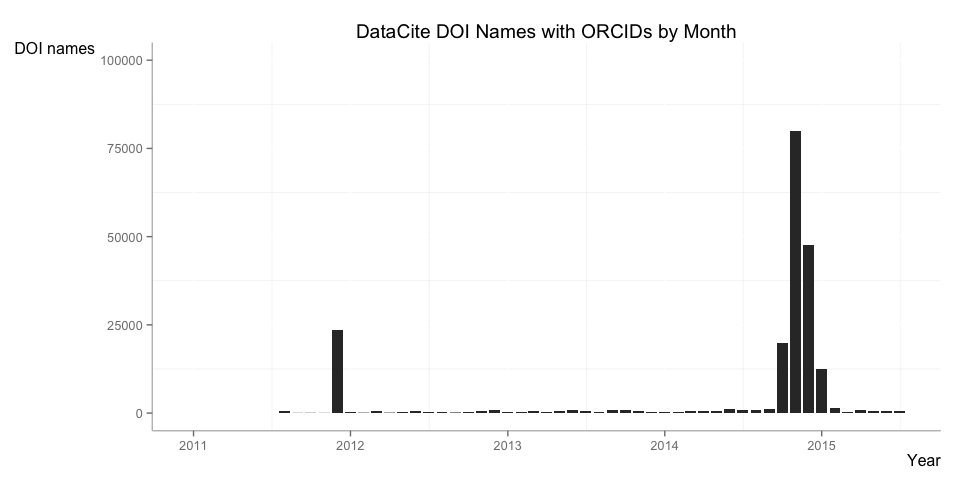
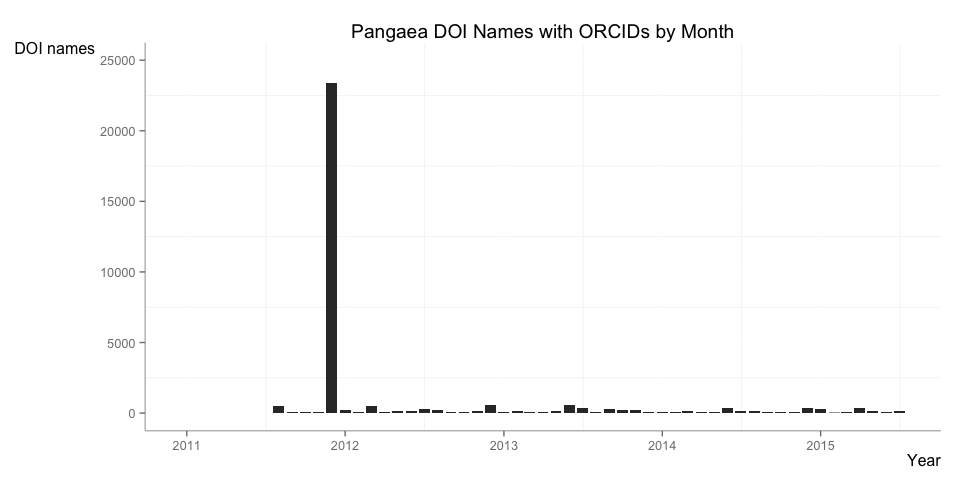
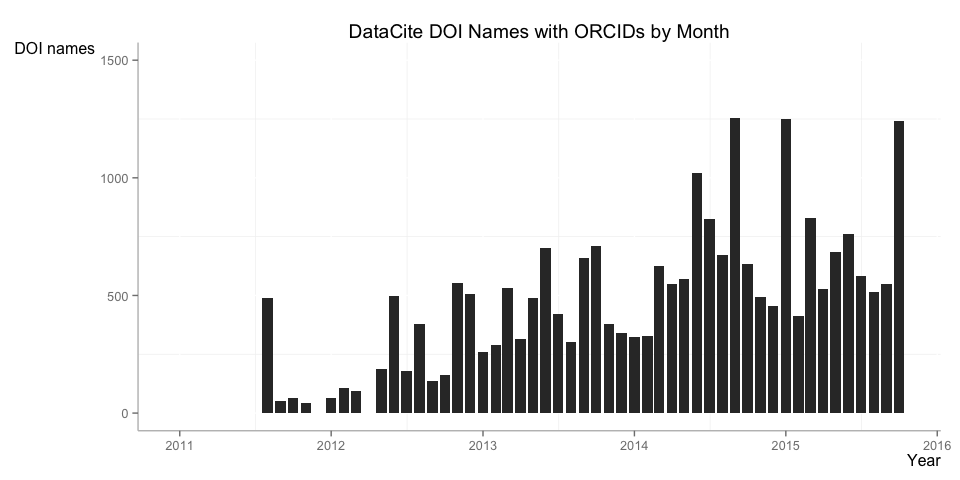
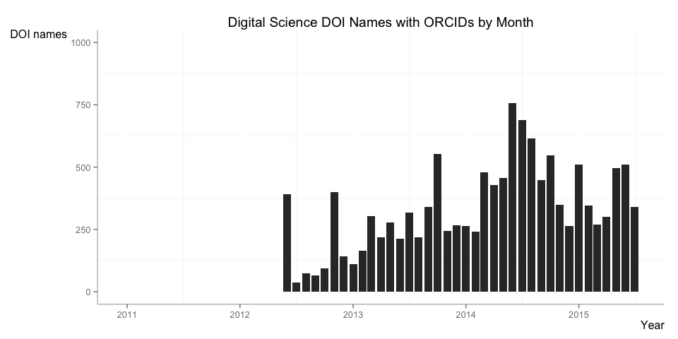

# DataCite DOI Names with ORCIDs


Install the required packages (see [here](https://github.com/ropensci/rdatacite) for more information).


```r
options(stringsAsFactors = FALSE)

# install required packages
# install.packages("lubridate")
# install.packages("ggplot2")
# install.packages("knitr")
# devtools::install_github("ropensci/solr")
# devtools::install_github("ropensci/rdatacite")

library('rdatacite')
library('lubridate')
library('ggplot2')
library('knitr')
```

## DataCite DOI Names with ORCIDs by Month

Show the number of DataCite DOIs with associated ORCIDs created by month. Exclude the current month. First we collect the data from the DataCite API:


```r
last_month <- ceiling_date(now() - months(1), "month")
last_month <- strftime(last_month, "UTC", format = "%FT%TZ")
dois <- dc_facet(q = 'nameIdentifier:ORCID\\:*', facet.date = 'created', facet.date.start = "2011-01-01T00:00:00Z", facet.date.end = last_month, facet.date.gap = "+1MONTH")
dois <- dois$facet_dates$created
dois$date <- as.Date(dois$date)
```

Then we plot the data.


```r
ggplot(dois, aes(x=date, y=value)) +
  ggtitle("DataCite DOI Names with ORCIDs by Month") +
  geom_bar(stat="identity") +
  scale_x_date("Year") +
  scale_y_continuous("DOI names", limits=c(0,100000)) +
  theme(panel.background = element_rect(fill = "white"),
        axis.line = element_line(colour = "grey"),
        axis.title.x = element_text(hjust=1),
        axis.title.y = element_text(angle=0, vjust=1))
```

 

There are two significant peeks, rather than a growing number of claims. The first peak is in December 2011, which is interesting since the ORCID service launched only in October 2012. Let's have a closer look:


```r
dois <- dc_facet(q = "nameIdentifier:ORCID\\:* AND created:[2011-12-01T00:00:00Z TO 2011-12-31T23:59:59Z]",facet.field = 'datacentre_facet', facet.sort = 'count', facet.limit = 5)
dois <- dois$facet_fields$datacentre_facet
kable(dois, format = "markdown")
```


|X1                                                                                  |X2    |
|:-----------------------------------------------------------------------------------|:-----|
|TIB.PANGAEA - PANGAEA - Publishing Network for Geoscientific and Environmental Data |24664 |
|DELFT.DATACENT - 3TU Datacentrum                                                    |14    |
|ANDS.CENTRE-1 - Griffith University                                                 |0     |
|ANDS.CENTRE-2 - CSSE Uni Melbourne                                                  |0     |
|ANDS.CENTRE-3 - Monash University                                                   |0     |

Basically all ORCID links are via the [Pangaea](http://pangaea.de/) data center.


```r
dois <- dc_facet(q = "nameIdentifier:ORCID\\:* AND datacentre_symbol:TIB.PANGAEA", facet.date = 'created', facet.date.start = "2011-01-01T00:00:00Z", facet.date.end = last_month, facet.date.gap = "+1MONTH")
dois <- dois$facet_dates$created
dois$date <- as.Date(dois$date)
```


```r
ggplot(dois, aes(x=date, y=value)) +
  ggtitle("Pangaea DOI Names with ORCIDs by Month") +
  geom_bar(stat="identity") +
  scale_x_date("Year") +
  scale_y_continuous("DOI names", limits=c(0,25000)) +
  theme(panel.background = element_rect(fill = "white"),
        axis.line = element_line(colour = "grey"),
        axis.title.x = element_text(hjust=1),
        axis.title.y = element_text(angle=0, vjust=1))
```

 

December 2011 is clearly special. To understand this, we can look at creator names next.


```r
dois <- dc_facet(q = "nameIdentifier:ORCID\\:* AND created:[2011-12-01T00:00:00Z TO 2011-12-31T23:59:59Z] AND datacentre_symbol:TIB.PANGAEA",facet.field = 'creator_facet', facet.sort = 'count', facet.limit = 5)
dois <- dois$facet_fields$creator_facet
kable(dois, format = "markdown")
```


|X1                 |X2    |
|:------------------|:-----|
|König-Langlo, Gert |14118 |
|Grobe, Hannes      |2905  |
|Thiede, Jörn       |1103  |
|Murray, James W    |1080  |
|Boetius, Antje     |986   |

Ninety-percent of the datasets have a particular author. Let#s look at the second peak at the end of 2014.


```r
dois <- dc_facet(q = "nameIdentifier:ORCID\\:* AND created:[2014-10-01T00:00:00Z TO 2015-01-31T23:59:59Z]",facet.field = 'datacentre_facet', facet.sort = 'count', facet.limit = 5)
dois <- dois$facet_fields$datacentre_facet
kable(dois, format = "markdown")
```


|X1                                                                                  |X2     |
|:-----------------------------------------------------------------------------------|:------|
|BL.IMPERIAL - Imperial College London                                               |157315 |
|CDL.DIGSCI - Digital Science                                                        |1871   |
|TIB.PANGAEA - PANGAEA - Publishing Network for Geoscientific and Environmental Data |782    |
|TIB.WDCC - World Data Center for Climate                                            |48     |
|INIST.ILL - Institut Laue-Langevin                                                  |18     |

Again almost all ORCID links from a single data center. Let's see whether we again have one author in particular.


```r
dois <- dc_facet(q = "nameIdentifier:ORCID\\:* AND created:[2014-10-01T00:00:00Z TO 2015-01-31T23:59:59Z] AND datacentre_symbol:BL.IMPERIAL",facet.field = 'creator_facet', facet.sort = 'count', facet.limit = 7)
dois <- dois$facet_fields$creator_facet
kable(dois, format = "markdown")
```


|X1                                                  |X2     |
|:---------------------------------------------------|:------|
|Andrew McLean                                       |157315 |
|Imperial College High Performance Computing Service |157315 |
|Henry S. Rzepa                                      |156862 |
|James J. P. Stewart                                 |156862 |
|Matthew J. Harvey                                   |156862 |
|Nicholas Mason                                      |156862 |
|Peter Murray-Rust                                   |156862 |

A group of authors (and one organization) are available for all links from Imperial College.

It seems that a handful of researchers are responsible for a large proportion of ORCID identifiers in the DataCite Metadata Store. Let's exlude these two (positive!) outliers (and ignore the December 2011 peak at Pangaea).


```r
last_month <- ceiling_date(now() - months(1), "month")
last_month <- strftime(last_month, "UTC", format = "%FT%TZ")
dois <- dc_facet(q = 'nameIdentifier:ORCID\\:* -nameIdentifier:ORCID\\:0000-0002-8635-8390 -nameIdentifier:ORCID\\:0000-0002-6100-4107', facet.date = 'created', facet.date.start = "2011-01-01T00:00:00Z", facet.date.end = last_month, facet.date.gap = "+1MONTH")
dois <- dois$facet_dates$created
dois$date <- as.Date(dois$date)
```


```r
ggplot(dois, aes(x=date, y=value)) +
  ggtitle("DataCite DOI Names with ORCIDs by Month") +
  geom_bar(stat="identity") +
  scale_x_date("Year") +
  scale_y_continuous("DOI names", limits=c(0,1500)) +
  theme(panel.background = element_rect(fill = "white"),
        axis.line = element_line(colour = "grey"),
        axis.title.x = element_text(hjust=1),
        axis.title.y = element_text(angle=0, vjust=1))
```

 

This distribution looks more organic. The number of DOI names with ORCIDs in the metadata is around 500 per month, or a rather small proportion of the total number of DOIs registered every month (more details [here](../overview.md)). What are the data centers?


```r
dois <- dc_facet(q = "nameIdentifier:ORCID\\:* -nameIdentifier:ORCID\\:0000-0002-8635-8390 -nameIdentifier:ORCID\\:0000-0002-6100-4107",facet.field = 'datacentre_facet', facet.sort = 'count', facet.limit = 5)
dois <- dois$facet_fields$datacentre_facet
kable(dois, format = "markdown")
```


|X1                                                                                  |X2    |
|:-----------------------------------------------------------------------------------|:-----|
|TIB.PANGAEA - PANGAEA - Publishing Network for Geoscientific and Environmental Data |17520 |
|CDL.DIGSCI - Digital Science                                                        |14407 |
|DELFT.DATACENT - 3TU Datacentrum                                                    |2792  |
|CDL.UCDIRL - University College Dublin                                              |748   |
|BL.IMPERIAL - Imperial College London                                               |519   |

Besides Pangaea that we already talked about earlier, almost all other ORCID links come from Digital Science DOIs, i.e. [Figshare](http://figshare.com/). What does the distribution of Figshare DOIs over time look like?


```r
last_month <- ceiling_date(now() - months(1), "month")
last_month <- strftime(last_month, "UTC", format = "%FT%TZ")
dois <- dc_facet(q = 'nameIdentifier:ORCID\\:* AND datacentre_symbol:CDL.DIGSCI -nameIdentifier:ORCID\\:0000-0002-8635-8390 -nameIdentifier:ORCID\\:0000-0002-6100-4107', facet.date = 'created', facet.date.start = "2011-01-01T00:00:00Z", facet.date.end = last_month, facet.date.gap = "+1MONTH")
dois <- dois$facet_dates$created
dois$date <- as.Date(dois$date)
```


```r
ggplot(dois, aes(x=date, y=value)) +
  ggtitle("Digital Science DOI Names with ORCIDs by Month") +
  geom_bar(stat="identity") +
  scale_x_date("Year") +
  scale_y_continuous("DOI names", limits=c(0,1000)) +
  theme(panel.background = element_rect(fill = "white"),
        axis.line = element_line(colour = "grey"),
        axis.title.x = element_text(hjust=1),
        axis.title.y = element_text(angle=0, vjust=1))
```

 

In summary, a small number of researchers is responsible for the vast amount of ORCIDs found in DataCite DOI names, plus two data centers (Pangaea and Digital Science/Figshare) have added ORCID linking to their DOI registration workflows on a large scale. There is still a lot of work to do, and we can learn from these individuals and data centers.
