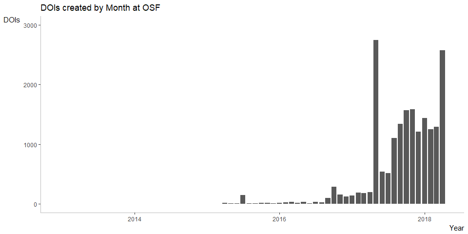
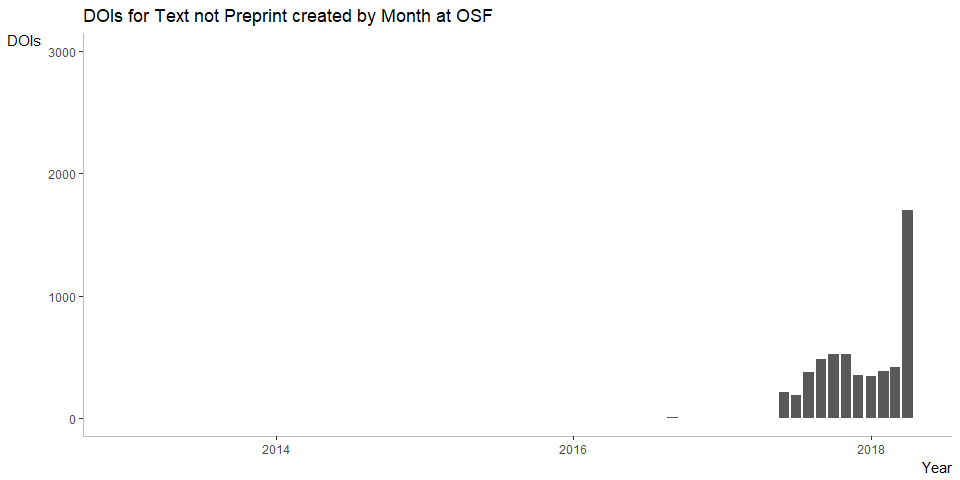

DataCite recently examined the DOIs that have been created for software (see https://doi.org/10.5438/1nmy-9902)
I have used the [R code provided](https://github.com/datacite/metadata-reports/blob/master/software/index.md) to examine the DOIs that have been created for preprints

The number of new DOIs created with 'Preprint' as resource type is growing rapidly, now reaching about 2000 preprint DOIs per month, with some spikes of around 4000 per month in some of 2017. However, the total number of DOIs registered at OSF with this resource type is less than the number of preprints hosted at OSF, raising the question whether all preprints are consistently assigned this resource type, or whether preprints only started to be added as a resource type 

The data and results are shown here, as follows:


Install the required packages (see [here](https://github.com/ropensci/rdatacite) for more information).

NB Compared to the original script, I also had to install the curl package before getting the ropensci package to work. 
I also installed all packages from cran. 

```r
options(stringsAsFactors = FALSE)

# install required packages
# install.packages("lubridate")
# install.packages("ggplot2")
# install.packages("knitr")
# install.packages("curl")
# install.packages("rdatacite")
# install.packages("solr")

library('lubridate')
library('ggplot2')
library('knitr')
library('curl')
library('rdatacite')
```

How many DOIs for preprints have been registered so far, and where?


```r
dois <- dc_facet(q = "resourceType:Preprint AND created:[2013-01-01T00:00:00Z TO 2018-03-08T23:59:59Z]",facet.field = 'datacentre_facet', facet.sort = 'count', facet.limit = 10)
dois <- dois$facet_fields$datacentre_facet
kable(dois, format = "markdown")
```

|term                                                    |value |
|:-------------------------------------------------------|:-----|
|CDL.COS - Open Science Framework                        |9027  |
|RG.RG - ResearchGate                                    |3221  |
|CERN.ZENODO - ZENODO - Research. Shared.                |501   |
|TIB.MFO - Mathematisches Forschungsinstitut Oberwolfach |267   |
|TIB.SULBDOI - Universität des Saarlandes                |238   |
|TIB.TUDO - Technische Universität Dortmund              |195   |
|FIGSHARE.ARS - figshare Academic Research System        |189   |
|GESIS.UBHD - University Library Heidelberg              |71    |
|TIB.UBS - Universitaetsbibliothek Stuttgart             |55    |
|SND.SU - Stockholm University                           |40    |


How did these numbers change over time?

```r
last_month <- ceiling_date(now() - months(1), "month")
last_month <- strftime(last_month, "UTC", format = "%FT%TZ")
dois <- dc_facet(q = 'resourceType:Preprint', facet.date = 'created', facet.date.start = "2013-01-01T00:00:00Z", facet.date.end = last_month, facet.date.gap = "+1MONTH")
dois <- dois$facet_dates$created
dois$date <- as.Date(dois$date)
```


```r
ggplot(dois, aes(x=date, y=value)) +
  ggtitle("DOIs for Preprint created by Month") +
  geom_bar(stat="identity") + 
  scale_x_date("Year") +
  scale_y_continuous("DOIs", limits=c(0,3000)) +
  theme(panel.background = element_rect(fill = "white"),
        axis.line = element_line(colour = "grey"),
        axis.title.x = element_text(hjust=1),
        axis.title.y = element_text(angle=0, vjust=1))
```

<!-- -->


## OSF

Most of these DOIs for software are registered by OSF (COS). 


```r
last_month <- ceiling_date(now() - months(1), "month")
last_month <- strftime(last_month, "UTC", format = "%FT%TZ")
dois <- dc_facet(q = 'datacentre_symbol:CDL.COS AND resourceType:Preprint', facet.date = 'created', facet.date.start = "2013-01-01T00:00:00Z", facet.date.end = last_month, facet.date.gap = "+1MONTH")
dois <- dois$facet_dates$created
dois$date <- as.Date(dois$date)
```


```r
ggplot(dois, aes(x=date, y=value)) +
  ggtitle("DOIs for Preprint created by Month at OSF") +
  geom_bar(stat="identity") + 
  scale_x_date("Year") +
  scale_y_continuous("DOIs", limits=c(0,3000)) +
  theme(panel.background = element_rect(fill = "white"),
        axis.line = element_line(colour = "grey"),
        axis.title.x = element_text(hjust=1),
        axis.title.y = element_text(angle=0, vjust=1)) 
  ggsave("datacite_preprints_OSF_plot.png") 
```

<!-- -->

What happened with DOI registration for software outside of Zenodo? For example Figshare and Bioconductor?


```r
last_month <- ceiling_date(now() - months(1), "month")
last_month <- strftime(last_month, "UTC", format = "%FT%TZ")
dois <- dc_facet(q = 'datacentre_symbol:FIGSHARE.ARS AND resourceTypeGeneral:Software', facet.date = 'created', facet.date.start = "2011-01-01T00:00:00Z", facet.date.end = last_month, facet.date.gap = "+1MONTH")
dois <- dois$facet_dates$created
dois$date <- as.Date(dois$date)
```


```r
ggplot(dois, aes(x=date, y=value)) +
  ggtitle("DOIs for Software created by Month at Figshare") +
  geom_bar(stat="identity") + 
  scale_x_date("Year") +
  scale_y_continuous("DOI names", limits=c(0,5000)) +
  theme(panel.background = element_rect(fill = "white"),
        axis.line = element_line(colour = "grey"),
        axis.title.x = element_text(hjust=1),
        axis.title.y = element_text(angle=0, vjust=1)) 
```

<!-- -->


```r
last_month <- ceiling_date(now() - months(1), "month")
last_month <- strftime(last_month, "UTC", format = "%FT%TZ")
dois <- dc_facet(q = 'datacentre_symbol:PURDUE.NCIB AND resourceTypeGeneral:Software', facet.date = 'created', facet.date.start = "2011-01-01T00:00:00Z", facet.date.end = last_month, facet.date.gap = "+1MONTH")
dois <- dois$facet_dates$created
dois$date <- as.Date(dois$date)
```


```r
ggplot(dois, aes(x=date, y=value)) +
  ggtitle("DOIs for Software created by Month at Bioconductor") +
  geom_bar(stat="identity") + 
  scale_x_date("Year") +
  scale_y_continuous("DOI names", limits=c(0,5000)) +
  theme(panel.background = element_rect(fill = "white"),
        axis.line = element_line(colour = "grey"),
        axis.title.x = element_text(hjust=1),
        axis.title.y = element_text(angle=0, vjust=1)) 
```

<!-- -->

And who was the first registering software using DOIs? We can look at who registered DOIs for software before 2014:


```r
dois <- dc_facet(q = "resourceTypeGeneral:Software AND !datacentre_symbol:CERN.ZENODO AND created:[2011-01-01T00:00:00Z TO 2013-12-31T23:59:59Z]",facet.field = 'datacentre_facet', facet.sort = 'count', facet.limit = 10)
dois <- dois$facet_fields$datacentre_facet
kable(dois, format = "markdown")
```


|term                                                              |value |
|:-----------------------------------------------------------------|:-----|
|PURDUE.EZID - Purdue University                                   |1319  |
|CERN.ZENODO - ZENODO - Research. Shared.                          |14    |
|FIGSHARE.ARS - figshare Academic Research System                  |10    |
|CDL.UCLAEEB - UCLA Department of Ecology and Evolutionary Biology |4     |
|CDL.USGS - USGS Core Science Analytics and Synthesis (CSAS)       |3     |
|BL.STFC - Science and Technology Facilities Council               |2     |
|TIB.IPK - IPK Gatersleben                                         |2     |
|CDL.NCAR - National Center for Atmospheric Research (NCAR)        |1     |
|CDL.UWL - University of Washington                                |1     |
|DK.AAU - Aalborg University Library                               |1     |


This is clearly Purdue, specifically [nanoHUB](https://nanohub.org/).

And what is the first DOI for software registered by DataCite? 

https://api.datacite.org/works?resource-type-id=software&sort=registered&order=asc&page[size]=1

This DOI was registered September 7th, 2011 by the Leibniz Institute of Plant Genetics and Crop Plant Research (IPK) in Germany: 

Colmsee, C., Flemming, S., Klapperstück, M., Lange, M., & Scholz, U. (2011). A case study for efficient management of high throughput primary lab data. Leibniz Institute of Plant Genetics and Crop Plant Research (IPK), Seeland OT Gatersleben, Corrensstraße 3, 06466, Germany. https://doi.org/10.5447/ipk/2011/0
