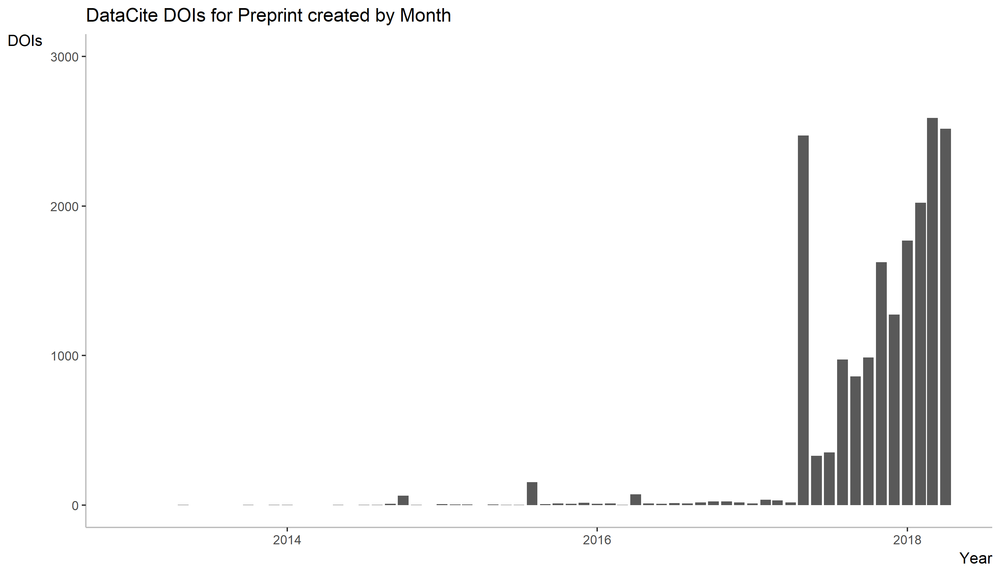
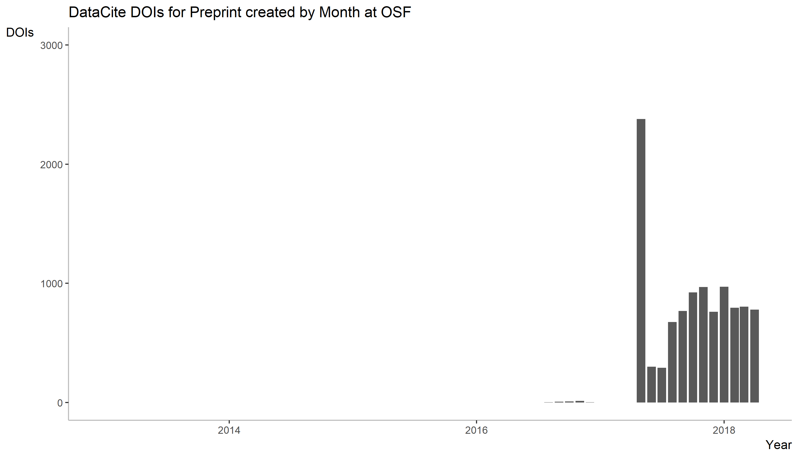
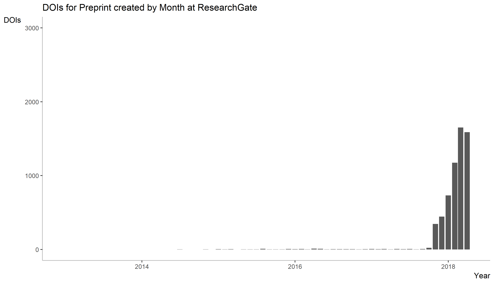

DataCite recently examined the DOIs that have been created for software (see https://doi.org/10.5438/1nmy-9902)
I have used the [R code provided](https://github.com/datacite/metadata-reports/blob/master/software/index.md) to examine the DOIs that have been created for preprints

The number of new DOIs created with 'Preprint' as resource type is growing rapidly, now reaching about 2500 preprint DOIs per month.

However, the total number of DOIs registered at OSF with this resource type (9027 on May 17, 2018) is less than the number of preprints hosted at OSF (11523 on May 17, 2018). 

This raises the question whether all preprints are currently consistently assigned this resource type, and/or whether this resource type only became official a while after launch of the first OSF preprint servers in the fall of 2016. 

The data and results are shown here, as follows:


Install the required packages (see [here](https://github.com/ropensci/rdatacite) for more information).

NB Compared to the original script, I also had to install the curl package before getting the ropensci package to work. 
I also installed all packages from cran. 

```r
options(stringsAsFactors = FALSE)

# install required packages
# install.packages("lubridate")
# install.packages("ggplot2")
# install.packages("knitr")
# install.packages("curl")
# install.packages("rdatacite")
# install.packages("solr")

library('lubridate')
library('ggplot2')
library('knitr')
library('curl')
library('rdatacite')
```

How many DOIs for preprints have been registered so far, and where?


```r
dois <- dc_facet(q = "resourceType:Preprint AND created:[2013-01-01T00:00:00Z TO 2018-03-08T23:59:59Z]",facet.field = 'datacentre_facet', facet.sort = 'count', facet.limit = 10)
dois <- dois$facet_fields$datacentre_facet
kable(dois, format = "markdown")
```

|term                                                    |value |
|:-------------------------------------------------------|:-----|
|CDL.COS - Open Science Framework                        |9027  |
|RG.RG - ResearchGate                                    |3221  |
|CERN.ZENODO - ZENODO - Research. Shared.                |501   |
|TIB.MFO - Mathematisches Forschungsinstitut Oberwolfach |267   |
|TIB.SULBDOI - Universität des Saarlandes                |238   |
|TIB.TUDO - Technische Universität Dortmund              |195   |
|FIGSHARE.ARS - figshare Academic Research System        |189   |
|GESIS.UBHD - University Library Heidelberg              |71    |
|TIB.UBS - Universitaetsbibliothek Stuttgart             |55    |
|SND.SU - Stockholm University                           |40    |


How did these numbers change over time?

```r
last_month <- ceiling_date(now() - months(1), "month")
last_month <- strftime(last_month, "UTC", format = "%FT%TZ")
dois <- dc_facet(q = 'resourceType:Preprint', facet.date = 'created', facet.date.start = "2013-01-01T00:00:00Z", facet.date.end = last_month, facet.date.gap = "+1MONTH")
dois <- dois$facet_dates$created
dois$date <- as.Date(dois$date)
```


```r
ggplot(dois, aes(x=date, y=value)) +
  ggtitle("DOIs for Preprint created by Month") +
  geom_bar(stat="identity") + 
  scale_x_date("Year") +
  scale_y_continuous("DOIs", limits=c(0,3000)) +
  theme(panel.background = element_rect(fill = "white"),
        axis.line = element_line(colour = "grey"),
        axis.title.x = element_text(hjust=1),
        axis.title.y = element_text(angle=0, vjust=1))
```

<!-- -->


## OSF


Most of these DOIs for software are registered by OSF (COS). 


```r
last_month <- ceiling_date(now() - months(1), "month")
last_month <- strftime(last_month, "UTC", format = "%FT%TZ")
dois <- dc_facet(q = 'datacentre_symbol:CDL.COS AND resourceType:Preprint', facet.date = 'created', facet.date.start = "2013-01-01T00:00:00Z", facet.date.end = last_month, facet.date.gap = "+1MONTH")
dois <- dois$facet_dates$created
dois$date <- as.Date(dois$date)
```


```r
ggplot(dois, aes(x=date, y=value)) +
  ggtitle("DOIs for Preprint created by Month at OSF") +
  geom_bar(stat="identity") + 
  scale_x_date("Year") +
  scale_y_continuous("DOIs", limits=c(0,3000)) +
  theme(panel.background = element_rect(fill = "white"),
        axis.line = element_line(colour = "grey"),
        axis.title.x = element_text(hjust=1),
        axis.title.y = element_text(angle=0, vjust=1)) 
  ggsave("datacite_preprints_OSF_plot.png") 
```

<!-- -->

The large peak in December 2017 (also observed in the overall figure) is almost completely attributable to OSF.
*Still to do: plot overall DOIs for OSF (or only for ResourceTypeGeneral:Text) and compare*


## ResearchGate

What happened with DOI registration for preprints outside of OSF? For example at ResearchGate?

```r
last_month <- ceiling_date(now() - months(1), "month")
last_month <- strftime(last_month, "UTC", format = "%FT%TZ")
dois <- dc_facet(q = 'datacentre_symbol:RG.RG AND resourceType:Preprint', facet.date = 'created', facet.date.start = "2013-01-01T00:00:00Z", facet.date.end = last_month, facet.date.gap = "+1MONTH")
dois <- dois$facet_dates$created
dois$date <- as.Date(dois$date)
```


```r
ggplot(dois, aes(x=date, y=value)) +
  ggtitle("DOIs for Preprint created by Month at ResearchGate") +
  geom_bar(stat="identity") + 
  scale_x_date("Year") +
  scale_y_continuous("DOIs", limits=c(0,3000)) +
  theme(panel.background = element_rect(fill = "white"),
        axis.line = element_line(colour = "grey"),
        axis.title.x = element_text(hjust=1),
        axis.title.y = element_text(angle=0, vjust=1)) 
  ggsave("datacite_preprints_RG_plot.png") 
```

<!-- -->
