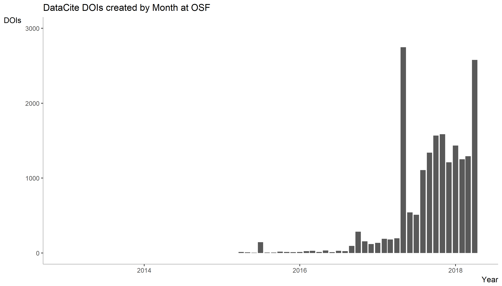
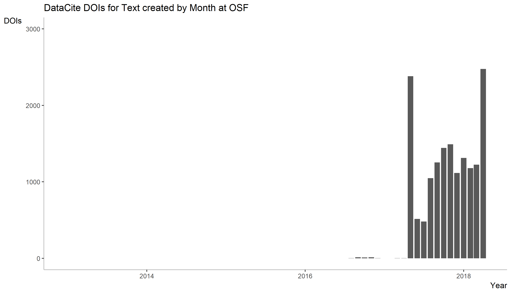
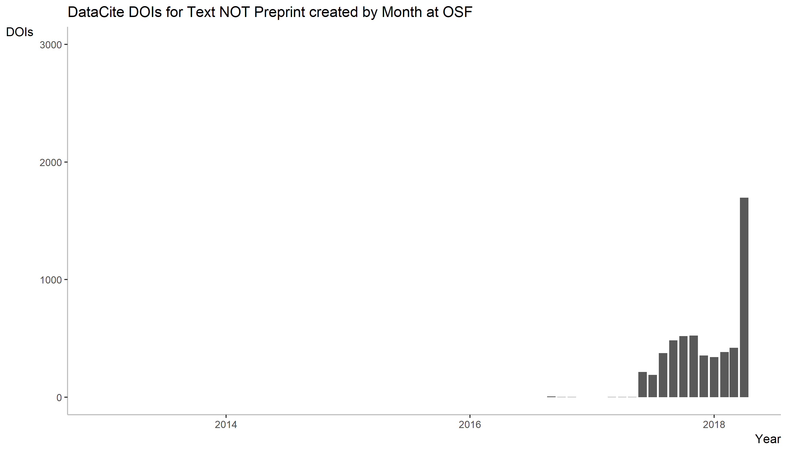

# DataCite DOIs for preprints

DataCite recently examined the DOIs that have been created for software (see https://doi.org/10.5438/1nmy-9902).
I have used the [R code provided](https://github.com/datacite/metadata-reports/blob/master/software/index.md) to examine the DOIs that have been created for preprints. Data collection was done on May 17-18, 2018. 

The number of new DOIs created with 'Preprint' as resource type is growing rapidly, now reaching about 2500 preprint DOIs per month, most of them from OSF. 

As the DataCite metadata field resourceType is a free-text field (so not based on controlled vocabulary), the reliability of these data is dependent on term usage across organizations registering preprints, and the consistency of term use within each organization. 

The data and results are shown here, as follows:  


Install the required packages (see [here](https://github.com/ropensci/rdatacite) for more information).

NB Compared to the original script, I also had to install the curl package before getting the ropensci package to work. 
I also installed all packages from cran. 

```r
options(stringsAsFactors = FALSE)

# install required packages
# install.packages("lubridate")
# install.packages("ggplot2")
# install.packages("knitr")
# install.packages("curl")
# install.packages("rdatacite")
# install.packages("solr")

library('lubridate')
library('ggplot2')
library('knitr')
library('curl')
library('rdatacite')
```

How many DOIs for preprints have been registered so far, and where?


```r
dois <- dc_facet(q = "resourceType:Preprint AND created:[2013-01-01T00:00:00Z TO 2018-03-08T23:59:59Z]",facet.field = 'datacentre_facet', facet.sort = 'count', facet.limit = 10)
dois <- dois$facet_fields$datacentre_facet
kable(dois, format = "markdown")
```

|term                                                    |value |
|:-------------------------------------------------------|:-----|
|CDL.COS - Open Science Framework                        |9027  |
|RG.RG - ResearchGate                                    |3221  |
|CERN.ZENODO - ZENODO - Research. Shared.                |501   |
|TIB.MFO - Mathematisches Forschungsinstitut Oberwolfach |267   |
|TIB.SULBDOI - Universität des Saarlandes                |238   |
|TIB.TUDO - Technische Universität Dortmund              |195   |
|FIGSHARE.ARS - figshare Academic Research System        |189   |
|GESIS.UBHD - University Library Heidelberg              |71    |
|TIB.UBS - Universitaetsbibliothek Stuttgart             |55    |
|SND.SU - Stockholm University                           |40    |


How did these numbers change over time?

```r
last_month <- ceiling_date(now() - months(1), "month")
last_month <- strftime(last_month, "UTC", format = "%FT%TZ")
dois <- dc_facet(q = 'resourceType:Preprint', facet.date = 'created', facet.date.start = "2013-01-01T00:00:00Z", facet.date.end = last_month, facet.date.gap = "+1MONTH")
dois <- dois$facet_dates$created
dois$date <- as.Date(dois$date)
```


```r
ggplot(dois, aes(x=date, y=value)) +
  ggtitle("DOIs for Preprint created by Month") +
  geom_bar(stat="identity") + 
  scale_x_date("Year") +
  scale_y_continuous("DOIs", limits=c(0,3000)) +
  theme(panel.background = element_rect(fill = "white"),
        axis.line = element_line(colour = "grey"),
        axis.title.x = element_text(hjust=1),
        axis.title.y = element_text(angle=0, vjust=1))
```

<!-- -->


## OSF


Most of these DOIs for preprints are registered by OSF (COS). 


```r
last_month <- ceiling_date(now() - months(1), "month")
last_month <- strftime(last_month, "UTC", format = "%FT%TZ")
dois <- dc_facet(q = 'datacentre_symbol:CDL.COS AND resourceType:Preprint', facet.date = 'created', facet.date.start = "2013-01-01T00:00:00Z", facet.date.end = last_month, facet.date.gap = "+1MONTH")
dois <- dois$facet_dates$created
dois$date <- as.Date(dois$date)
```


```r
ggplot(dois, aes(x=date, y=value)) +
  ggtitle("DOIs for Preprint created by Month at OSF") +
  geom_bar(stat="identity") + 
  scale_x_date("Year") +
  scale_y_continuous("DOIs", limits=c(0,3000)) +
  theme(panel.background = element_rect(fill = "white"),
        axis.line = element_line(colour = "grey"),
        axis.title.x = element_text(hjust=1),
        axis.title.y = element_text(angle=0, vjust=1)) 
  ggsave("datacite_preprints_OSF_plot.png") 
```

<!-- -->

The large peak in May 2017 observed in the figure for preprint DOIs overall is almost completely attributable to OSF. This peak likely indicates that OSF only started to register DOI's for preprints at this time, including all preprints published since launching their first preprint servers in fall 2016. 

This is corroborated by comparing the plots for overall number of DOIs from OSF an number of DOIs for text from OSF. 
Prior to May 2017, OSF was already issuing DOIs for other entities, most likely projects, but registration of text documents was virtually non-existent until that time.  

```r
# alternative query lines to use in script:
# all OSF DOIs
dois <- dc_facet(q = 'datacentre_symbol:CDL.COS', facet.date = 'created', facet.date.start = "2013-01-01T00:00:00Z", facet.date.end = last_month, facet.date.gap = "+1MONTH")
# all OSF DOIs for text
dois <- dc_facet(q = 'datacentre_symbol:CDL.COS AND resourceTypeGeneral:Text', facet.date = 'created', facet.date.start = "2013-01-01T00:00:00Z", facet.date.end = last_month, facet.date.gap = "+1MONTH")
```

<!-- -->
<!-- -->

Interestingly, there is a peak in OSF for text material in May 2018 (see figure below) that is not labeled as preprint in the metadata. For the months between June 2017-April 2018 there is also a considerable number of text documents not labeled as preprints. Whether either of these are responsible for the discrepancy between the total number of preprints on all OSF preprint servers as listed on [OSF Preprint Search](https://osf.io/preprints/discover) (11523 on May 17, 2018) and the number of DataCite DOIs for preprints from OSF (9027 on May 17, 2018), for instance because of inconsistent use of metadata, remains to be investigated.  

```r
# alternative query line to use in script:
# all OSF DOIs for text excluding preprints
dois <- dc_facet(q = 'datacentre_symbol:CDL.COS AND resourceTypeGeneral:Text NOT resourceType:Preprint', facet.date = 'created', facet.date.start = "2013-01-01T00:00:00Z", facet.date.end = last_month, facet.date.gap = "+1MONTH")
```

<!-- --> 

## ResearchGate

What happened with DOI registration for preprints outside of OSF? For example at ResearchGate?

```r
last_month <- ceiling_date(now() - months(1), "month")
last_month <- strftime(last_month, "UTC", format = "%FT%TZ")
dois <- dc_facet(q = 'datacentre_symbol:RG.RG AND resourceType:Preprint', facet.date = 'created', facet.date.start = "2013-01-01T00:00:00Z", facet.date.end = last_month, facet.date.gap = "+1MONTH")
dois <- dois$facet_dates$created
dois$date <- as.Date(dois$date)
```


```r
ggplot(dois, aes(x=date, y=value)) +
  ggtitle("DOIs for Preprint created by Month at ResearchGate") +
  geom_bar(stat="identity") + 
  scale_x_date("Year") +
  scale_y_continuous("DOIs", limits=c(0,3000)) +
  theme(panel.background = element_rect(fill = "white"),
        axis.line = element_line(colour = "grey"),
        axis.title.x = element_text(hjust=1),
        axis.title.y = element_text(angle=0, vjust=1)) 
  ggsave("datacite_preprints_RG_plot.png") 
```

<!-- -->
