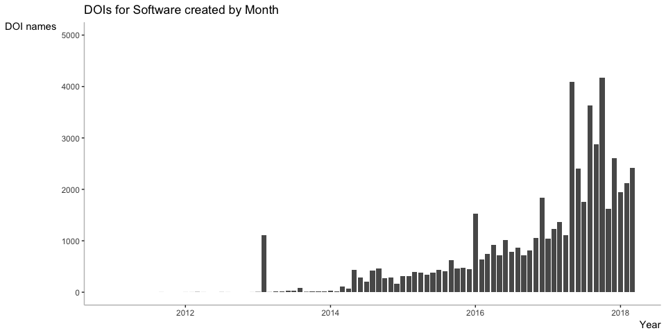
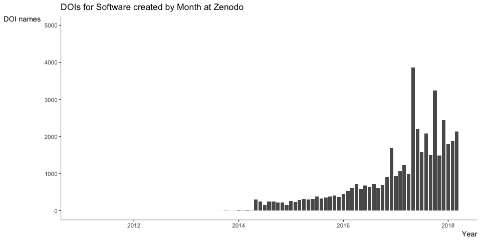
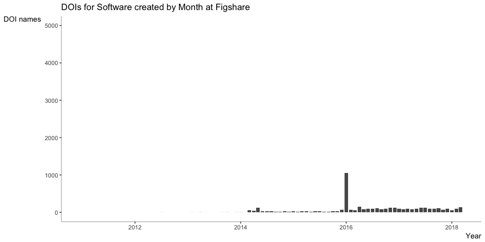
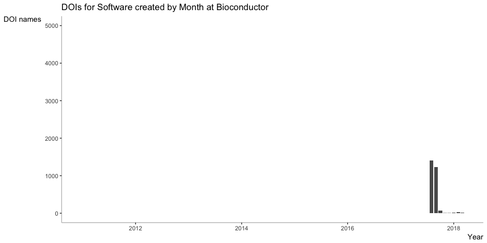

We know that software is important in research, and some of the scholarly communications community, for example, [in FORCE11](https://www.force11.org/group/software-citation-implementation-working-group), has been pushing the concept of software citations as a method to allow software developers and maintainers to get academic credit for their work: software releases are published and assigned DOIs, and software users then cite these releases when they publish research that uses the software.

DataCite recently examined the DOIs that have been created for software, and found that the number of new DOIs created for software is growing roughly exponentially, now reaching about 2000 software DOIs per month, with some spikes of around 4000 per month in some of 2017. The data and results are shown here, as follows:


Install the required packages (see [here](https://github.com/ropensci/rdatacite) for more information).


```r
options(stringsAsFactors = FALSE)

# install required packages
# install.packages("lubridate")
# install.packages("ggplot2")
# install.packages("knitr")
# devtools::install_github("ropensci/solr")
# devtools::install_github("ropensci/rdatacite")

library('rdatacite')
library('lubridate')
library('ggplot2')
library('knitr')
```

How many DOIs for software have been registered so far, and where?


```r
dois <- dc_facet(q = "resourceTypeGeneral:Software AND !datacentre_symbol:CERN.ZENODO AND created:[2011-01-01T00:00:00Z TO 2018-03-08T23:59:59Z]",facet.field = 'datacentre_facet', facet.sort = 'count', facet.limit = 10)
dois <- dois$facet_fields$datacentre_facet
kable(dois, format = "markdown")
```


|term                                                                                       |value |
|:------------------------------------------------------------------------------------------|:-----|
|CERN.ZENODO - ZENODO - Research. Shared.                                                   |41346 |
|FIGSHARE.ARS - figshare Academic Research System                                           |4226  |
|PURDUE.NCIB - National Cancer Institute, Bioconductor                                      |2769  |
|PURDUE.EZID - Purdue University                                                            |2463  |
|OSTI.DOE - DOE Generic                                                                     |736   |
|INIST.INRA - Institut National de Recherche Agronomique                                    |223   |
|OCEAN.OCEAN - Code Ocean                                                                   |206   |
|CRUI.INFNCNAF - Istituto Nazionale di Fisica Nucleare. Centro Nazionale Analisi Fotogrammi |190   |
|CDL.UCI - UC Irvine Library                                                                |120   |
|ETHZ.DA-RD - ETHZ Data Archive - Research Data                                             |88    |

Most DOIs for software have been registered at Zenodo. How did these numbers change over time?

We can start by looking at the [Zenodo/Github integration](https://guides.github.com/activities/citable-code/), where users can archive a Github repository in the Zenodo data repository. 


```r
last_month <- ceiling_date(now() - months(1), "month")
last_month <- strftime(last_month, "UTC", format = "%FT%TZ")
dois <- dc_facet(q = 'resourceTypeGeneral:Software', facet.date = 'created', facet.date.start = "2011-01-01T00:00:00Z", facet.date.end = last_month, facet.date.gap = "+1MONTH")
dois <- dois$facet_dates$created
dois$date <- as.Date(dois$date)
```


```r
ggplot(dois, aes(x=date, y=value)) +
  ggtitle("DOIs for Software created by Month") +
  geom_bar(stat="identity") + 
  scale_x_date("Year") +
  scale_y_continuous("DOI names", limits=c(0,5000)) +
  theme(panel.background = element_rect(fill = "white"),
        axis.line = element_line(colour = "grey"),
        axis.title.x = element_text(hjust=1),
        axis.title.y = element_text(angle=0, vjust=1)) 
```

<!-- -->

The integration was launched in February 2014 and we can see a nice correlation with this data, and with a [May 2014 blog post](https://github.com/blog/1840-improving-github-for-science) by Arfon Smith on the Github blog, describing (and advertizing) the integration work.

Also, in late 2016, the [FORCE11 Software Citation Principles](https://doi.org/10.7717/peerj-cs.86) were published (Sept. 2016), and the [GitHub Guide to Making your Code Citable](https://guides.github.com/activities/citable-code/) was updated (Oct. 2016).  There appears to be a change of in the rate of growth around this time as well.


## Zenodo

Most of these DOIs for software are registered by Zenodo. 


```r
last_month <- ceiling_date(now() - months(1), "month")
last_month <- strftime(last_month, "UTC", format = "%FT%TZ")
dois <- dc_facet(q = 'datacentre_symbol:CERN.ZENODO AND resourceTypeGeneral:Software', facet.date = 'created', facet.date.start = "2011-01-01T00:00:00Z", facet.date.end = last_month, facet.date.gap = "+1MONTH")
dois <- dois$facet_dates$created
dois$date <- as.Date(dois$date)
```


```r
ggplot(dois, aes(x=date, y=value)) +
  ggtitle("DOIs for Software created by Month at Zenodo") +
  geom_bar(stat="identity") + 
  scale_x_date("Year") +
  scale_y_continuous("DOI names", limits=c(0,5000)) +
  theme(panel.background = element_rect(fill = "white"),
        axis.line = element_line(colour = "grey"),
        axis.title.x = element_text(hjust=1),
        axis.title.y = element_text(angle=0, vjust=1)) 
```

<!-- -->

What happened with DOI registration for software outside of Zenodo? For example Figshare and Bioconductor?


```r
last_month <- ceiling_date(now() - months(1), "month")
last_month <- strftime(last_month, "UTC", format = "%FT%TZ")
dois <- dc_facet(q = 'datacentre_symbol:FIGSHARE.ARS AND resourceTypeGeneral:Software', facet.date = 'created', facet.date.start = "2011-01-01T00:00:00Z", facet.date.end = last_month, facet.date.gap = "+1MONTH")
dois <- dois$facet_dates$created
dois$date <- as.Date(dois$date)
```


```r
ggplot(dois, aes(x=date, y=value)) +
  ggtitle("DOIs for Software created by Month at Figshare") +
  geom_bar(stat="identity") + 
  scale_x_date("Year") +
  scale_y_continuous("DOI names", limits=c(0,5000)) +
  theme(panel.background = element_rect(fill = "white"),
        axis.line = element_line(colour = "grey"),
        axis.title.x = element_text(hjust=1),
        axis.title.y = element_text(angle=0, vjust=1)) 
```

<!-- -->


```r
last_month <- ceiling_date(now() - months(1), "month")
last_month <- strftime(last_month, "UTC", format = "%FT%TZ")
dois <- dc_facet(q = 'datacentre_symbol:PURDUE.NCIB AND resourceTypeGeneral:Software', facet.date = 'created', facet.date.start = "2011-01-01T00:00:00Z", facet.date.end = last_month, facet.date.gap = "+1MONTH")
dois <- dois$facet_dates$created
dois$date <- as.Date(dois$date)
```


```r
ggplot(dois, aes(x=date, y=value)) +
  ggtitle("DOIs for Software created by Month at Bioconductor") +
  geom_bar(stat="identity") + 
  scale_x_date("Year") +
  scale_y_continuous("DOI names", limits=c(0,5000)) +
  theme(panel.background = element_rect(fill = "white"),
        axis.line = element_line(colour = "grey"),
        axis.title.x = element_text(hjust=1),
        axis.title.y = element_text(angle=0, vjust=1)) 
```

<!-- -->

And who was the first registering software using DOIs? We can look at who registered DOIs for software before 2014:


```r
dois <- dc_facet(q = "resourceTypeGeneral:Software AND !datacentre_symbol:CERN.ZENODO AND created:[2011-01-01T00:00:00Z TO 2013-12-31T23:59:59Z]",facet.field = 'datacentre_facet', facet.sort = 'count', facet.limit = 10)
dois <- dois$facet_fields$datacentre_facet
kable(dois, format = "markdown")
```


|term                                                              |value |
|:-----------------------------------------------------------------|:-----|
|PURDUE.EZID - Purdue University                                   |1319  |
|CERN.ZENODO - ZENODO - Research. Shared.                          |14    |
|FIGSHARE.ARS - figshare Academic Research System                  |10    |
|CDL.UCLAEEB - UCLA Department of Ecology and Evolutionary Biology |4     |
|CDL.USGS - USGS Core Science Analytics and Synthesis (CSAS)       |3     |
|BL.STFC - Science and Technology Facilities Council               |2     |
|TIB.IPK - IPK Gatersleben                                         |2     |
|CDL.NCAR - National Center for Atmospheric Research (NCAR)        |1     |
|CDL.UWL - University of Washington                                |1     |
|DK.AAU - Aalborg University Library                               |1     |


This is clearly Purdue, specifically [NanoHub](https://nanohub.org/).

And what is the first DOI for software registered by DataCite? 

https://api.datacite.org/works?resource-type-id=software&sort=registered&order=asc&page[size]=1

This DOI was registered September 7th, 2011 by the Leibniz Institute of Plant Genetics and Crop Plant Research (IPK) in Germany: 

Colmsee, C., Flemming, S., Klapperstück, M., Lange, M., & Scholz, U. (2011). A case study for efficient management of high throughput primary lab data. Leibniz Institute of Plant Genetics and Crop Plant Research (IPK), Seeland OT Gatersleben, Corrensstraße 3, 06466, Germany. https://doi.org/10.5447/ipk/2011/0
